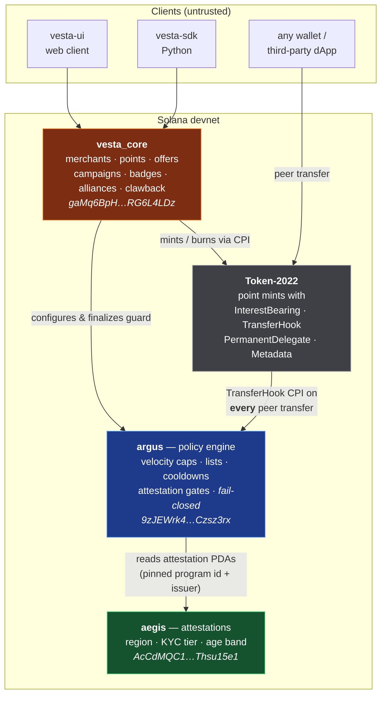
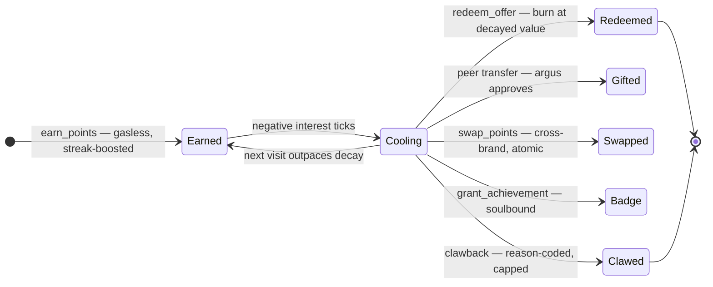
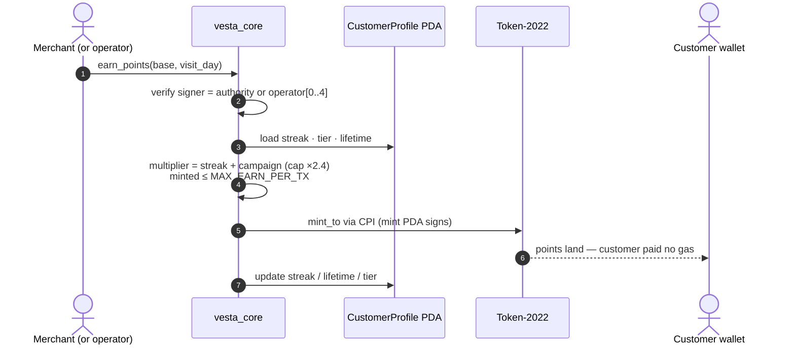
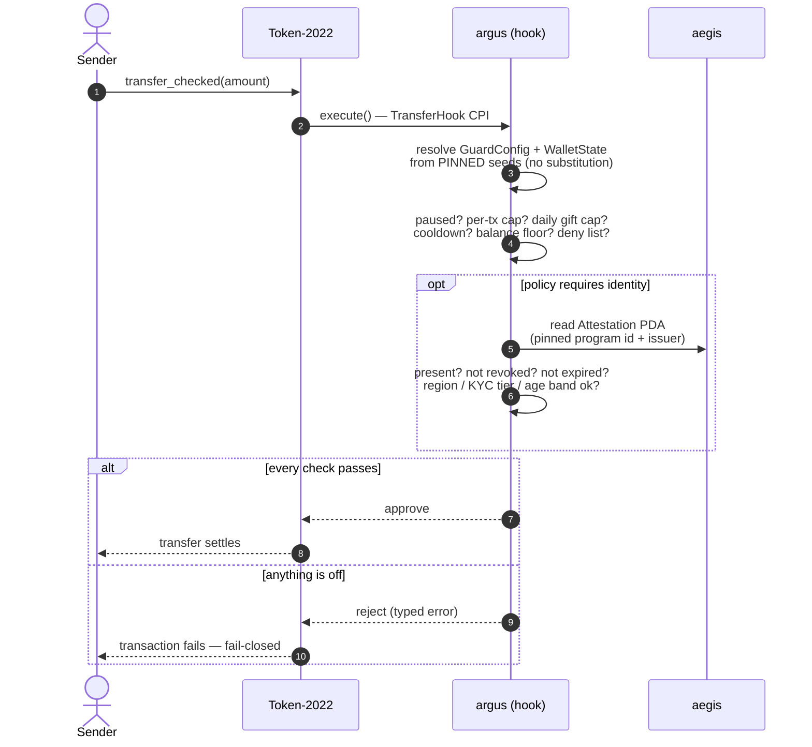
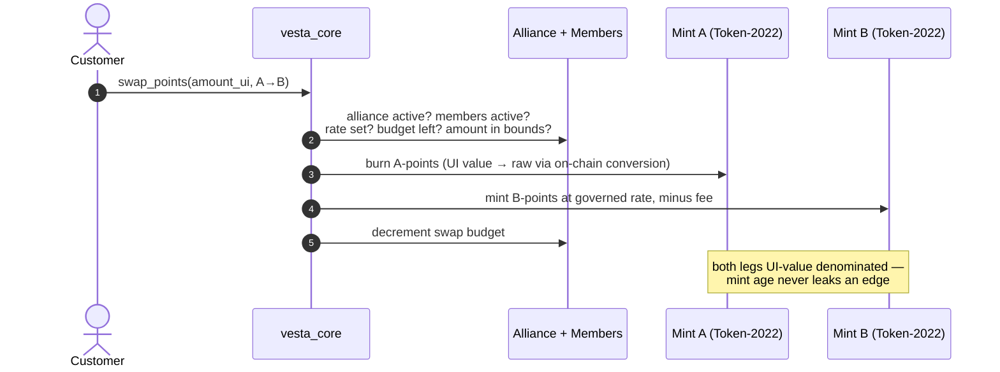
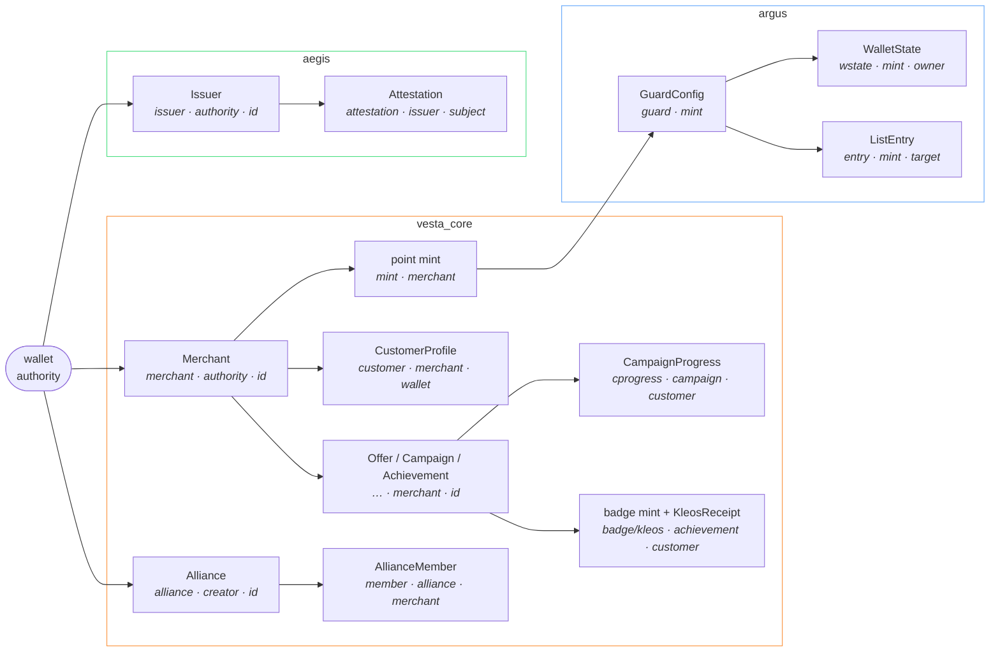

<div align="center">

# 🔥 VESTA

**The Living Loyalty Protocol on Solana**

Points that behave like a flame: they reward engagement, cool when untended,
move only under merchant-defined policy, and compose across brands.

[](LICENSE)
[](rust-toolchain.toml)
[](Anchor.toml)
[](#deployments)

[Live client](https://dev-vesta.netlify.app/) ·
[Technical spec](docs/TECHNICAL_SPEC.md) ·
[Hook engine spec](docs/ARGUS_SPEC.md) ·
[Security policy](SECURITY.md)

</div>

---

## Table of contents

- [Why VESTA](#why-vesta)
- [Design rationale](#design-rationale)
- [Protocol at a glance](#protocol-at-a-glance)
- [Architecture](#architecture)
- [Deployments](#deployments)
- [Quick start](#quick-start)
- [How the economy works](#how-the-economy-works)
- [Transaction flows](#transaction-flows)
- [Account model](#account-model)
- [Instruction surface](#instruction-surface)
- [Security & compliance](#security--compliance)
- [Testing](#testing)
- [Operations runbook](#operations-runbook)
- [Live demo evidence](#live-demo-evidence)
- [Repository layout](#repository-layout)
- [Documentation & resources](#documentation--resources)
- [Ecosystem](#ecosystem)
- [Roadmap](#roadmap)
- [Contributing](#contributing)
- [License](#license)

## Why VESTA

Traditional loyalty programs are silos: points live in one vendor's database,
expire by cliff, can't be exchanged, and every rule is a private backend
decision the customer must take on faith. VESTA re-implements loyalty as a
**public on-chain primitive** where the rules are the code:

- **Decay is priced by the token program itself** — a Token-2022
  interest-bearing config with a negative rate, so no client can misrepresent
  a balance's real value.
- **Transfer policy travels with the token** — an SPL transfer hook fires on
  *every* peer transfer, wherever it happens, and fails closed.
- **Cross-brand liquidity is governed, not promised** — alliances swap points
  at on-chain rates with budgets, fees, and bounds.
- **Even the escape hatch is accountable** — clawback exists, but it is
  reason-coded, publicly self-capped, and audited by the hook engine.

The client proposes; the chain disposes. Nothing in the UI can do what the
programs forbid.

## Design rationale

### The novel mechanism & the friction it removes

The core innovation is **time-decaying loyalty value enforced at the token
level** — points as a *living* asset rather than a static ledger entry.

The friction being attacked is **loyalty liability rot**: merchants accumulate
enormous balance-sheet liabilities from hoarded points, so they respond with
cliff expirations and devaluations that customers experience as betrayal.
VESTA replaces the cliff with a **continuous, transparent cooling curve** that
customers can outpace simply by staying engaged (streaks add +2%/day against
the decay). Hoarding stops being free, engagement stops being unrewarded, and
the merchant's liability decays predictably instead of exploding — all priced
by the token program itself, not by a backend that can quietly change the rules.

Around that core, three second-order mechanisms address the classic loyalty
frictions:

- **Siloed value** → *koinon* alliances: governed, budgeted, atomically-settled
  cross-brand swaps — small merchants can form networks that compete with
  big-chain programs.
- **Unverifiable status** → *kleos* soulbound badges: achievements any external
  dApp can token-gate on, without asking the merchant's API for permission.
- **Trust in the operator** → policy-carrying tokens: velocity caps, gift
  limits, and identity gates ride with the token (argus) instead of living in
  terms-of-service fine print.

### Why Solana specifically

This design is not portable to a generic EVM chain without rebuilding half of
it in application code. It leans on infrastructure Solana ships natively:

| Solana primitive | What it enables here |
|---|---|
| **Token-2022 `InterestBearingConfig`** | Decay computed by the token program (`amount_to_ui_amount`) — zero oracle, zero cron, zero client trust; a negative rate makes every wallet and explorer show the honest, cooled value |
| **Token-2022 `TransferHook`** | Policy enforcement on *every* peer transfer at the protocol level — an EVM ERC-20 cannot intercept transfers without wrapping/whitelisting hacks |
| **Token-2022 `PermanentDelegate` + `NonTransferable` + metadata extensions** | Accountable clawback, soulbound badges, and on-chain brand metadata as *mint configuration*, not bespoke contract code |
| **PDAs** | Deterministic, pinned account derivation — argus resolves policy and attestations from seeds, making account-substitution attacks structurally impossible |
| **Fee economics + parallel runtime** | Merchant-signed, customer-gasless earns are viable at retail frequency (a coffee purchase per second across thousands of merchants would be absurd on L1 EVM gas) |
| **Atomic multi-instruction transactions** | Mint creation with five extensions configured in one transaction; cross-brand swaps that burn and mint on two mints atomically |

### Tradeoffs & constraints

Honest costs of the design, and how they are managed:

- **Hook tax on transfers.** Every peer transfer pays the argus CPI (extra
  compute + accounts). Accepted deliberately: earns and redemptions — the hot
  paths — are program operations that don't traverse the hook; only
  peer-to-peer gifting pays the toll, and that is exactly the path that needs
  policing.
- **Decay is per-mint, not per-holder.** `InterestBearingConfig` is a mint-level
  rate, so individual "VIP freeze" exemptions aren't expressible at the token
  layer; tier perks must come from earn multipliers and campaigns instead.
- **Token-2022 wallet compatibility.** Some wallets and dApps still handle
  extension-heavy mints imperfectly; the reference UI compensates, but
  third-party display of decayed balances varies with wallet quality.
- **RPC-bound analytics.** All state is chain-derivable, but protocol-scale
  aggregation over `getProgramAccounts` doesn't scale past thousands of
  accounts — an indexer is on the [roadmap](#roadmap) before mainnet.
- **Custody realism.** Devnet runs on a single admin key and `init_config` is
  first-come; both are tracked findings, with multisig and a deploy-time gate
  gating mainnet.
- **Regulatory posture.** Decaying, non-cash-redeemable points are deliberately
  chosen to look like loyalty value, not a security or stored monetary value —
  and aegis provides the identity rails (region/KYC gating) if a jurisdiction
  demands them.

## Protocol at a glance

| Capability | Mechanism |
|---|---|
| **Breathing points** | Token-2022 `InterestBearingConfig`, negative rate — activity streaks outpace the cooling |
| **Guarded transfers** | Transfer hook (**argus**): velocity caps, cooldowns, lists, gift caps — fail-closed |
| **Cross-brand alliances** (*koinon*) | Atomic point swaps at governed rates, UI-value denominated on both legs |
| **Soulbound achievements** (*kleos*) | Non-transferable Token-2022 badges any dApp can token-gate on |
| **Verifiable identity** (*aegis*) | Attestation registry (region / KYC tier / age band) guards can gate on |
| **Accountable clawback** | `PermanentDelegate` recovery — reason-coded, publicly self-capped, on-chain audited |
| **Gasless customers** | Merchants (or their operators) sign earns; customers pay nothing to be loyal |

## Architecture

Three programs with strictly one-directional trust — the economy configures the
guard, the guard reads identity, and nothing points back up:



- **vesta_core** owns the economy. Registering a merchant mints a Token-2022
  point token in one transaction with on-chain metadata, negative interest
  (decay), a transfer-hook extension pointed at argus, a permanent delegate
  for clawback, and a mint-close authority for clean deletion.
- **argus** is invoked by Token-2022 on **every** peer transfer. It resolves
  its policy account from pinned seeds (no account substitution possible),
  applies the policy, and rejects on any inconsistency.
  Deep dive: [`docs/ARGUS_SPEC.md`](docs/ARGUS_SPEC.md).
- **aegis** is a standalone attestation registry. argus derives attestation
  PDAs from a **pinned program ID and issuer**, so a malicious client cannot
  smuggle in a forged attestation.

## Deployments

| Program | Devnet ID | On-chain metadata |
|---|---|---|
| `vesta_core` | [`gaMq6BpH1aqC8ZCYtAxwZBjTa9AnfdWvYwURG6L4LDz`](https://explorer.solana.com/address/gaMq6BpH1aqC8ZCYtAxwZBjTa9AnfdWvYwURG6L4LDz?cluster=devnet) | name · logo · security.txt · IDL |
| `argus` | [`9zJEWrk47z1ACT3ySMwzmUrMsQzFC8afBSFcsCzsz3rx`](https://explorer.solana.com/address/9zJEWrk47z1ACT3ySMwzmUrMsQzFC8afBSFcsCzsz3rx?cluster=devnet) | name · logo · security.txt · IDL |
| `aegis` | [`AcCdMQC1rj4KukjhFzf4S8metEAXpnt9gzvMThsu15e1`](https://explorer.solana.com/address/AcCdMQC1rj4KukjhFzf4S8metEAXpnt9gzvMThsu15e1?cluster=devnet) | name · logo · security.txt · IDL |

Config PDA: `4aeV5JNqBXBa1M1gxch7b2h36hHBoobAR8Ajqax6J5Nr`.
Canonical IDLs are committed under [`idl/`](idl/) and published on-chain.

| Environment | Status |
|---|---|
| **Devnet** | ✅ Live (v2), with a seeded production-shaped demo dataset |
| **Mainnet** | ⏳ Gated on external audit and multisig custody ([Roadmap](#roadmap)) |

## Quick start

**Prerequisites:** Rust 1.89 (pinned) · Solana CLI 4.1.x (Agave) · Anchor 1.1.2
· Node.js ≥ 20 · a funded devnet keypair at `~/.config/solana/id.json`.

```bash
git clone git@github.com:ivasik-k7/vesta-core.git && cd vesta-core
npm install
anchor build                                    # all three programs
cargo test                                      # LiteSVM integration suite (52 tests)
```

Deploy your own instance:

```bash
anchor deploy --provider.cluster devnet
npx tsx scripts/init-config-devnet.ts           # one-time Config PDA
# program metadata / security.txt / logos / IDLs: see metadata/README.md
```

Seed a production-shaped demo (idempotent — safe to re-run):

```bash
RPC_URL="https://devnet.helius-rpc.com/?api-key=…" npm run seed
```

Provisions 5 merchants (guards, offers, campaigns, achievements), a 3-member
alliance, an aegis issuer with attestations, points across ~8 customers, a
redemption, a guarded gift, and a clawback — then verifies every account and
prints an explorer-linked report. Ephemeral customer keys persist to
`scripts/.seed-state.json` (gitignored).

## How the economy works

**Earn.** The merchant (or an authorized operator, up to 4 hot keys) signs
`earn_points`; the customer pays no gas. Daily visit streaks add +2%/day,
campaigns stack multipliers and bonuses — jointly capped at ×2.4. A single
issue is capped at 1,000,000 raw units.

**Hold.** Balances cool continuously via the mint's interest-bearing config.
The displayed value is computed by the token program (`amount_to_ui_amount`),
so decay cannot be mispriced by any client.

**Spend.** Burn for offers (priced in decayed UI value, converted on-chain),
gift within guard policy, or swap cross-brand through an alliance —
UI-value denominated on both legs, so mint age never leaks an edge.

**Own many.** Every major resource is keyed `(authority, id)`: one wallet may
own multiple merchants, alliances, and issuers. `Merchant.id` leads the account
layout so argus reads fixed byte offsets with zero deserialization drift.

**Fail closed.** argus rejects a transfer when *anything* is off — missing
wallet-state, wrong PDA, paused guard, exceeded velocity, absent/revoked/
expired attestation. There is no permissive fallback.

The whole loop, from the customer's point of view:



## Transaction flows

### Gasless earn — the hot path



### Guarded peer transfer — every gift pays the toll



### Cross-brand alliance swap — one atomic transaction



## Account model

| Account | Seeds | Program |
|---|---|---|
| `Config` | `["config"]` | vesta_core |
| `Merchant` | `["merchant", authority, id_le]` | vesta_core |
| point mint | `["mint", merchant]` | vesta_core |
| `CustomerProfile` | `["customer", merchant, wallet]` | vesta_core |
| `Offer` / `Campaign` / `Achievement` | `["offer" \| "campaign" \| "achieve", merchant, id_le]` | vesta_core |
| `CampaignProgress` | `["cprogress", campaign, customer]` | vesta_core |
| badge mint / `KleosReceipt` | `["badge" \| "kleos", achievement, customer]` | vesta_core |
| `Alliance` / `AllianceMember` | `["alliance", creator, id_le]` / `["member", alliance, merchant]` | vesta_core |
| `GuardConfig` / `WalletState` / `ListEntry` | `["guard", mint]` / `["wstate", mint, owner]` / `["entry", mint, target]` | argus |
| `Issuer` / `Attestation` | `["issuer", authority, id_le]` / `["attestation", issuer, subject]` | aegis |

Everything hangs off `(authority, id)` roots, so the full state graph is
derivable from a wallet address alone:



## Instruction surface

<details>
<summary><b>vesta_core</b> — 40+ instructions</summary>

- **Protocol admin:** `init_config`, `migrate_config`, `set_paused` (circuit
  breaker; transfers keep working so clawback is never bricked), `set_admin` /
  `accept_admin` (two-step), `verify_merchant`
- **Merchant lifecycle:** `register_merchant`, `close_merchant` (zero-supply
  only), `update_merchant`, `update_merchant_profile`, `set_merchant_paused`,
  `set_merchant_operator` (≤4 hot keys), `set_clawback_cap`
- **Token:** `update_decay_rate`, `update_token_metadata`,
  `set_token_attribute`, `finalize_transfer_guard` (permanently burns the hook
  authority)
- **Points:** `earn_points`, `earn_points_campaign`
- **Offers:** `create_offer`, `close_offer`, `redeem_offer`, `close_receipt`
- **Campaigns:** `create_campaign` (multiplier / flat bonus / quest; budgets,
  per-customer caps, tier & spend gates), `update_campaign` (extend / budget /
  pause), `close_campaign`
- **Achievements:** `create_achievement`, `grant_achievement` (permissionless —
  the chain checks eligibility), `close_achievement`
- **Alliances:** `create_alliance`, `join_alliance` (co-signed handshake),
  `leave_alliance`, `set_swap_rate`, `set_swap_budget`, `swap_points`,
  `set_alliance_params`, `set_alliance_paused`, `set_member_active`, two-step
  authority transfer
- **Clawback:** `clawback` (reason-coded, daily-capped, argus-audited)
</details>

<details>
<summary><b>argus</b> — policy engine</summary>

`initialize_transfer_guard`, `configure_policy` (gift/per-tx/balance caps,
transfers-per-day, cooldowns, flags, attestation gates), `set_guard_paused`,
`open_wallet_state`, `add_list_entry` / `remove_list_entry`, two-step authority
transfer, `execute` (the hook).
</details>

<details>
<summary><b>aegis</b> — attestation registry</summary>

`init_issuer`, `set_issuer_operator`, `set_issuer_paused`, `issue_attestation`,
`update_attestation`, `revoke_attestation`, two-step authority transfer.
</details>

## Security & compliance

| Artifact | Where |
|---|---|
| Disclosure policy & contact | [SECURITY.md](SECURITY.md) · `kovtun.ivan@proton.me` · on-chain `security.txt` in every program |
| Internal production review | [`docs/PRODUCTION_REVIEW.md`](docs/PRODUCTION_REVIEW.md) — 21 tracked findings, Tier 1–3 remediated |
| Contribution rules | [CONTRIBUTING.md](CONTRIBUTING.md) — enforced arithmetic/`unsafe` lints, quality gates |
| Code of conduct | [CODE_OF_CONDUCT.md](CODE_OF_CONDUCT.md) |
| Dependency policy | [`deny.toml`](deny.toml) — license allow-list + advisory checks via `cargo deny` |
| Change history | [CHANGELOG.md](CHANGELOG.md) |

Design invariants baked into the codebase:

- **Fail-closed hook** — no permissive fallback anywhere in argus.
- **Pinned cross-program derivation** — policy and attestation accounts resolve
  from pinned program IDs and seeds; client-supplied accounts are never trusted.
- **Two-step authority transfers** throughout; owner/operator privilege
  separation; public self-limits on the most sensitive power (clawback).
- **Enforced, not reviewed:** `unsafe_code = "forbid"` and
  `clippy::arithmetic_side_effects = "deny"` at the workspace level — every
  arithmetic op is `checked_*`/`saturating_*` by construction.

Known limitations: single-key admin on devnet (multisig planned for mainnet);
`init_config` is first-come (deploy-time gate tracked in the review).
**No external audit yet — do not use with real value.**

## Testing

| Layer | Tooling | Coverage |
|---|---|---|
| Unit | `cargo test` | math, state helpers |
| Integration | **LiteSVM** (bundled Token-2022) | 52 tests: happy paths, guard rejections, cap violations, authority checks, campaign kinds, alliance swaps, clawback accounting |
| Live | `scripts/seed-master.ts` | end-to-end devnet run with per-step ✓/✗ verification |

```bash
cargo fmt --all --check && cargo clippy --all-targets -- -D warnings
cargo test
cargo deny check
```

## Operations runbook

- **RPC:** the public devnet endpoint rate-limits `getProgramAccounts`; run
  against a private endpoint (e.g. Helius) via `RPC_URL`.
- **Upgrades:** `solana program extend <id> <bytes>` before deploying a larger
  binary (minimum 10,240 bytes).
- **IDLs:** large IDLs publish via URL pointer through
  `@solana-program/program-metadata`; small ones go on-chain directly.
- **Observability:** all state is chain-derivable; the UI's Network / Analytics
  pages double as a live health view.

## Live demo evidence

<details>
<summary>Every mechanic executed on devnet (café <b>Kavarna</b> + bookstore <b>Litera</b> in one <b>Koinon</b> alliance)</summary>

| Mechanic | Transaction |
|---|---|
| Register merchant (Token-2022 mint: metadata + decay + hook + delegate) | [Kavarna](https://explorer.solana.com/tx/5AW9ZVgsHCWoYBN3ykJn9p6sQkBBRh4f1nUzvq8LMu54MP4fTpnahMpvkNnKnjC9AxcC1dJXTsAE7LPJsNqNif8W?cluster=devnet) · [Litera](https://explorer.solana.com/tx/4KUMHBpiez8oCaYa7NSwnGrL5VvWnjqz5RgbhaDYyZYytQFR4R3jGc9127ot6K3ZeYiEDbFe9hRwtAHzb4tGt8RQ?cluster=devnet) |
| Initialize transfer guard (argus EAML) | [Kavarna](https://explorer.solana.com/tx/2b8iR6tVMw2azTycg3scrYFhFAQnSG6uJsqgkbqSCaHs74myxy5TsTn9txWzbHHpJh4aB9nddwBbiV9BzSH4xyCX?cluster=devnet) · [Litera](https://explorer.solana.com/tx/5UZaPobGHmiUMKVmpFFX1bGemNxDuwvPJFLVcmByafmUAKNhFRiRZB6sFfQptGABgiGFX5kwNdQxa4t3reFXqDsf?cluster=devnet) |
| Finalize guard (hook authority burned) | [Kavarna](https://explorer.solana.com/tx/35MZ1HFEmd4RTscEWyAKkLYnYc3kptW6neBgzbHjcSEQMBD3XZQSkcgD9ZGHuNzThYsYvva4WPow2D8bYKuLWxvL?cluster=devnet) |
| Earn points (merchant-signed, customer gasless, streak-boosted) | [Kavarna](https://explorer.solana.com/tx/4To7xWA7CZcfqdkG3REcLBaWqtRVLVQgPt3nzyqbAE5DLGUngaZZQhuHeLWo2YMdu7g4f1XpNYyE6Tgm5nmGRwzS?cluster=devnet) · [Litera](https://explorer.solana.com/tx/4eSvaDuxaRVXbBQ5dQkFJdp474c1NTE3M8SZ8xebgfwcRBV5BjuDMLmnYxmCmn5YadXWKybF99vLk7PtbirBCkWu?cluster=devnet) |
| Gift within cap (hooked transfer) | [tx](https://explorer.solana.com/tx/5gBE7KAho23R7n4fwgx4cDn1tApjPCxPcNYa5ojT1EBJbCCvDS5rNUYZbCWyEjc4o95Z7mqxZeEg5T5osqZF4Fju?cluster=devnet) |
| **Gift over cap → rejected by argus** (`GiftCapExceeded`) | enforced live; reproduce by exceeding the daily cap |
| Create alliance (Koinon) | [tx](https://explorer.solana.com/tx/4u5cCkvwmjN565z1kh38zZz9zAwhf6rQBm2nxZzg6dmxReHUmQr4SGDFnBikmg2SKwz7dqhWVC7AqD91Es3BjoEr?cluster=devnet) |
| Join alliance (handshake co-sign) | [Kavarna](https://explorer.solana.com/tx/34QJe4TXtES6ueENe3jSpB59BvkH9iXD1cqNUGs5ct6TGdog8mjBdy2QA3sp1FNKqEWKfTmF8moZDaiKtC9UMLhz?cluster=devnet) · [Litera](https://explorer.solana.com/tx/bc1XActzPxhNM7dkpMT8NzYE36zQLErZVFxC3YCRh5ef9voiQbb6AEFD4kqT4HZjPjeU3h5gmy1HjNu9ZqRY4Kq?cluster=devnet) |
| Swap points (UI-denominated, cross-brand) | [tx](https://explorer.solana.com/tx/4Nn5PymTqG17kGW456ZkGS7fApaJ72qN8c1N1G5k3i6iHvNsEeNFxuWGBuuDqWcBsN6qGFAVsrgrri74L3nhGs1?cluster=devnet) |
| Create offer | [tx](https://explorer.solana.com/tx/4XYHY78UWxtCFzYTemqHWHaE2Ns2LMvokxvUtPYdqPMxZUDUCwh7526kBh3jqd9JeWYCwszTc1vpTYs7Bv7ADu6a?cluster=devnet) |
| Redeem offer (on-chain UI→raw conversion + burn) | [tx](https://explorer.solana.com/tx/M75qxoEYZLnjLnzxPoVrDBxPE2pnFgR2VhY1oxq35nkF5u2SGU9jQ4bNDwrZZzhMGRCXtFUbrrid9oBdyeqvBAv?cluster=devnet) |

A larger production-shaped dataset (5 merchants, attestations, clawback) is
provisioned by `scripts/seed-master.ts`.
</details>

## Repository layout

```
programs/
  vesta-core/          # protocol program (Rust / Anchor)
  argus/               # transfer-hook policy engine
  aegis/               # attestation registry
docs/
  TECHNICAL_SPEC.md    # protocol-wide technical specification
  ARGUS_SPEC.md        # deep spec of the hook engine
  PRODUCTION_REVIEW.md # internal security review (21 findings)
idl/                   # canonical IDLs (also published on-chain)
metadata/              # logos, metadata.json, security.json + publish runbook
scripts/
  seed-master.ts       # idempotent production-shaped demo provisioning
  earn-to-me.ts        # issue any brand's points to any wallet (demo helper)
  init-config-devnet.ts
CONTRIBUTING.md · CODE_OF_CONDUCT.md · SECURITY.md · CHANGELOG.md · LICENSE
```

## Documentation & resources

### In this repository

| Document | What it covers |
|---|---|
| [`docs/TECHNICAL_SPEC.md`](docs/TECHNICAL_SPEC.md) | Protocol-wide specification: state, math, invariants |
| [`docs/ARGUS_SPEC.md`](docs/ARGUS_SPEC.md) | The hook engine in depth: policy fields, pinned derivation, failure taxonomy |
| [`docs/PRODUCTION_REVIEW.md`](docs/PRODUCTION_REVIEW.md) | Internal security review — 21 findings and their remediation status |
| [`idl/`](idl/) | Canonical IDLs for all three programs (also published on-chain) |
| [`metadata/`](metadata/) | Program logos, metadata.json, security.json + the publish runbook |
| [SECURITY.md](SECURITY.md) · [CONTRIBUTING.md](CONTRIBUTING.md) · [CHANGELOG.md](CHANGELOG.md) | Disclosure policy · contribution bar · release history |

### Live on-chain

| Resource | Link |
|---|---|
| Program: `vesta_core` | [Explorer](https://explorer.solana.com/address/gaMq6BpH1aqC8ZCYtAxwZBjTa9AnfdWvYwURG6L4LDz?cluster=devnet) · [Solscan](https://solscan.io/account/gaMq6BpH1aqC8ZCYtAxwZBjTa9AnfdWvYwURG6L4LDz?cluster=devnet) |
| Program: `argus` | [Explorer](https://explorer.solana.com/address/9zJEWrk47z1ACT3ySMwzmUrMsQzFC8afBSFcsCzsz3rx?cluster=devnet) · [Solscan](https://solscan.io/account/9zJEWrk47z1ACT3ySMwzmUrMsQzFC8afBSFcsCzsz3rx?cluster=devnet) |
| Program: `aegis` | [Explorer](https://explorer.solana.com/address/AcCdMQC1rj4KukjhFzf4S8metEAXpnt9gzvMThsu15e1?cluster=devnet) · [Solscan](https://solscan.io/account/AcCdMQC1rj4KukjhFzf4S8metEAXpnt9gzvMThsu15e1?cluster=devnet) |
| Reference client | [dev-vesta.netlify.app](https://dev-vesta.netlify.app/) — Network & Verify pages double as a protocol health view |

### Upstream references

| Topic | Reference |
|---|---|
| Token-2022 extensions | [spl.solana.com/token-2022/extensions](https://spl.solana.com/token-2022/extensions) — InterestBearingConfig, TransferHook, PermanentDelegate, NonTransferable, MetadataPointer |
| Transfer hook interface | [Transfer Hook guide](https://solana.com/developers/guides/token-extensions/transfer-hook) |
| Anchor framework | [anchor-lang.com](https://www.anchor-lang.com/) (this repo pins Anchor 1.1.2) |
| LiteSVM test runtime | [github.com/LiteSVM/litesvm](https://github.com/LiteSVM/litesvm) |
| Program metadata / security.txt | [@solana-program/program-metadata](https://github.com/solana-program/program-metadata) · [solana-security-txt](https://github.com/neodyme-labs/solana-security-txt) |
| PDAs | [solana.com/docs/core/pda](https://solana.com/docs/core/pda) |

## Ecosystem

| Repository | Purpose |
|---|---|
| [`vesta-core`](https://github.com/ivasik-k7/vesta-core) | On-chain programs (this repo) |
| [`vesta-ui`](https://github.com/ivasik-k7/vesta-ui) | Web client — customer wallet + merchant console ([live](https://dev-vesta.netlify.app/)) |
| [`vesta-sdk`](https://github.com/ivasik-k7/vesta-sdk) | Python SDK for backend integrators |

## Roadmap

- [ ] External security audit
- [ ] Mainnet deployment behind a Squads multisig; role separation (admin ≠ deployer ≠ demo)
- [ ] `init_config` deploy-time gate
- [ ] Offer time-windows · achievement metadata updates · attribute removal
- [ ] Indexer (Helius webhooks / DAS) for protocol-scale analytics
- [ ] Python SDK GA for backend integrators

## Contributing

Contributions are welcome under a strict security-first bar — read
[CONTRIBUTING.md](CONTRIBUTING.md) before opening a PR. Exploitable issues go
to [SECURITY.md](SECURITY.md), never the public tracker.

## License

[MIT](LICENSE) © 2026 [Ivan Kovtun (ivasik-k7)](https://github.com/ivasik-k7)

> VESTA is deployed on **devnet** for evaluation. It is not financial
> infrastructure until audited and released on mainnet.
