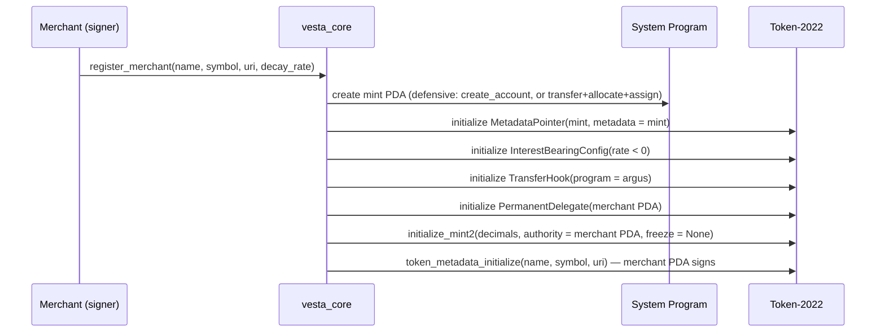

# VESTA — On-Chain Technical Specification

> Engineering spec for `vesta_core` and `argus`. Single source of truth for phases 1–4.
> Every load-bearing claim was adversarially fact-checked against spl-token-2022 /
> transfer-hook / anchor 1.1.2 / litesvm sources across three verification rounds
> (six-dimension fact-check, primary-source resolution, four-judge panel + completeness
> critic); see the verification log in §13.

- Status: **v4 — panel & critic findings integrated; implementation-ready**
- Deployed (devnet): `vesta_core` `Am2X4B1SCnJKXL8Yir2j6yGpHAKrmwcf2E5aKnA9BZV` · `argus` `CrzLCMSQ1pWTuLXBomoLn6eAB1c1gLsw5x9sBeuyBNKt`
- Upgrade authority: `JC2b9dnqMge1pGAoM1VGg416vmvy6xiLfep6oNJFAWsQ` (owner wallet; disclosure in §16)
- Toolchain: Rust 1.89 (pinned) · Solana CLI 4.1.1 (Agave) · Anchor 1.1.2 · LiteSVM 0.10

---

## 0. Scope and current state

Implemented today: `init_config` (Config PDA) with LiteSVM tests; `argus` is a deployable
placeholder.

**Config migration (decided):** the deployed `Config` predates this spec (no
`pending_admin`). Phase 1 ships `migrate_config` — an admin-signed, one-shot in-place
migration (Anchor `realloc`, +33 bytes, rewrite fields) on the **same program id**, so
the deployed addresses in this header and every published devnet link stay valid. A
"clean redeploy" is rejected: seeds are `["config"]`, so `init_config` cannot re-run
under the same program id while the account exists, and a new program id would invalidate
the README links.

| Phase | Deliverable |
|---|---|
| 1 | `migrate_config`, `set_admin`/`accept_admin`, `set_paused`, `register_merchant`, `update_merchant`, `earn_points` (**with streaks + tiers** — the innovation carrier ships first), `create_offer`/`close_offer`, `redeem_offer` + `Receipt`/`close_receipt` |
| 2 | `argus`: `initialize_transfer_guard`, `open_gift_ledger`, `execute` policy; `vesta_core::finalize_transfer_guard` (hook-authority revocation); peer gifting via plain hooked `transfer_checked` |
| 3 | campaigns (`create_campaign`/`close_campaign`, earn campaign multiplier), `create_achievement`, `grant_achievement` (kleos + receipt) |
| 4 | `create_alliance`, `join_alliance`, `leave_alliance`, `transfer_alliance_authority` (two-step), `set_swap_rate`, `set_swap_budget`, `swap_points` (UI-denominated, budget-capped), `clawback` |

**Fallback scope (innovation insurance):** if phase 4 slips, ship a two-merchant
fixed-rate swap without alliances/budgets behind the same instruction name, and say so in
the README. The judged demo must always include: live decay, streaks, gifting with a cap,
and at least one cross-merchant swap.

Non-goals (stretch, tracked separately): cNFT tessera vouchers via Bubblegum, gasless
relayer, per-POS nonce registry, streak grace-windows.

---

## 1. System overview

Two programs, one token standard:

- **`vesta_core`** owns all protocol state (merchants, customers, offers, alliances,
  achievements) and performs every mint CPI (signed by the merchant PDA, the mint
  authority). Burns are signed by the token owner (customer).
- **`argus`** implements the SPL transfer-hook interface. Token-2022 invokes it on **every
  transfer** of a point mint (including permanent-delegate transfers). Mint/burn do **not**
  trigger transfer hooks — so earn/redeem/swap are governed by `vesta_core` logic, while
  free-floating transfers are governed by `argus`. Legacy (unchecked) `transfer` is
  rejected by Token-2022 for hook-enabled mints — `transfer_checked` is the only transfer
  path.



Ordering constraints (verified against token-2022 sources):
1. All mint-extension initializations run **after account creation, before
   `initialize_mint2`**.
2. The `TokenMetadata` TLV is written **after** mint initialization and **requires the
   mint authority as signer** — therefore always before any authority revocation.
3. The mint account must be pre-funded to remain rent-exempt after the metadata realloc
   (applies to the point mint **and** the badge mint in §3.5).

---

## 2. Account model (`vesta_core`)

All PDAs use canonical bumps stored on the account. Sizes are `8 + InitSpace`.
`merchant: Pubkey` is deliberately the **first field** of `Campaign`, `Offer`, and
`Achievement` so the §12.2 `memcmp(offset = 8)` catalog queries work.

| Account | Seeds | Fields (type) | Purpose |
|---|---|---|---|
| `Config` | `["config"]` | admin `Pubkey`, pending_admin `Option<Pubkey>`, paused `bool`, bump `u8` | protocol admin, pause |
| `Merchant` | `["merchant", authority]` | authority `Pubkey`, point_mint `Pubkey`, treasury `Pubkey`, name `String(32)`, decay_rate_bps `i16`, base_earn_rate `u64`, lifetime_points_issued `u128`, customer_count `u64`, joined_alliance `Option<Pubkey>`, bump `u8`, mint_bump `u8` | one per merchant; `customer_count` incremented by `earn_points` on profile init |
| `CustomerProfile` | `["customer", merchant, wallet]` | wallet `Pubkey`, merchant `Pubkey`, streak_days `u16`, last_visit_day `u32`, lifetime_earned `u64`, lifetime_redemptions `u32`, tier `u8`, bump `u8` | per merchant-customer pair |
| `Campaign` | `["campaign", merchant, id_le]` | **merchant `Pubkey`**, id `u64`, multiplier_bps `u16`, starts_at `i64`, ends_at `i64`, active `bool`, bump `u8` | earn multipliers (phase 3) |
| `Offer` | `["offer", merchant, id_le]` | **merchant `Pubkey`**, id `u64`, price_points `u64` (UI points ×10²), supply_remaining `u32`, active `bool`, bump `u8` | redemption catalog |
| `Receipt` | `["receipt", offer, customer, profile.lifetime_redemptions_le]` | offer `Pubkey`, customer `Pubkey`, redeemed_at `i64`, bump `u8` | voucher; index from the on-chain profile counter (collision-free); closable via `close_receipt` |
| `Alliance` | `["alliance", creator, id_le]` | id `u64`, authority `Pubkey`, pending_authority `Option<Pubkey>`, name `String(32)`, member_count `u16`, bump `u8` | koinon root; creator in seeds kills permissionless id squatting |
| `AllianceMember` | `["member", alliance, merchant]` | alliance `Pubkey`, merchant `Pubkey`, rate_bps_to_alliance `u32`, swap_in_budget_raw `u64`, swapped_in_today `u64`, budget_day `u32`, active `bool`, bump `u8` | membership, normalized rate, inbound-swap risk budget |
| `Achievement` | `["achieve", merchant, id_le]` | **merchant `Pubkey`**, id `u64`, name `String(32)`, uri `String(128)`, threshold_lifetime `u64`, badge_count `u32`, bump `u8` | kleos definition |
| `KleosReceipt` | `["kleos", achievement, customer]` | granted_at `i64`, bump `u8` | double-grant guard that survives a holder-side badge burn |

Mint PDAs (owned by Token-2022 after creation):
- point mint — seeds `["mint", merchant]`
- badge mint — seeds `["badge", achievement, customer]`

Signing model (explicit, because it is easy to get wrong): the **mint PDA seeds sign only
the account-creation CPI** (the new account must sign). All `mint_to` CPIs are signed by
the **merchant PDA** (`["merchant", authority]`) — the mint authority. Burns are signed by
the token-account **owner** (customer). Clawback `transfer_checked` is signed by the
merchant PDA as permanent delegate.

`treasury` is defined as `ATA(merchant authority wallet, point_mint)`, **created
(init_if_needed, payer = merchant authority) during `register_merchant`** and stored on
`Merchant`; argus receives it as a literal meta (see §4).

Swap rates are stored as **rate to a virtual alliance unit** (`rate_bps_to_alliance`); a
pairwise A→B rate is `rate_A / rate_B`. O(1) membership instead of O(n²) pair rates.

### 2.1 Protocol constants

| Constant | Value | Unit | Rationale |
|---|---|---|---|
| `DECIMALS` | 2 | — | UI points with two decimals; all mints |
| `DEFAULT_DECAY_RATE_BPS` | −2_000 | bps/yr, continuous | −20%/yr; merchant-tunable in −10_000..=0 at registration |
| `MAX_EARN_PER_TX` | 1_000_000 | raw (= 10 000.00 pts) | fat-finger / self-dealing blast-radius bound |
| `STREAK_BPS_PER_DAY` | 200 | bps | +2%/day of streak |
| `STREAK_DAYS_CAP` | 30 | days | streak component ≤ +6 000 bps (1.6× total) |
| `CAMPAIGN_MAX_BPS` | 20_000 | bps | per-campaign bound (2.0×) |
| `MAX_TOTAL_MULTIPLIER_BPS` | 24_000 | bps | **joint cap** on streak+campaign composition (2.4×); prevents unbounded stacking |
| `DAILY_GIFT_CAP_RAW` | 50_000 | raw (= 500.00 pts at issue) | per-(mint, wallet) daily gift velocity |
| `TIER_THRESHOLDS` | [0, 100_000, 1_000_000, 10_000_000] | raw `lifetime_earned` | tiers 0–3 (= 1k / 10k / 100k pts); raw-at-issue, so decay never demotes a tier |
| `BASE_EARN_RATE` bounds | 1..=1_000 | raw per fiat cent | `amount_base` is the purchase total in **fiat minor units (cents)**; rate 100 ⇒ 1.00 pt per cent ⇒ 100 pts per currency unit |

Raw-vs-UI note: caps and thresholds are denominated in **raw** units — the safe,
monotonic direction (a fixed raw cap's UI value shrinks as decay accrues, i.e. limits
tighten over time; never the reverse). Documented for judges.

Worked example (the "living points" pitch, numerically): 100.00 pts earned on Jan 1 at
−20%/yr displays ≈ **81.87 pts** a year later. A daily regular with a 30-day streak earns
at **1.6×** — one month of devotion out-earns a full year of decay on any balance they
keep tending. Streaks require consecutive UTC days by design (grace windows are listed
future work).

### 2.2 Rent & payer matrix

Rent numbers are estimates (finalized from tests); rent-exempt cost ≈ `(128 + bytes) × 6 960` lamports.

| Account | ~Bytes | ~Rent (SOL) | Rent payer | Reclaimable by |
|---|---|---|---|---|
| point mint (4 ext + metadata TLV) | ~550–650 | ~0.005 | merchant | — (permanent) |
| `Merchant` | ~250 | ~0.0026 | merchant | — |
| treasury ATA (T22) | ~170 | ~0.002 | merchant | merchant (close when empty) |
| `EAML` + literal metas (argus) | ~150 | ~0.002 | merchant | — |
| `CustomerProfile` | ~100 | ~0.0016 | **merchant** (earn init_if_needed) or **customer** (redeem-first path) | — |
| customer ATA (T22) | ~170 | ~0.002 | **merchant** (earn) or customer | customer (close when empty) |
| `Offer` / `Campaign` / `Achievement` | ~90–190 | ~0.0015–0.0022 | merchant | merchant (close) |
| `Receipt` | ~90 | ~0.0015 | customer | customer (`close_receipt`) |
| `KleosReceipt` + badge mint + badge ATA | ~90 + ~350 + ~170 | ~0.006 | merchant | — (badge permanent) |
| `GiftLedger` (argus) | ~50 | ~0.0012 | customer (`open_gift_ledger`) | **nobody — deliberately non-closable** (closing+reopening would reset the daily cap; the locked rent is the anti-reset bond) |

Merchant cost model: onboarding ≈ **0.012 SOL** one-time; each new customer via earn ≈
**0.0036 SOL** (profile + ATA) ⇒ ~3.6 SOL per 1 000 customers. Fee/rent sponsorship for
customer flows: §12.4.

---

## 3. Instruction reference (`vesta_core`)

Common validation for every state-mutating instruction: `!config.paused`; all PDAs
verified via seeds + stored bump; all arithmetic checked (`checked_*` / `u128`
intermediates); the token program account is declared as `Program<'info, Token2022>` —
note that `Interface<TokenInterface>` alone accepts classic SPL Token too (its `IDS`
contains both program ids), so Token-2022 exclusivity is enforced by this explicit
program type plus `mint::token_program` constraints, not by the interface types.

### 3.1 Admin (phase 1)

- `init_config()` — once; `admin = signer`, `pending_admin = None`.
- `migrate_config()` — one-shot; current admin signs; `realloc` the live devnet account
  to the v4 layout (+`pending_admin`), rewrite fields, emit `ConfigMigrated`. Guarded by
  a data-length check so it cannot run twice.
- `set_admin(new_admin: Pubkey)` — admin-only; writes `pending_admin`.
- `accept_admin()` — `pending_admin` signs; swaps and clears. Two-step transfer.
- `set_paused(paused: bool)` — admin-only circuit breaker. Pause blocks vesta_core state
  mutations; it deliberately does **not** affect token transfers (argus policy is
  pause-independent so clawback/treasury flows can never be bricked by a pause).

### 3.2 Merchant lifecycle

`register_merchant(args)` (phase 1) — args: `name: String(≤32)`, `symbol: String(≤10)`,
`uri: String(≤200)`, `decay_rate_bps: i16 (−10_000..=0)`, `base_earn_rate: u64 (1..=1_000)`,
`decimals: u8 (=2)`.

Accounts (8): authority (signer, mut, pays all rent), `Merchant` (init), mint PDA (mut),
treasury ATA (init_if_needed, `authority = authority, mint = mint`), `Config`,
`Program<Token2022>`, ATA program, system program.

Steps (single transaction; CU measured in tests, budget requested client-side):
1. **Defensive creation** of the mint PDA (the address is publicly predictable, so a
   1-lamport donation must not brick registration — bare `create_account` fails on any
   pre-funded address): if `lamports == 0` → `create_account`; else → `transfer` (top up
   to rent-exempt target), `allocate(space)`, `assign(Token-2022)` — all signed with the
   mint PDA seeds. Space = `ExtensionType::try_calculate_account_len::<Mint>(&[MetadataPointer, InterestBearingConfig, TransferHook, PermanentDelegate])`;
   lamports = rent for that space **plus** the future metadata TLV bytes.
2. CPI `metadata_pointer_initialize(metadata_address = mint)`.
3. CPI `interest_bearing_mint_initialize(rate_authority = merchant PDA, rate = decay_rate_bps)`.
4. CPI `transfer_hook_initialize(authority = merchant PDA, program_id = argus)`.
5. CPI `permanent_delegate_initialize(delegate = merchant PDA)`.
6. CPI `initialize_mint2(decimals, mint_authority = merchant PDA, freeze_authority = None)`.
7. CPI `token_metadata_initialize(name, symbol, uri)` — merchant PDA signs as mint authority.
8. Create treasury ATA (init_if_needed); write `Merchant` fields incl. `treasury`.

Freeze authority is deliberately `None`: the protocol cannot freeze customer accounts
wholesale; clawback is scoped to the audited permanent-delegate transfer path.

`update_merchant(base_earn_rate: Option<u64>, uri: Option<String>)` (phase 1) —
merchant-signed; re-validates the §2.1 bounds; emits `MerchantUpdated`. Token metadata
`update_field` (name/uri rebranding, merchant PDA is update authority) is a documented
optional path, out of judged scope. Merchant-key rotation is deliberately unsupported
in-scope (authority is baked into seeds) — disclosed in §6.

`finalize_transfer_guard()` (phase 2) — the owning instruction for hook-authority
revocation. Accounts: merchant authority (signer), `Merchant`, mint (mut), EAML PDA
(verified: owner == argus, seeds `["extra-account-metas", mint]`, initialized),
`Program<Token2022>`. CPIs `set_authority(AuthorityType::TransferHookProgramId → None)`
(verified: variant 10) with merchant-PDA signer seeds, so no future actor — including the
merchant — can repoint the hook to a no-op program. Emits `TransferGuardFinalized`.
The interest-bearing rate authority (`AuthorityType::InterestRate`, variant 7) remains
the merchant PDA; any future rate-update instruction must re-validate −10_000..=0.

Failure modes to test: re-registration; pre-funded mint address (griefing); oversized
strings; **max-length strings succeed and stay rent-exempt**; positive decay rate;
classic-token program substitution; finalize before guard init rejected; repoint attempt
after finalize fails.

### 3.3 `earn_points(amount_base: u64, visit_day: u32)` (phase 1; campaign multiplier lands in phase 3)

Signers: **merchant authority** (mandatory — the POS approves the earn; also the payer
for profile/ATA rent, per §2.2). Customer wallet does not sign (one-tap QR flow).

Accounts (10 + optional): merchant authority (signer, mut, **payer**), `Merchant`,
`CustomerProfile` (init_if_needed, payer = merchant authority), customer wallet
(SystemAccount), customer ATA (init_if_needed, payer = merchant authority,
`associated_token::authority = customer`, `associated_token::mint = point_mint`),
mint PDA (mut), `Config`, `Program<Token2022>`, ATA program, system program,
optional `Campaign` (P3; validated via seeds + window if supplied).

Logic:
1. `unix_day = clock.unix_timestamp / 86_400`; require `visit_day == unix_day` (rejects
   stale/replayed POS payloads). UTC-day tradeoff documented for judges.
2. Streak: `+1` if `last_visit_day + 1 == unix_day`; unchanged if same-day; reset to 1
   otherwise. On profile init: `streak_days = 1`, `merchant.customer_count += 1`.
3. Multiplier: `streak_bps = min(streak_days, STREAK_DAYS_CAP) * STREAK_BPS_PER_DAY`;
   (P3) `+ campaign.multiplier_bps` if a valid active campaign is supplied (the program
   applies *the supplied* campaign — it cannot claim "best" on-chain);
   `total_bps = min(10_000 + streak_bps + campaign_bps, MAX_TOTAL_MULTIPLIER_BPS)`.
4. `minted = amount_base * base_earn_rate * total_bps / 10_000` — u128 intermediates,
   u64 overflow check. `amount_base` is the purchase total in fiat minor units (§2.1).
5. Per-earn cap: `minted <= MAX_EARN_PER_TX` — bounds fat-finger and self-dealing blast
   radius; the systemic self-mint risk is handled at the swap boundary (§3.6).
6. CPI `mint_to` (merchant PDA signs) to customer ATA.
7. Update `lifetime_earned`, `lifetime_points_issued`; auto-tier per `TIER_THRESHOLDS`
   (raw-at-issue — decay never demotes). Emit `PointsEarned`.

### 3.4 `create_offer` / `close_offer` / `redeem_offer` / `close_receipt` (phase 1)

`create_offer(id, price_points, supply)` — merchant-only. `price_points` is denominated
in **UI points ×10²** (post-decay purchasing power — the scale the customer sees).

`close_offer(id)` — merchant-only, anytime; rent to merchant; emits `OfferClosed`.

`redeem_offer(id, max_raw_amount: u64)` — accounts (11): customer (signer, mut, payer),
`Merchant`, `Offer` (mut, `has_one = merchant`), `CustomerProfile` (**init_if_needed**,
payer = customer — a customer holding only *gifted* points has no profile yet; the
gift-then-redeem path must not brick), `Receipt` (init, payer = customer), customer ATA
(mut), mint PDA (mut), `Config`, `Program<Token2022>`, ATA program, system program.

1. Offer active, `supply_remaining > 0`; burned mint == `merchant.point_mint`; receipt
   PDA indexed by `customer_profile.lifetime_redemptions` (on-chain counter,
   collision-free).
2. Convert the UI price to the raw burn amount **on-chain**: format `price_points` as a
   decimal string (integer math, two decimals), CPI Token-2022
   `UiAmountToAmount(mint, price_str)`, read the **little-endian u64** from return data
   (verified). Require `raw_needed <= max_raw_amount` (customer slippage bound — decay
   ticks between quote and execution). Conversions are float-based and not round-trip
   reversible (documented by Token-2022) — vesta_core only ever converts ui → raw
   on-chain; the slippage bound absorbs residual wobble.
3. CPI `burn(raw_needed)` from customer ATA — customer signs.
4. `supply_remaining -= 1`; `lifetime_redemptions += 1`; init `Receipt`; emit
   `OfferRedeemed`.

`close_receipt()` — customer-signed after fulfillment; rent back to customer; emits
`ReceiptClosed`.

### 3.5 Gamification (phase 3)

- `create_campaign(id, multiplier_bps ≤ CAMPAIGN_MAX_BPS, starts_at < ends_at)` /
  `close_campaign` — merchant-only; closable, rent to merchant.
- `create_achievement(id, name, uri, threshold_lifetime)` — merchant-only.
- `grant_achievement()` — **merchant-signed** (not permissionless: unsolicited badge/ATA
  spam is griefing). Accounts (12): merchant authority (signer, mut, payer), `Merchant`,
  `Achievement` (mut, `has_one = merchant`), `CustomerProfile`, customer wallet
  (SystemAccount), badge mint PDA (mut), badge ATA (init, payer = merchant authority),
  `KleosReceipt` (init, payer = merchant authority), `Config`, `Program<Token2022>`,
  ATA program, system program.
  Requirements: `customer_profile.lifetime_earned >= threshold` and `KleosReceipt` does
  not exist (the receipt — not the ATA — is the double-grant guard, because a holder can
  burn the badge: NonTransferable blocks transfers for everyone, but the **holder can
  still burn and close the ATA**, so "supply frozen at 1" really means "supply can never
  increase"). Steps: defensive-create badge mint PDA (pre-funded for the metadata TLV,
  §1.3); init extensions (`NonTransferable` **before** `initialize_mint2`,
  `MetadataPointer`); `initialize_mint2` (authority = merchant PDA, decimals 0);
  `token_metadata_initialize` (**before** authority revocation — permanently impossible
  after); create badge ATA (T22 ATAs auto-initialize `ImmutableOwner`); `mint_to(1)`;
  `set_authority(MintTokens → None)` (irreversible; later re-sets fail with
  `TokenError::FixedSupply`); init `KleosReceipt`; `badge_count += 1`; emit
  `AchievementGranted`.

### 3.6 Koinon (phase 4)

- `create_alliance(id, name)` — any merchant; creator in the seeds (no id squatting);
  creator becomes alliance authority. Governance honesty: a single key; multisig/DAO
  recommended for real deployments — documented, not enforced in-scope.
- `transfer_alliance_authority(new_authority)` / `accept_alliance_authority()` — two-step
  rotation mirroring Config admin.
- `join_alliance(rate_bps_to_alliance, swap_in_budget_raw)` — merchant opts in; alliance
  authority co-signs (handshake). The member sets their own **inbound swap budget** —
  the maximum raw amount of their points mintable via swaps per UTC day.
- `leave_alliance()` — member-signed, anytime; `active = false`,
  `member_count -= 1`, closes `AllianceMember` (rent to merchant), clears
  `merchant.joined_alliance`; emits `AllianceLeft`. Subsequent swaps against a departed
  member fail (`MemberInactive`); re-joining requires a fresh handshake.
- `set_swap_rate(new_rate)` / `set_swap_budget(new_budget)` — member-signed; rate changes
  additionally require the alliance-authority co-sign (anti-manipulation).
- `swap_points(ui_amount: u64, max_raw_in: u64, min_raw_out: u64)` — **UI-denominated**.
  Raw units are NOT comparable across mints even at identical decay rates: interest
  scaling runs from each mint's initialization timestamp, so same-rate mints created a
  year apart differ ~22% in value-per-raw-unit — pricing swaps in raw would be a
  systematic arbitrage faucet draining members' budgets. The swap therefore converts
  through UI value on both legs, reusing the verified §3.4 machinery:
  1. Both `AllianceMember`s active and in the **same** `Alliance` (seed-bound), each
     bound to its own merchant and `merchant.point_mint`.
  2. `raw_in = UiAmountToAmount(mint_A, fmt(ui_amount))`; require `raw_in <= max_raw_in`.
  3. `ui_out = ui_amount * rate_a / rate_b` (u128, floor);
     `raw_out = UiAmountToAmount(mint_B, fmt(ui_out))`; require `raw_out >= min_raw_out`.
  4. **Budget check (the koinon risk boundary)**: roll `budget_day`/`swapped_in_today`
     by unix_day; require `swapped_in_today + raw_out <= swap_in_budget_raw` for member
     B — bounds the "malicious merchant mints own points and drains a partner" attack to
     B's self-chosen daily exposure.
  5. CPI `burn(raw_in)` from customer's mint-A ATA (customer signs).
  6. CPI `mint_to(raw_out)` to customer's mint-B ATA (merchant-B PDA signs;
     init_if_needed, payer = customer).
  Accounts (15): customer (signer, mut, payer), `Alliance`, member_A, member_B (mut),
  merchant_A, merchant_B, mint_A (mut), mint_B (mut), customer ATA A (mut), customer
  ATA B (init_if_needed), `Config`, `Program<Token2022>`, ATA program, system program —
  plus compute budget ix client-side. Tx-size asserted < 1232 bytes in tests (§7.3).

### 3.7 `clawback(amount_raw: u64, reason_code: u16)` (phase 4)

Merchant-only, via **PermanentDelegate**: CPI `transfer_checked` from the customer ATA to
the merchant `treasury` (destination constrained to `merchant.treasury`), merchant PDA
signs as delegate. Because it is a transfer, **argus fires and audits it**. vesta_core
never exercises the permanent delegate's *burn* capability (burns bypass hooks) — this
invariant is enforced by test (§7.1), not just review.

Honest disclosure (also for the README): a permanent delegate makes points
**issuer-revocable in full** — the merchant can claw back any holder's entire balance of
their own mint. Events (`Clawback { reason_code }`) provide auditability, not prevention.
Accepted, disclosed tradeoff for fraud/refund handling; per-epoch caps or dispute
timelocks are documented future work.

---

## 4. `argus` — transfer hook program

### 4.1 Interface compliance

- `execute(amount)` implemented with the interface discriminator:
  `#[instruction(discriminator = ExecuteInstruction::SPL_DISCRIMINATOR_SLICE)]` with
  `use spl_discriminator::SplDiscriminate;` in scope — the exact pattern used by Anchor
  1.1.2's own transfer-hook test. (No `interface-instructions` feature exists in 1.x.)
- `initialize_transfer_guard(mint)` — **strictly authorized** (the EAML is init-once; an
  attacker initializing it first could void the gift cap or brick every transfer of the
  mint permanently). Authorization: merchant authority wallet signs; the instruction
  receives the `Merchant` account, verifies `owner == vesta_core`, re-derives the PDA
  from `["merchant", authority]` under vesta_core's hardcoded program id, and checks
  `merchant.point_mint == mint`. Writes the meta list and the literal metas (treasury).
  Emits `TransferGuardInitialized`. Followed by `vesta_core::finalize_transfer_guard`
  (§3.2) which revokes the hook authority.
- `open_gift_ledger(mint)` — one-time, customer-signed; creates the `GiftLedger` (§4.3).
  Emits `GiftLedgerOpened`.
- ExtraAccountMetaList PDA: seeds `["extra-account-metas", mint]` under argus.
- **Fail-closed guarantee**: Token-2022's `invoke_execute` does not itself error when the
  meta-list account is missing from the transfer — it CPIs the hook with only the four
  base accounts. argus therefore hard-requires its extra accounts in the `Execute`
  context; a client that omits them fails account resolution and the whole transfer
  aborts. Omitting extras can never bypass policy.

### 4.2 Execute-time facts the design relies on (verified)

1. The hook fires on `transfer_checked` / `transfer_checked_with_fee`, **including
   permanent-delegate transfers** (the delegate arrives as the authority account), and
   never on mint/burn.
2. Accounts arrive **privilege-de-escalated**: source, mint, destination, authority are
   read-only non-signers from the hook's perspective.
3. Hook-owned extra accounts **can be writable** (`ExtraAccountMeta` `is_writable = true`)
   — required for the `GiftLedger`.
4. Extra metas can be derived from **account data** of transfer accounts:
   - `Seed::AccountData { account_index: 0 (source), data_index: 32, length: 32 }` — the
     source token account's owner field — used for the ledger seeds. Deriving from the
     **authority** account (index 3) instead would let a customer mint fresh ledgers by
     approving delegates; the source-owner field is delegation-proof.
   - `ExtraAccountMeta::new_with_pubkey_data(&[PubkeyData::AccountData { account_index: 2 (destination), data_index: 32 }], false, false)`
     — dereferences the destination owner **wallet** so the hook can inspect which
     program owns it (constructor and variant verified). Meta *validation* runs inside
     argus with the crate version **we** vendor; meta *resolution* runs in our
     SDK/clients — neither depends on the devnet token-2022 build.
5. Reentrant token CPIs on the transferring accounts are not allowed during execute.

### 4.3 Policy

Accounts in `execute`: source, mint, destination, authority, meta-list, then extras:
`GiftLedger` (writable; seeds `["ledger", mint, source_owner]` via AccountData seed),
`destination_owner_wallet` (read; via PubkeyData), `treasury` (read; literal, written at
guard init).

**GiftLedger typing (implementation-critical):** the ledger extra must be declared as
`UncheckedAccount` and deserialized **only when rule 3 is reached**. Rules 1–2 (clawback,
pay-to-treasury) must succeed for customers who never called `open_gift_ledger` — a
naive `Account<'info, GiftLedger>` would brick clawback for ledger-less wallets.

argus account table:

| Account | Seeds | Fields | Notes |
|---|---|---|---|
| `GiftLedger` | `["ledger", mint, source_owner]` | day `u32`, gifted_today `u64`, bump `u8` | pre-created via `open_gift_ledger` (in-hook creation impossible: de-escalation leaves no rent payer). Missing ledger on a peer transfer → `GuardError::LedgerNotOpened`, fail-closed; SDK bundles open+transfer for first-time gifters. **Deliberately non-closable** — close/reopen would reset the daily cap; the locked rent is the anti-reset bond |
| `ExtraAccountMetaList` | `["extra-account-metas", mint]` | interface-defined | init-once, guarded |

Rules, in order:
1. `authority == permanent delegate of the mint` (read from the mint account's
   `PermanentDelegate` extension TLV — the mint is always account #1; no extra meta
   needed) → **allow** (clawback / merchant treasury ops). Emits `ClawbackObserved`.
2. `destination == treasury` (literal meta) → **allow** (customer→merchant payment flows).
3. Otherwise — peer transfer:
   a. `destination_owner_wallet.owner != system_program` → **reject**
      `GuardError::ProgramOwnedDestination`. **Scope honesty:** this is a best-effort
      filter, not a DEX blocker — many AMM vault authorities are unfunded system-owned
      PDAs that pass this check. It cheaply rejects the naive cases only.
   b. Daily cap (the **load-bearing guarantee** — every non-merchant outflow, including
      any pool deposit that slips past 3a, is rate-limited): roll ledger by unix_day;
      require `gifted_today + amount <= DAILY_GIFT_CAP_RAW`; update ledger → **allow**,
      emit `PointsGifted`.

**Honest limitation (documented, by design):** the cap is per `(mint, source-owner)`.
A determined user can split balances across N wallets or relay through intermediaries
for N× the cap. Without on-chain identity this is inherent; the cap is a velocity limit
on a wallet, not a Sybil-proof aggregate.

### 4.4 Client implications

Off-chain transfers must append hook accounts — spl-token's
`createTransferCheckedWithTransferHookInstruction` resolves extras automatically.
**Wallet compatibility (de-risked for the demo):** pubkey-data metas are resolved by
strictly fewer clients than plain seed metas. Minimum client: `@solana/spl-token`
**≥ 0.4.x with pubkey-data resolution — pin the exact minor at phase-2 start and record
it here**. Gifting is demoed **exclusively through vesta-ui** (which builds the transfer
itself); wallet-native sends are best-effort, verified by a tested wallet matrix
(Phantom / Solflare / Backpack × hooked send: pass/fail, date, devnet) published in the
README. §7.2 includes an e2e gift built with the stock client library. On-chain, the
only transferring CPI is `clawback`, which passes the resolved extras explicitly.

---

## 5. Decay economics (InterestBearingConfig)

- Rate is `i16` basis points, continuously compounded; default `−2_000` (−20%/yr).
- **Display-time semantics**: raw amounts never change; `amount_to_ui_amount` applies
  `exp(rate·t)` scaling. Customer-facing balances and offer prices are denominated in UI
  points (×10²); raw amounts are internal.
- On-chain conversions go through Token-2022's `UiAmountToAmount` (CPI + u64-LE return
  data) — no float math re-implemented in-program, always consistent with wallets.
  vesta_core formats `u64 → "12.34"` strings with integer math only, and only ever
  converts ui → raw on-chain (§3.4).
- **Cross-mint comparison warning:** interest scaling runs from each mint's own
  initialization timestamp — raw units are never comparable across mints, even at equal
  rates. Anything cross-mint (swaps) must convert through UI value (§3.6).
- Per-account decay freezing is impossible with a mint-level rate — by design; streak
  multipliers on earn are the per-user compensator. README tradeoff.
- Rate updates (if ever shipped) use anchor-spl's `interest_bearing_mint_update_rate`
  and must re-validate the `−10_000..=0` range.

---

## 6. Security model

### 6.1 Authority matrix

| Capability | Holder | Notes |
|---|---|---|
| Program upgrade | owner wallet (NuFi) | both programs; **hot single key through judging — disclosed** (§16), multisig post-challenge |
| Config admin | dev key → owner wallet after two-step transfer | `set_admin`/`accept_admin` |
| Mint authority (points) | **merchant PDA** `["merchant", authority]` | signs all mint_to CPIs |
| Mint account creation | mint PDA seeds `["mint", merchant]` | creation signature only |
| Rate authority | merchant PDA | range re-validated on any update path |
| Permanent delegate | merchant PDA | clawback transfers only; burn never exercised (**test-enforced**, §7.1) |
| Transfer-hook authority | merchant PDA → **None** via `finalize_transfer_guard` | prevents hook repointing |
| Badge mint authority | none (revoked after metadata init) | supply can never increase |
| Alliance authority | creator → two-step rotation | multisig recommended, documented |

**Key-concentration disclosure:** one merchant wallet controls that mint's entire
economy (mint, rate, permanent delegate, and pre-finalize hook authority). A compromised
merchant key can inflate and claw back its own mint — but never touch another merchant's
mint, and its alliance damage is bounded by partners' swap budgets. Merchant-side
multisig is recommended and documented; not enforced in-scope.

### 6.2 Threats and mitigations

- **Mint-PDA creation griefing** (1-lamport donation) → defensive create
  (transfer/allocate/assign fallback), §3.2 step 1.
- **Koinon self-mint drain** → per-member daily `swap_in_budget_raw` chosen by the
  exposed merchant; alliance-authority handshake on join and rate changes; per-earn cap
  bounds blast radius; UI-denominated swap kills the mint-age arbitrage (§3.6).
- **Mint-age arbitrage** (raw-denominated swaps between different-age mints) →
  swaps convert through UI value on both legs (§3.6, §5).
- **EAML front-run / init DoS** → `initialize_transfer_guard` authorization chain (§4.1).
- **Gift-cap bypass via delegated transfers** → ledger seeded from source token-account
  *owner data*, not the authority account.
- **Gift-cap reset via close/reopen** → `GiftLedger` is non-closable by design (§4.3).
- **Gift-cap Sybil bypass** → documented as inherent; per-wallet velocity control.
- **Replay of earn payloads** → merchant signer + same-day assertion + monotonic
  `last_visit_day`; per-POS nonce registry listed as stretch hardening.
- **Multiplier stacking** → joint `MAX_TOTAL_MULTIPLIER_BPS` cap over streak+campaign
  composition, boundary-tested.
- **Arithmetic overflow** → `overflow-checks = true` for **all** profiles, `checked_*`
  / u128, capped multipliers/rates.
- **Value substitution** → explicit bindings: redeem burns `merchant.point_mint` with
  `offer.has_one = merchant`; swap requires same-alliance **active** members each bound
  to their own mint; clawback destination == `merchant.treasury`.
- **Alliance id squatting** → creator key in `Alliance` seeds.
- **Wrong token program substitution** → `Program<'info, Token2022>` (interface types
  alone accept classic SPL Token — insufficient).
- **Decay quote drift** → `max_raw_amount` / `max_raw_in` / `min_raw_out` user bounds.
- **Clawback abuse** → fully disclosed issuer-revocability (§3.7); hook-audited transfer
  path only; reason-coded events; PD-burn test invariant.
- **Hook bypass** → extension lives on the mint; omitted extras fail closed (§4.1);
  mint/burn paths are vesta_core-gated; legacy `transfer` rejected for hook mints.
- **init_if_needed re-init** → Anchor guards; profile fields move monotonically.
- **Rent farming via close** → closable: `Offer`/`Campaign` (merchant), `Receipt`
  (customer), `AllianceMember` (via `leave_alliance`, merchant). Nothing else, ever.
- **Pause semantics** → pause blocks vesta_core mutations only; transfers are
  pause-independent; unpause admin-only.

### 6.3 Program hygiene

`overflow-checks = true` in all workspace profiles; clippy `-D warnings` in CI; no
`unsafe`; named errors everywhere (§9); events on every user-facing state mutation;
reproducible build via `solana-verify` (§16).

---

## 7. Testing strategy

### 7.1 LiteSVM (unit/integration, runs in CI)

**LiteSVM 0.10 bundles the SPL programs we need by default** (spl-token, token-2022 v10
with every extension used here, ATA, memo). Tests only `add_program` our two freshly
built `.so`s; no fixture dumping until the Bubblegum stretch.

Time travel: `warp_to_slot` **only changes the slot, not the timestamp** — decay and
streak tests mutate the Clock sysvar:
`let mut clock: Clock = svm.get_sysvar(); clock.unix_timestamp += N; svm.set_sysvar(&clock);`

Per instruction: happy path + every failure mode from §3–§4. Adversarial suite (minimum):

- register/update: duplicate merchant; pre-funded mint PDA (griefing → fallback path);
  oversized strings; **max-length strings succeed, account stays rent-exempt**; positive
  rate; classic-token program; update_merchant out-of-bounds rate.
- guard lifecycle: **unauthorized `initialize_transfer_guard` rejected; front-run init
  cannot brick or de-cap the mint**; finalize before init rejected; **hook authority
  reads None after finalize and a repoint attempt fails**.
- earn: replayed `visit_day`; same-day repeat (streak unchanged); forged merchant
  signer; paused; per-tx cap boundary; **composed multiplier capped at
  MAX_TOTAL_MULTIPLIER_BPS boundary**; customer_count increments once per profile.
- redeem: expired/empty offer; `max_raw_amount` exceeded after time-warp (raw_needed
  grows as UI value decays); receipt counter reuse; **gift-then-redeem: customer with
  only gifted points (no profile) redeems successfully — profile init_if_needed path**.
- hook/gift: cap boundary (exact cap passes, +1 fails); ledger day rollover; delegated
  transfer uses source-owner ledger; omitted extras abort (fail-closed); program-owned
  destination rejected; permanent-delegate transfer allowed + observed; **clawback
  succeeds for a wallet with NO GiftLedger (UncheckedAccount typing)**; missing ledger
  on peer transfer → `LedgerNotOpened`.
- clawback: **destination other than treasury fails**; **no instruction reachable with
  the merchant-PDA authority issues a burn CPI (PD-burn invariant test)**; reason_code
  round-trips through the event.
- swap: non-members; cross-alliance substitution; mismatched member/mint; **departed
  member (`leave_alliance`) cannot be swapped with**; stale `min_raw_out`; swap budget
  exact boundary + day rollover; **equal-rate mints of different ages swap at fair UI
  value (mint-age arbitrage test)**; u128 edges.
- badges: double-grant blocked by `KleosReceipt` even after holder burns badge + closes
  ATA; badge transfer fails (`TokenError::NonTransferable`); metadata present before
  authority revocation.
- admin: two-step transfer; non-pending accept; pause blocks earn but not transfers;
  **migrate_config: applies once, second call rejected, admin preserved**.
- alliance governance: authority rotation two-step; join handshake required; rate change
  without co-sign rejected.

### 7.2 Devnet e2e

Scripted (`scripts/e2e-devnet.ts`): register café + bookstore, earn (streak visible),
gift within cap **using the stock client library build** (wallet-compat proof), fail
beyond cap, alliance + swap within budget, redeem, grant badge — each step printing an
explorer link. Links feed the README table (§15) and the judge demo (§14).

### 7.3 Compute & size budget

Filled from LiteSVM `compute_units_consumed` as instructions land; hard assertions in
tests. Client requests `measured × 1.2` via `setComputeUnitLimit`.

| Instruction | Accounts | Measured CU | Requested CU | Tx bytes | Bound |
|---|---|---|---|---|---|
| `register_merchant` | 8 | tbd | tbd | tbd | < 400k CU |
| `earn_points` | 10–11 | tbd | tbd | tbd | < 200k |
| `redeem_offer` (incl. UiAmountToAmount CPI float exp) | 11 | tbd | tbd | tbd | < 200k |
| `grant_achievement` | 12 | tbd | tbd | tbd | < 400k (CPI count rivals register) |
| `swap_points` (2 × UiAmountToAmount) | 15 | tbd | tbd | tbd | < 300k; **tx < 1232 B** |
| first-gift tx (`open_gift_ledger` + hooked transfer, 3 extras) | ~12 | tbd | tbd | tbd | < 200k |
| `clawback` (hooked) | ~10 | tbd | tbd | tbd | < 200k |

The finished table is published in the README (§15) — judges reward it.

---

## 8. Events (with fields)

| Event | Fields |
|---|---|
| `ConfigInitialized` / `ConfigMigrated` | admin |
| `AdminProposed` / `AdminChanged` | old, new |
| `Paused` | paused |
| `MerchantRegistered` | merchant, mint, name, decay_rate_bps |
| `MerchantUpdated` | merchant, base_earn_rate, uri |
| `PointsEarned` | merchant, customer, base, minted, multiplier_bps, streak_days |
| `OfferCreated` / `OfferClosed` | merchant, offer_id, price_points, supply |
| `OfferRedeemed` | offer, customer, raw_burned, receipt |
| `ReceiptClosed` | receipt, customer |
| `GiftLedgerOpened` (argus) | mint, owner |
| `PointsGifted` (argus) | mint, source_owner, destination, amount, gifted_today |
| `ClawbackObserved` (argus) | mint, source_owner, amount |
| `Clawback` | merchant, customer, amount_raw, reason_code |
| `TransferGuardInitialized` (argus) / `TransferGuardFinalized` | mint, merchant |
| `CampaignCreated` / `CampaignClosed` | merchant, id, multiplier_bps, window |
| `AchievementCreated` | merchant, id, threshold |
| `AchievementGranted` | achievement, customer, badge_mint |
| `AllianceCreated` / `AllianceJoined` / `AllianceLeft` | alliance, merchant, rate_bps, swap_in_budget |
| `AllianceAuthorityProposed` / `AllianceAuthorityChanged` | alliance, old, new |
| `SwapRateSet` / `SwapBudgetSet` | member, old, new |
| `PointsSwapped` | customer, merchant_a, merchant_b, ui_amount, raw_in, raw_out |

Anchor `emit!` (log-based) for phases 1–4; `emit_cpi!` is the documented upgrade path if
indexer reliability demands it (§12.5).

---

## 9. Errors (frozen contract surface — SDKs map these to UX messages)

`VestaError` (vesta_core): `ProtocolPaused`, `Unauthorized`, `PendingAdminMismatch`,
`MigrationAlreadyApplied`, `InvalidDecayRate`, `InvalidEarnRate`, `InvalidDecimals`,
`StringTooLong`, `StaleVisitDay`, `EarnCapExceeded`, `MultiplierOverflow`,
`CampaignInactive`, `CampaignWindowInvalid`, `OfferInactive`, `OfferSoldOut`,
`SlippageExceeded`, `MintMismatch`, `MerchantMismatch`, `TreasuryMismatch`,
`AllianceMismatch`, `MemberInactive`, `SwapBudgetExceeded`, `InvalidSwapRate`,
`GuardNotInitialized`, `GuardAlreadyFinalized`, `ThresholdNotReached`, `AlreadyGranted`,
`InvalidAmount`, `Overflow`.

`GuardError` (argus): `UnauthorizedGuardInit`, `MintMismatch`, `LedgerNotOpened`,
`GiftCapExceeded`, `ProgramOwnedDestination`, `MetaListMismatch`, `FlowNotAllowed`.

Every `require!` maps to exactly one named variant; explorer-readable messages for every
user-reachable failure. Codes freeze before the SDKs tag v1.0 (§12.3).

---

## 10. Dependencies (fact-checked against anchor-spl 1.1.2)

```toml
# vesta-core
[dependencies]
anchor-lang = { version = "1.1.2", features = ["init-if-needed"] }
anchor-spl = "1.1.2"   # token_2022_extensions is a default feature; do NOT add "metadata"
                       # (that feature pulls Metaplex mpl-token-metadata, unrelated to T22 TLV metadata)

[features]
idl-build = ["anchor-lang/idl-build", "anchor-spl/idl-build"]  # required or `anchor build` IDL gen fails

# argus
[dependencies]
anchor-lang = "1.1.2"
spl-discriminator = "<pin>"            # SplDiscriminate trait for the execute discriminator
spl-transfer-hook-interface = "<pin>"  # ExecuteInstruction, instruction types
spl-tlv-account-resolution = "<pin>"   # ExtraAccountMeta, Seed::AccountData, PubkeyData
```

**Phase-1 gate (before the first line of instruction code):** run `cargo add anchor-spl`
+ `cargo tree` in this workspace and replace every `<pin>` above with the resolved
versions — this block has not yet been compiled against the workspace, and resolver
surprises must land on day 1, not day 10. Also set `anchor_version = "1.1.2"` in
`Anchor.toml`'s `[toolchain]` (currently empty). Client side: pin the minimum
`@solana/spl-token` with pubkey-data meta resolution (§4.4). Do NOT add the legacy
`spl-token-2022` program crate (anchor-spl uses `spl-token-2022-interface ^2`;
duplicate-type conflicts).

---

## 11. Delivery checklist (definition of done, per phase)

On-chain:
- [ ] All instructions implemented per §3–§4 with events (§8) and named errors (§9)
- [ ] LiteSVM suite green incl. the §7.1 adversarial list; clippy `-D warnings`; fmt
- [ ] §7.3 CU/tx-size table filled with measured values; assertions in tests
- [ ] `overflow-checks = true` extended to all profiles
- [ ] §10 dependency pins resolved via `cargo tree`; `[toolchain] anchor_version` set
- [ ] Devnet deploy + `anchor keys sync`; IDL republished; `migrate_config` executed
- [ ] `set_admin` → `accept_admin` executed; Config admin = owner wallet

Submission surface (mandatory-requirement carriers):
- [ ] `scripts/seed-demo.ts` run against devnet (café + bookstore + alliance + offers + demo customer, §14)
- [ ] `scripts/e2e-devnet.ts` run; explorer links captured into the README table (§15)
- [ ] **Public client URL live** (Netlify) and demo click-path executable end-to-end (§14)
- [ ] Demo video (2–3 min) recorded as devnet-outage fallback
- [ ] Wallet matrix tested and published (§4.4)
- [ ] README filled per the §15 blueprint (architecture, tradeoffs table, tx links, CU table)
- [ ] Reproducible build: `solana-verify build` → `solana-verify verify-from-repo -um --program-id <ID> <repo-url>` output published in README

---

## 12. Integration contract (Python SDK · TS client · third parties)

The composability surface. Everything below is derivable from the on-chain IDL; this
section pins the flows so `vesta-sdk` (Python) and the `vesta-ui` TS client implement the
same contract, and third-party dApps can integrate without reading program source.

### 12.1 Who signs what

| Flow | Instruction(s) | Signers | Typical caller |
|---|---|---|---|
| Merchant onboarding | `register_merchant` → `initialize_transfer_guard` → `finalize_transfer_guard` | merchant authority | dashboard / SDK |
| Merchant updates | `update_merchant`, `create_offer`/`close_offer`, campaigns | merchant authority | dashboard / SDK |
| POS earn | `earn_points` | merchant authority | POS via SDK |
| Redeem | `redeem_offer` / `close_receipt` | customer | customer app |
| Gift (first time) | `open_gift_ledger` + hooked `transfer_checked` (one tx) | customer | vesta-ui (primary), wallets best-effort |
| Gift (subsequent) | hooked `transfer_checked` | customer | vesta-ui / wallet |
| Swap | `swap_points` | customer | customer app |
| Alliance ops | create/join/leave/rates/budgets/authority | merchant + alliance authority | SDK |
| Grant badge | `grant_achievement` | merchant authority | SDK |
| Clawback | `clawback` | merchant authority | SDK |

### 12.2 Read patterns

- **Balances**: standard Token-2022 accounts; live UI value client-side from the mint's
  `InterestBearingConfig` state (rate + timestamps) — same math wallets use.
- **Catalog**: `getProgramAccounts` with `dataSize` + `memcmp(offset = 8)` on the
  merchant key (`Offer`, `Campaign`, `Achievement` — merchant is the first field by
  design, §2). Discriminator + offset table ships with both SDKs. Note: gPA is
  throttled/disabled on many public RPCs — the project runs against Helius (devnet ok);
  documented, acceptable for the challenge.
- **Events**: see §12.5.
- **Badge gating (third parties)**: `KleosReceipt` PDA existence = "earned it" (survives
  a holder-side burn); badge ATA balance = "still holds it". Gate on whichever semantic
  the integrating dApp needs — deliberate API surface.

### 12.3 Stability

Error codes (§9) and event schemas (§8) freeze before the SDKs tag v1.0; the IDL is
published on-chain and is the canonical interface artifact. Note for integrators: argus's
`execute` uses the SPL interface discriminator, so it appears in the IDL non-standardly —
third parties never call it directly (Token-2022 does).

### 12.4 Fees & rent sponsorship

Resolves the "customers never think about SOL" product promise against reality:

| Flow | Tx fee payer | Rent payer | Customer needs SOL? |
|---|---|---|---|
| earn | merchant (sole signer) | merchant (profile + ATA) | **no** |
| redeem / receipt | customer | customer (Receipt; profile if first touch) | yes (~0.002 SOL) |
| gift (first) | customer | customer (GiftLedger) | yes (~0.0013 SOL) |
| swap | customer | customer (dest ATA if new) | yes (~0.002 SOL) |

In-scope stance: earn — the highest-frequency flow — is natively customer-gasless. For
customer-signed flows the demo seeds each demo wallet with SOL (§14) and vesta-ui
surfaces costs honestly. Full sponsorship (merchant/relayer as fee payer with
`payer ≠ authority` contexts and partial-sign flows) is designed-for but out of judged
scope — every §3 context already separates the rent payer account, so a relayer can be
added without breaking the IDL. Documented as the README's UX tradeoff row.

### 12.5 Indexing & events

In-scope: cursor-based polling via `getSignaturesForAddress(program_id)` +
`getTransaction` log parsing (survives websocket drops; no missed events), plus
`logsSubscribe` for live UI. Dashboard aggregates are computed client-side from events +
account scans at demo scale. Decision recorded: log-based `emit!` is sufficient for the
challenge; `emit_cpi!` (+1 self-CPI cost per event) is the documented upgrade if log
truncation is ever observed; Helius webhooks are the stretch path for a persistent store.

### 12.6 Third-party recipes (README artifacts)

1. **Token-gate on a kleos badge** (~20 lines, TS + Python): derive
   `["kleos", achievement, customer]` under vesta_core, `getAccountInfo`, non-null ⇒
   earned. Ships as a standalone "partner perks" demo page/script — concrete
   composability evidence, not an assertion.
2. **Listen for `PointsEarned`** — event discriminator + layout + cursor pattern.
3. **Python EAML resolver (decision):** solders/solana-py cannot resolve transfer-hook
   extra metas; `vesta-sdk` therefore implements a minimal resolver (~80 lines: fetch
   `["extra-account-metas", mint]`, parse the TLV `ExtraAccountMeta` list, materialize
   literal/seed/pubkey-data metas). Test vector: the devnet café mint. Scope: enough for
   `clawback` and SDK-driven gifts; anything more exotic stays in TS.

---

## 13. Verification log

### Round 1 — six-dimension adversarial fact-check (43 findings applied)

Dimensions: token-2022 lifecycle, anchor-spl 1.1.2, transfer-hook interface, LiteSVM,
security, internal consistency — checked against docs.rs, solana.com guides,
agave/token-2022/anchor sources, and local vendored crates.

| # | Area | What changed |
|---|---|---|
| 1 | create_account griefing | defensive create pattern (transfer/allocate/assign) — §3.2.1 |
| 2 | signing model | mint PDA signs creation only; merchant PDA is mint authority; burns owner-signed — §2, §6.1 |
| 3 | naming | `interest_bearing_mint_update_rate` (v1 name didn't exist) — §5 |
| 4 | badges | holder-burn reality; `KleosReceipt` guard; metadata **before** authority revoke; NonTransferable before init_mint; ATA ImmutableOwner — §3.5 |
| 5 | anchor-spl features | dropped `metadata` (it's Metaplex) — §10 |
| 6 | token program pinning | `Interface<TokenInterface>` accepts classic token → explicit `Program<Token2022>` — §3, §6.2 |
| 7 | discriminator | `#[instruction(discriminator = ExecuteInstruction::SPL_DISCRIMINATOR_SLICE)]`; no `interface-instructions` feature in 1.x — §4.1 |
| 8 | deps | anchor-spl 1.1.2 → spl-token-2022-interface ^2; `idl-build` wiring — §10 |
| 9 | clawback path | PD burn never fires hooks → invariant stated — §3.7, §6.1 |
| 10 | Merchant meta unresolvable | dropped from extras; permanent delegate read from mint TLV — §4.3 rule 1 |
| 11 | dest-owner check | v1 unimplementable; PubkeyData::AccountData dereference + destination-agnostic cap — §4.3 |
| 12 | fail-closed | invoke_execute doesn't require the meta list; argus hard-requires extras — §4.1 |
| 13 | LiteSVM | **bundles** token-2022 v10/ATA/memo; fixture dumping removed — §7.1 |
| 14 | clock | warp_to_slot doesn't advance unix_timestamp → Clock sysvar mutation — §7.1 |
| 15 | koinon economics | self-mint drain → per-member daily swap budget + per-earn cap — §3.6, §6.2 |
| 16 | EAML init DoS | `initialize_transfer_guard` authorization chain — §4.1 |
| 17 | GiftLedger seeds | source token-account owner data (delegation-proof) — §4.2.4 |
| 18 | Sybil honesty | per-wallet velocity framing — §4.3 |
| 19 | clawback disclosure | issuer-revocability stated; reason_code added — §3.7 |
| 20 | pause semantics | transfers pause-independent — §3.1, §4.3 |
| 21 | authority hardening | hook authority → None; rate-range revalidation — §3.2, §6.1 |
| 22 | binding constraints | redeem/swap/clawback bindings explicit — §3.4–§3.7 |
| 23 | grant_achievement | merchant-signed (was permissionless griefing) — §3.5 |
| 24–43 | consistency | mint-authority contradiction; treasury defined; events completed; Receipt/KleosReceipt/GiftLedger modeled; phase re-scoping; close instructions; reason_code sourced; draft artifacts removed |

### Round 2 — open-claim resolution (primary sources)

| Claim | Resolution |
|---|---|
| pubkey-data extra metas | **Confirmed.** `new_with_pubkey_data(&[PubkeyData], is_signer, is_writable)`; `PubkeyData::AccountData { account_index, data_index }` — §4.2/§4.3 as written |
| hook authority → None | **Confirmed.** `AuthorityType::TransferHookProgramId` (variant 10); `InterestRate` (variant 7) — §3.2 |
| ui→raw conversion | **Confirmed.** `UiAmountToAmount` takes `&str`, returns u64 LE via return data, applies interest math; non-round-trippable → one-direction policy — §3.4 |
| GiftLedger creation in-hook | **Refuted.** De-escalation leaves no rent payer → `open_gift_ledger`, fail-closed — §4.3 |

### Round 3 — judge panel (4 lenses) + completeness critic → v4

Panel scores on v3: solana-architect 80, security-auditor 80, hackathon-judge 80,
implementation-readiness 72. All accepted findings integrated:

| Area | v4 change |
|---|---|
| Mint-age arbitrage (top design fix) | swap re-denominated in UI value, both legs via UiAmountToAmount — §3.6, §5, §6.2 |
| memcmp impossibility | `merchant` now first field of Offer/Campaign/Achievement — §2, §12.2 |
| gift-then-redeem brick | CustomerProfile init_if_needed in redeem — §3.4 |
| hook-authority revocation had no owner | `finalize_transfer_guard` specified — §3.2 |
| GiftLedger typing | UncheckedAccount, deserialized only in rule 3 — §4.3 |
| rule 3a overclaim | rescoped to best-effort filter; 3b is the guarantee — §4.3 |
| alliance lifecycle | `leave_alliance`, two-step authority rotation, creator in seeds, `active` enforced in swap — §2, §3.6 |
| multiplier stacking | joint `MAX_TOTAL_MULTIPLIER_BPS` cap — §2.1, §3.3 |
| constants unpinned | §2.1 table with values, units, raw-vs-UI rationale, worked example |
| rent/fees unaccounted | §2.2 matrix + §12.4 sponsorship stance (resolves the PLAN contradiction) |
| Config migration trap | in-place `migrate_config`, same program id — §0, §3.1 |
| innovation timing | streaks moved to phase 1; phase-4 fallback scope — §0 |
| judge-facing surface | §14 demo package, §15 README blueprint, §16 ops/upgrades |
| wallet compat risk | §4.4 de-risked (vesta-ui primary path, wallet matrix, version pin gate) |
| indexing/events | §12.5 decision recorded |
| Python EAML resolver | §12.6 decision (~80-line resolver, test vector) |
| error contract | §9 enumerated and frozen |
| CU budget | §7.3 measured-table template with per-instruction bounds |
| deps never compiled | §10 phase-1 gate (cargo tree before first instruction code) |
| PD-burn invariant | promoted from review-note to test — §7.1 |
| hardening tests | guard front-run, repoint-after-None, non-treasury clawback — §7.1 |
| key concentration | §6.1 disclosure rows (merchant key, hot upgrade key) |

---

## 14. Judge demo package

The first five minutes of judging, engineered:

1. **`scripts/seed-demo.ts`** — produces on devnet: two merchants — "Kavarna" (café) and
   "Litera" (bookstore) — with distinct decay rates and logos; one alliance with rates
   set; 3 live offers; 1 achievement with one badge already granted; a **demo customer
   wallet** funded with SOL, holding points in both mints, an active streak, and a
   partially-used gift ledger. Idempotent; re-run after any redeploy.
2. **90-second self-serve path** (top of README): open the deployed vesta-ui URL →
   connect the provided demo wallet (or watch-only mode) → see live decay ticking →
   press the demo "earn" (merchant-signed server action or pre-built QR) → gift within
   cap → attempt gift over cap (named `GiftCapExceeded` error linked in explorer) →
   swap café→bookstore points → redeem an offer → badge showcase. No `solana airdrop`
   ever required by a judge.
3. **Numbered 3-minute click path** for the full run (each step: what to click, what to
   observe, the explorer link it produces).
4. **Recorded 2–3 min video** — fallback for devnet outages; linked from the README.

---

## 15. README blueprint (the mandatory artifact, mapped)

| README section | Source |
|---|---|
| What & why (novel mechanism, friction addressed) | PLAN §1 concept, translated + §2.1 worked example |
| Why Solana specifically | Token-2022 extensions as the mechanism carrier (§1), fees/speed for POS, IDL-on-chain composability |
| Architecture | §1 diagram + mermaid; two-program boundary rationale |
| **Tradeoffs table** (mandatory) | rows: mint-level decay (no per-account freeze; streaks compensate) · UTC-day boundaries · issuer-revocable clawback · per-wallet Sybil-limited gift cap · supplied-not-best campaign · single-key alliance authority (rotation supported, multisig documented) · pause excludes transfers · float non-round-trip + slippage bounds · customer-paid rent on redeem/gift/swap (earn is gasless; §12.4) · hot upgrade key through judging (§16) |
| Devnet links table | one row per mechanic incl. the **failure case** (gift-over-cap rejection) — from §7.2 |
| CU/size table | §7.3 (measured) |
| Try it (90s) + demo video | §14 |
| Integration recipes | §12.6 |
| Verifiable build output | §16 |
| Wallet matrix | §4.4 |

---

## 16. Operations & upgrades

- **State policy (challenge scope):** devnet state is disposable; breaking account
  changes are handled by redeploying the same program ids and re-running
  `scripts/seed-demo.ts`. No `version` fields on accounts — accepted debt, mitigated by
  Anchor discriminators + reseed; the single live-data migration is `migrate_config`
  (§3.1).
- **Upgrade authority:** stays with the owner wallet through judging (hotfix ability),
  disclosed in the README with the exact pubkey; post-challenge plan is transfer to a
  multisig. Program upgrades do **not** disturb PDAs — EAML, mints, and all state
  survive; only redeploys that change account layouts require reseeding.
- **Runbook:** fund dev key via faucet (web faucet fallback; keep ≥ 3 SOL — a vesta_core
  redeploy costs ~1 SOL); redeploy = `anchor build` → `anchor deploy` →
  `anchor idl upgrade` → `scripts/seed-demo.ts` → smoke-test earn + gift; capture new tx
  links if any README link went stale.
- **Reproducible build:** `solana-verify build` then
  `solana-verify verify-from-repo -um --program-id <ID> https://github.com/ivasik-k7/vesta-core`
  — output published in the README before submission.
- **Monitoring (demo-scale):** the e2e script doubles as a health check; run it before
  any demo session.
