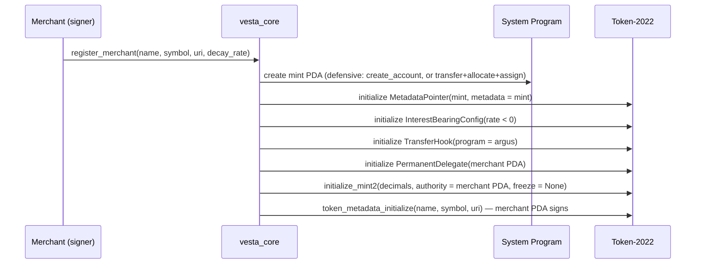

# VESTA — On-Chain Technical Specification

> Engineering spec for `vesta_core` and `argus`. Single source of truth for phases 1–4.
> Every load-bearing claim was adversarially fact-checked by a six-dimension verification
> pass against spl-token-2022 / transfer-hook / anchor 1.1.2 / litesvm sources; see the
> verification log in §12. Claims marked `[R2]` are queued for the second verification round.

- Status: **v2 — fact-check round 1 applied (43 findings), round 2 pending**
- Deployed (devnet): `vesta_core` `Am2X4B1SCnJKXL8Yir2j6yGpHAKrmwcf2E5aKnA9BZV` · `argus` `CrzLCMSQ1pWTuLXBomoLn6eAB1c1gLsw5x9sBeuyBNKt`
- Upgrade authority: `JC2b9dnqMge1pGAoM1VGg416vmvy6xiLfep6oNJFAWsQ` (owner wallet)
- Toolchain: Rust 1.89 (pinned) · Solana CLI 4.1.1 (Agave) · Anchor 1.1.2 · LiteSVM 0.10

---

## 0. Scope and current state

Implemented today: `init_config` (Config PDA) with LiteSVM tests; `argus` is a deployable
placeholder. Note: the deployed `Config` predates this spec — it lacks `pending_admin`,
so phase 1 starts with a state migration (redeploy + `init_config` v2 on a fresh PDA
version or in-place upgrade; devnet, so a clean redeploy is acceptable).

| Phase | Deliverable |
|---|---|
| 1 | `set_admin`/`accept_admin`, `set_paused`, `register_merchant`, `earn_points` (flat rate), `create_offer`/`close_offer`, `redeem_offer` + `Receipt` |
| 2 | `argus`: `initialize_transfer_guard` (ExtraAccountMetaList) + `execute` policy; peer gifting happens via plain hooked `transfer_checked` — no dedicated vesta_core instruction |
| 3 | earn extensions: streaks, tiers, campaign multiplier; `create_campaign`/`close_campaign`, `create_achievement`, `grant_achievement` (kleos + receipt) |
| 4 | `create_alliance`, `join_alliance`, `set_swap_rate`, `swap_points` (budget-capped), `clawback` |

Non-goals (stretch, tracked separately): cNFT tessera vouchers via Bubblegum, gasless
relayer, per-POS nonce registry.

---

## 1. System overview

Two programs, one token standard:

- **`vesta_core`** owns all protocol state (merchants, customers, offers, alliances,
  achievements) and performs every mint CPI (signed by the merchant PDA, the mint
  authority). Burns are signed by the token owner (customer).
- **`argus`** implements the SPL transfer-hook interface. Token-2022 invokes it on **every
  transfer** of a point mint (including permanent-delegate transfers). Mint/burn do **not**
  trigger transfer hooks — so earn/redeem/swap are governed by `vesta_core` logic, while
  free-floating transfers are governed by `argus`.



Ordering constraints (verified against token-2022 sources):
1. All mint-extension initializations run **after account creation, before
   `initialize_mint2`**.
2. The `TokenMetadata` TLV is written **after** mint initialization and **requires the
   mint authority as signer** — therefore always before any authority revocation.
3. The mint account must be pre-funded to remain rent-exempt after the metadata realloc.

---

## 2. Account model (`vesta_core`)

All PDAs use canonical bumps stored on the account. Sizes are `8 + InitSpace`.

| Account | Seeds | Fields (type) | Purpose |
|---|---|---|---|
| `Config` | `["config"]` | admin `Pubkey`, pending_admin `Option<Pubkey>`, paused `bool`, bump `u8` | protocol admin, pause |
| `Merchant` | `["merchant", authority]` | authority `Pubkey`, point_mint `Pubkey`, treasury `Pubkey`, name `String(32)`, decay_rate_bps `i16`, base_earn_rate `u64`, lifetime_points_issued `u128`, customer_count `u64`, joined_alliance `Option<Pubkey>`, bump `u8`, mint_bump `u8` | one per merchant |
| `CustomerProfile` | `["customer", merchant, wallet]` | wallet `Pubkey`, merchant `Pubkey`, streak_days `u16`, last_visit_day `u32`, lifetime_earned `u64`, tier `u8`, bump `u8` | per merchant-customer pair |
| `Campaign` | `["campaign", merchant, id_le]` | id `u64`, multiplier_bps `u16`, starts_at `i64`, ends_at `i64`, active `bool`, bump `u8` | earn multipliers (phase 3) |
| `Offer` | `["offer", merchant, id_le]` | id `u64`, price_points `u64` (UI points ×10²), supply_remaining `u32`, active `bool`, bump `u8` | redemption catalog |
| `Receipt` | `["receipt", offer, customer, redemption_index_le]` | offer `Pubkey`, customer `Pubkey`, redeemed_at `i64`, bump `u8` | phase-1 voucher; rent paid by customer, closable by customer after fulfillment (lamports back to customer) |
| `Alliance` | `["alliance", id_le]` | id `u64`, authority `Pubkey`, name `String(32)`, member_count `u16`, bump `u8` | koinon root |
| `AllianceMember` | `["member", alliance, merchant]` | alliance `Pubkey`, merchant `Pubkey`, rate_bps_to_alliance `u32`, swap_in_budget_raw `u64`, swapped_in_today `u64`, budget_day `u32`, active `bool`, bump `u8` | membership, normalized rate, inbound-swap risk budget |
| `Achievement` | `["achieve", merchant, id_le]` | id `u64`, name `String(32)`, uri `String(128)`, threshold_lifetime `u64`, badge_count `u32`, bump `u8` | kleos definition |
| `KleosReceipt` | `["kleos", achievement, customer]` | granted_at `i64`, bump `u8` | double-grant guard that survives a holder-side badge burn |

Mint PDAs (owned by Token-2022 after creation):
- point mint — seeds `["mint", merchant]`
- badge mint — seeds `["badge", achievement, customer]`

Signing model (explicit, because it is easy to get wrong): the **mint PDA seeds sign only
the account-creation CPI** (the new account must sign). All `mint_to` CPIs are signed by
the **merchant PDA** (`["merchant", authority]`) — the mint authority. Burns are signed by
the token-account **owner** (customer). Clawback `transfer_checked` is signed by the
merchant PDA as permanent delegate.

`treasury` is defined as `ATA(merchant authority wallet, point_mint)` and stored on
`Merchant` at registration; argus receives it as a literal meta (see §4).

Swap rates are stored as **rate to a virtual alliance unit** (`rate_bps_to_alliance`); a
pairwise A→B rate is `rate_A / rate_B`. O(1) membership instead of O(n²) pair rates.

---

## 3. Instruction reference (`vesta_core`)

Common validation for every state-mutating instruction: `!config.paused`; all PDAs
verified via seeds + stored bump; all arithmetic checked (`checked_*` / `u128`
intermediates); the token program account is declared as `Program<'info, Token2022>` —
note that `Interface<TokenInterface>` alone accepts classic SPL Token too (its `IDS`
contains both program ids), so Token-2022 exclusivity is enforced by this explicit
program type plus `mint::token_program` constraints, not by the interface types.

### 3.1 Admin (phase 1)

- `init_config()` — once; `admin = signer`, `pending_admin = None`.
- `set_admin(new_admin: Pubkey)` — admin-only; writes `pending_admin`.
- `accept_admin()` — `pending_admin` signs; swaps and clears. Two-step transfer.
- `set_paused(paused: bool)` — admin-only circuit breaker. Pause blocks vesta_core state
  mutations; it deliberately does **not** affect token transfers (argus policy is
  pause-independent so clawback/treasury flows can never be bricked by a pause).

### 3.2 `register_merchant(args)` (phase 1)

Args: `name: String(≤32)`, `symbol: String(≤10)`, `uri: String(≤200)`,
`decay_rate_bps: i16 (−10_000..=0)`, `base_earn_rate: u64 (>0)`, `decimals: u8 (=2)`.

Accounts (6): authority (signer, mut), `Merchant` (init), mint PDA (mut), `Config`,
`Program<Token2022>`, system program.

Steps (single transaction; CU measured in tests, budget requested client-side):
1. **Defensive creation** of the mint PDA (the address is publicly predictable, so a
   1-lamport donation must not brick registration — bare `create_account` fails on any
   pre-funded address): if `lamports == 0` → `create_account`; else → `transfer` (top up
   to rent-exempt target), `allocate(space)`, `assign(Token-2022)` — all signed with the
   mint PDA seeds. Space = `ExtensionType::try_calculate_account_len::<Mint>(&[MetadataPointer, InterestBearingConfig, TransferHook, PermanentDelegate])`;
   lamports = rent for that space **plus** the future metadata TLV bytes.
2. CPI `metadata_pointer_initialize(metadata_address = mint)`.
3. CPI `interest_bearing_mint_initialize(rate_authority = merchant PDA, rate = decay_rate_bps)`.
4. CPI `transfer_hook_initialize(authority = merchant PDA, program_id = argus)`.
5. CPI `permanent_delegate_initialize(delegate = merchant PDA)`.
6. CPI `initialize_mint2(decimals, mint_authority = merchant PDA, freeze_authority = None)`.
7. CPI `token_metadata_initialize(name, symbol, uri)` — merchant PDA signs as mint authority.
8. Write `Merchant` fields, including `treasury = ATA(authority, mint)` (derived, stored).

Freeze authority is deliberately `None`: the protocol cannot freeze customer accounts
wholesale; clawback is scoped to the audited permanent-delegate transfer path.

Transfer-hook authority hardening `[R2]`: after `initialize_transfer_guard` (phase 2)
succeeds for the mint, vesta_core sets the mint's transfer-hook authority to `None` so no
future actor — including the merchant — can repoint the hook to a no-op program. The
interest-bearing rate authority remains the merchant PDA; if a rate-update instruction
ever ships, it must re-validate the registration range (−10_000..=0).

Failure modes to test: re-registration; pre-funded mint address (griefing); oversized
strings; positive decay rate; classic-token program substitution.

### 3.3 `earn_points(amount_base: u64, visit_day: u32)` (phase 1; steps marked P3 land in phase 3)

Signers: **merchant authority** (mandatory — the POS approves the earn). Customer wallet
is not required to sign (one-tap QR flow).

Accounts: merchant authority (signer), `Merchant`, `CustomerProfile` (init_if_needed),
customer wallet (SystemAccount), customer ATA (init_if_needed,
`associated_token::authority = customer`, `associated_token::mint = point_mint`),
mint PDA (mut), `Config`, `Program<Token2022>`, ATA program, system program,
optional `Campaign` (P3; validated via seeds + window if supplied).

Logic:
1. `unix_day = clock.unix_timestamp / 86_400`; require `visit_day == unix_day` (rejects
   stale/replayed POS payloads). Note: UTC day boundaries — a 23:50/00:10 pair counts as
   two visits; acceptable for the challenge, documented for judges.
2. (P3) Streak: `+1` if `last_visit_day + 1 == unix_day`; unchanged if same-day; reset to
   1 otherwise.
3. (P3) Multiplier: `10_000 + min(streak_days, 30) * 200`, capped at `16_000` bps; plus
   the supplied active campaign's `multiplier_bps` (the program applies *the supplied*
   campaign — it cannot claim "best" on-chain).
4. `minted = amount_base * base_earn_rate (* multiplier_bps / 10_000)` — u128
   intermediates, u64 overflow check. Phase 1 uses the flat product only.
5. Per-earn cap: `minted <= MAX_EARN_PER_TX` (protocol constant) — bounds fat-finger and
   self-dealing blast radius; the systemic self-mint risk is handled at the swap boundary
   (§3.6), since a merchant inflating their own mint only dilutes themselves until points
   try to cross into another merchant's economy.
6. CPI `mint_to` (merchant PDA signs) to customer ATA.
7. Update `lifetime_earned`, `lifetime_points_issued`; (P3) auto-tier at
   `[0, 1_000, 10_000, 100_000]` → tier 0–3. Emit `PointsEarned`.

### 3.4 `create_offer` / `close_offer` / `redeem_offer` (phase 1)

`create_offer(id, price_points, supply)` — merchant-only. `price_points` is denominated
in **UI points ×10²** (post-decay purchasing power, two implied decimals — same scale the
customer sees in a wallet).

`close_offer(id)` — merchant-only; requires `!active || supply_remaining == 0` is NOT
required — merchant may close anytime; rent returns to merchant. Emits `OfferClosed`.

`redeem_offer(id, redemption_index: u64, max_raw_amount: u64)`:
1. Offer active, `supply_remaining > 0`; constraints: burned mint == `merchant.point_mint`,
   `offer.merchant == merchant` (seed-bound), receipt PDA derived from
   `(offer, customer, redemption_index)` where the index equals the customer's prior
   redemption count for the offer (prevents receipt collisions).
2. Convert the UI price to the raw burn amount **on-chain**: format `price_points` as a
   decimal string (integer math, two decimals), CPI Token-2022
   `ui_amount_to_amount(mint, price_str)` and read the `u64` from return data. Require
   `raw_needed <= max_raw_amount` (customer's slippage bound — decay ticks between quote
   and execution). `[R2]`
3. CPI `burn(raw_needed)` from customer ATA — customer signs.
4. `supply_remaining -= 1`; init `Receipt`; emit `OfferRedeemed`.

### 3.5 Gamification (phase 3)

- `create_campaign(id, multiplier_bps ≤ 20_000, starts_at < ends_at)` / `close_campaign` —
  merchant-only; closable, rent to merchant.
- `create_achievement(id, name, uri, threshold_lifetime)` — merchant-only.
- `grant_achievement()` — **merchant-signed** (not permissionless: unsolicited badge/ATA
  spam is griefing; merchants grant as part of their flow). Requirements:
  `customer_profile.lifetime_earned >= threshold` and `KleosReceipt` does not exist (the
  receipt — not the ATA — is the double-grant guard, because a holder can burn the badge:
  NonTransferable blocks transfers for everyone, but the **holder can still burn and
  close the ATA**, so "supply frozen at 1" is really "supply can never increase").
  Steps: defensive-create badge mint PDA; init extensions
  (`NonTransferable` **before** `initialize_mint2`, `MetadataPointer`); `initialize_mint2`
  (authority = merchant PDA, decimals 0); `token_metadata_initialize` (**before** any
  authority revocation — metadata init requires the mint-authority signature and becomes
  permanently impossible after revocation); create customer ATA (Token-2022 ATAs
  auto-initialize `ImmutableOwner`); `mint_to(1)`; `set_authority(MintTokens → None)`
  (irreversible; later re-set attempts fail with `TokenError::FixedSupply`); init
  `KleosReceipt`; emit `AchievementGranted`.

### 3.6 Koinon (phase 4)

- `create_alliance(id, name)` — any merchant; creator becomes alliance authority.
  Governance honesty: the authority is a single key; for real deployments it should be a
  multisig/DAO — documented, not enforced on-chain in this challenge.
- `join_alliance(rate_bps_to_alliance, swap_in_budget_raw)` — merchant opts in; alliance
  authority co-signs (handshake). The member sets their own **inbound swap budget** —
  the maximum raw amount of their points mintable via swaps per UTC day.
- `set_swap_rate(new_rate)` / `set_swap_budget(new_budget)` — member-signed; rate changes
  additionally require the alliance-authority co-sign (anti-manipulation).
- `swap_points(amount_raw_a, min_out_b)`:
  1. Both `AllianceMember` accounts belong to the **same** `Alliance` (identical alliance
     key in seeds), each bound to its own merchant and `merchant.point_mint` (explicit
     constraint — prevents cross-alliance or mismatched-mint substitution).
  2. `out_b = amount_raw_a * rate_a / rate_b` (u128, floor); require `out_b >= min_out_b`.
  3. **Budget check (the koinon risk boundary)**: roll `budget_day`/`swapped_in_today` by
     unix_day; require `swapped_in_today + out_b <= swap_in_budget_raw` for member B.
     This bounds the "malicious merchant mints their own points and drains a partner"
     attack to B's self-chosen daily exposure.
  4. CPI `burn(amount_raw_a)` from customer's mint-A ATA (customer signs).
  5. CPI `mint_to(out_b)` to customer's mint-B ATA (merchant-B PDA signs).
  Atomic — both CPIs in one instruction. Alliances should standardize `decay_rate_bps`
  across members so raw amounts are comparable; recorded as a governance guideline (the
  earlier idea of an on-chain "warning event" is dropped — a mismatch is visible off-chain
  and an event adds state-free noise).

### 3.7 `clawback(amount_raw: u64, reason_code: u16)` (phase 4)

Merchant-only, via **PermanentDelegate**: CPI `transfer_checked` from the customer ATA to
the merchant `treasury` (destination constrained to `merchant.treasury`), merchant PDA
signs as delegate. Because it is a transfer, **argus fires and audits it**. vesta_core
never exercises the permanent delegate's *burn* capability (burns bypass hooks) — this is
a code-review invariant, stated here so reviewers check for it.

Honest disclosure (also for the README): a permanent delegate makes points
**issuer-revocable in full** — the merchant can claw back any holder's entire balance of
their own mint. Events (`Clawback { reason_code }`) provide auditability, not prevention.
This is an accepted, disclosed tradeoff for merchant fraud/refund handling in a loyalty
context; a per-epoch clawback cap or dispute-flag timelock is documented future work.

---

## 4. `argus` — transfer hook program

### 4.1 Interface compliance

- `execute(amount)` implemented with the interface discriminator:
  `#[instruction(discriminator = ExecuteInstruction::SPL_DISCRIMINATOR_SLICE)]` with
  `use spl_discriminator::SplDiscriminate;` in scope — this exact pattern is used by
  Anchor 1.1.2's own transfer-hook test. (There is no `interface-instructions` feature in
  Anchor 1.x; custom discriminators replaced it.)
- `initialize_transfer_guard(mint)` — **strictly authorized** (the ExtraAccountMetaList
  PDA is init-once; an attacker initializing it first could void the gift cap or brick
  every transfer of the mint permanently). Authorization: merchant authority wallet signs;
  the instruction receives the `Merchant` account, verifies `owner == vesta_core`,
  re-derives the PDA from `["merchant", authority]` under vesta_core's program id
  (hardcoded const), and checks `merchant.point_mint == mint`. Writes the meta list and
  the literal metas (treasury). Emits `TransferGuardInitialized`.
- ExtraAccountMetaList PDA: seeds `["extra-account-metas", mint]` under argus.
- **Fail-closed guarantee**: Token-2022's `invoke_execute` does not itself error when the
  meta-list account is missing from the transfer — it CPIs the hook with only the four
  base accounts. argus therefore hard-requires its extra accounts in the `Execute`
  context; a client that omits them fails account resolution and the whole transfer
  aborts. Omitting extras can never bypass policy.

### 4.2 Execute-time facts the design relies on (verified)

1. The hook fires on `transfer_checked` / `transfer_checked_with_fee`, **including
   permanent-delegate transfers** (the delegate arrives as the authority account), and
   never on mint/burn.
2. Accounts arrive **privilege-de-escalated**: source, mint, destination, authority are
   read-only non-signers from the hook's perspective.
3. Hook-owned extra accounts **can be writable** (`ExtraAccountMeta` `is_writable = true`)
   — required for the `GiftLedger`.
4. Extra metas can be derived from **account data** of transfer accounts:
   - `Seed::AccountData { account_index: 0 (source), data_index: 32, length: 32 }` — the
     source token account's owner field — used for the ledger seeds. Deriving from the
     **authority** account (index 3) instead would let a customer mint fresh ledgers by
     approving delegates; the source-owner field is delegation-proof.
   - `ExtraAccountMeta::new_with_pubkey_data(PubkeyData::AccountData { account_index: 2 (destination), data_index: 32 })`
     — dereferences the destination owner **wallet** so the hook can inspect which program
     owns it. `[R2]`
5. Reentrant token CPIs on the transferring accounts are not allowed during execute.

### 4.3 Policy v2

Accounts in `execute`: source, mint, destination, authority, meta-list, then extras:
`GiftLedger` (writable; seeds `["ledger", mint, source_owner]` via AccountData seed),
`destination_owner_wallet` (read; via PubkeyData), `treasury` (read; literal, written at
guard init).

argus account table:

| Account | Seeds | Fields | Notes |
|---|---|---|---|
| `GiftLedger` | `["ledger", mint, source_owner]` | day `u32`, gifted_today `u64`, bump `u8` | created lazily on first peer transfer; rent paid by transfer fee payer `[R2 — creation inside a hook needs a writable+funded path; if infeasible, pre-create in a one-time `open_gift_ledger` ix]` |
| `ExtraAccountMetaList` | `["extra-account-metas", mint]` | interface-defined | init-once, guarded |

Rules, in order:
1. `authority == permanent delegate of the mint` (read from the mint account's
   `PermanentDelegate` extension TLV — the mint is always account #1; no extra meta
   needed) → **allow** (clawback / merchant treasury ops). Emits `ClawbackObserved`.
2. `destination == treasury` (literal meta) → **allow** (customer→merchant payment flows).
3. Otherwise — peer transfer:
   a. `destination_owner_wallet.owner != system_program` → **reject**
      `GuardError::ProgramOwnedDestination` (blocks DEX/pool deposits). `[R2]`
   b. Daily cap: roll ledger by unix_day; require
      `gifted_today + amount <= DAILY_GIFT_CAP_RAW`; update ledger → **allow**, emit
      `PointsGifted`.

Defense-in-depth note: rule 3b is the load-bearing guarantee; rule 3a is an additional
filter. Even if 3a were removed, every non-merchant flow — including a pool deposit — is
rate-limited by the cap.

**Honest limitation (documented, by design):** the cap is per `(mint, source-owner)`.
A determined user can split balances across N wallets or relay through intermediaries for
N× the cap. Without on-chain identity this is inherent; the cap is a velocity limit on a
wallet, not a Sybil-proof aggregate. Loyalty-point value outside the ecosystem is already
bounded by rules 2–3a.

### 4.4 Client implications

Off-chain transfers must append hook accounts — spl-token's
`createTransferCheckedWithTransferHookInstruction` resolves extras automatically
(document in SDK). On-chain, the only transferring CPI is `clawback`, which passes the
resolved extras explicitly.

---

## 5. Decay economics (InterestBearingConfig)

- Rate is `i16` basis points, continuously compounded; default `−2_000` (−20%/yr).
- **Display-time semantics**: raw amounts never change; `amount_to_ui_amount` applies
  `exp(rate·t)` scaling. Customer-facing balances and offer prices are denominated in UI
  points (×10²); raw amounts are internal.
- On-chain conversions go through Token-2022's `amount_to_ui_amount` /
  `ui_amount_to_amount` instructions (CPI + return data) — no float math re-implemented
  in-program, always consistent with wallet displays. vesta_core formats `u64 → "12.34"`
  strings with integer math only.
- Per-account decay freezing is impossible with a mint-level rate — by design; streak
  multipliers on earn are the per-user compensator. README tradeoff.
- Rate updates (if ever shipped) use anchor-spl's `interest_bearing_mint_update_rate`
  and must re-validate the `−10_000..=0` range.

---

## 6. Security model

### 6.1 Authority matrix

| Capability | Holder | Notes |
|---|---|---|
| Program upgrade | owner wallet (NuFi) | both programs |
| Config admin | dev key → owner wallet after two-step transfer | `set_admin`/`accept_admin` |
| Mint authority (points) | **merchant PDA** `["merchant", authority]` | signs all mint_to CPIs |
| Mint account creation | mint PDA seeds `["mint", merchant]` | creation signature only |
| Rate authority | merchant PDA | range re-validated on any update path |
| Permanent delegate | merchant PDA | clawback transfers only; burn capability never exercised (code-review invariant) |
| Transfer-hook authority | merchant PDA → **None** after guard init `[R2]` | prevents hook repointing |
| Badge mint authority | none (revoked after metadata init) | supply can never increase |

### 6.2 Threats and mitigations

- **Mint-PDA creation griefing** (1-lamport donation to the predictable address) →
  defensive create (transfer/allocate/assign fallback), §3.2 step 1.
- **Koinon self-mint drain** (merchant mints own points, swaps into partner's) → per-member
  daily `swap_in_budget_raw` chosen by the exposed merchant; alliance-authority handshake
  on join and rate changes; per-earn cap bounds blast radius; multisig authority
  recommended off-chain.
- **EAML front-run / init DoS** → `initialize_transfer_guard` authorization chain (§4.1).
- **Gift-cap bypass via delegated transfers** → ledger seeded from the source token
  account's *owner data*, not the authority account.
- **Gift-cap Sybil bypass** → documented as inherent; cap is per-wallet velocity control.
- **Replay of earn payloads** → merchant signer + same-day assertion + monotonic
  `last_visit_day`; per-POS nonce registry listed as stretch hardening.
- **Arithmetic overflow** → `overflow-checks = true` for **all** profiles (extend the
  current release-only setting), `checked_*`/u128, capped multipliers/rates.
- **Value substitution** → explicit bindings: redeem burns `merchant.point_mint` and
  `offer.merchant == merchant`; swap requires same-alliance members each bound to their
  own mint; clawback destination == `merchant.treasury`.
- **Wrong token program substitution** → `Program<'info, Token2022>` (interface types
  alone accept classic SPL Token — insufficient).
- **Decay quote drift** → `max_raw_amount` / `min_out_b` user bounds.
- **Clawback abuse** → fully disclosed issuer-revocability (§3.7); hook-audited transfer
  path only; reason-coded events.
- **Hook bypass** → extension lives on the mint (transfers can't skip it); omitted extras
  fail closed (§4.1); mint/burn paths are vesta_core-gated.
- **init_if_needed re-init** → Anchor guards; profile fields only move monotonically.
- **Rent farming via close** → closable accounts: `Offer`, `Campaign` (merchant-signed,
  rent to merchant), `Receipt` (customer-signed post-fulfillment, rent to customer).
  Nothing else is closable.
- **Pause semantics** → pause blocks vesta_core mutations only; transfers (argus) are
  pause-independent so merchant ops can't be bricked; unpause admin-only.

### 6.3 Program hygiene

`overflow-checks = true` in all workspace profiles; clippy `-D warnings` in CI; no
`unsafe`; named errors everywhere; events on every user-facing state mutation;
reproducible build via `solana-verify build` + `solana-verify verify-from-repo` before
submission (commands in §11).

---

## 7. Testing strategy

### 7.1 LiteSVM (unit/integration, runs in CI)

**LiteSVM 0.10 bundles the SPL programs we need by default** — `LiteSVM::new()` preloads
spl-token, **spl-token-2022 (v10 build, all extensions used here included)**, ATA, memo,
and more. Tests therefore only `add_program` our two freshly built `.so`s; no fixture
dumping is needed for phases 1–4 (Bubblegum, if the stretch lands, is the only dump).

Time travel: `warp_to_slot` **only changes the slot, not the timestamp** — decay and
streak tests must mutate the Clock sysvar instead:
`let mut clock: Clock = svm.get_sysvar(); clock.unix_timestamp += N; svm.set_sysvar(&clock);`

Per instruction: happy path + every failure mode from §3–§4. Adversarial suite (minimum):

- register: duplicate merchant; **pre-funded mint PDA (griefing path exercises
  transfer/allocate/assign)**; oversized strings; positive rate; classic-token program.
- earn: replayed `visit_day`; same-day repeat (streak unchanged, P3); forged merchant
  signer; paused; per-tx cap boundary.
- redeem: expired/empty offer; `max_raw_amount` exceeded after `set_sysvar` time-warp
  (assert raw_needed grows as UI value decays); receipt index reuse.
- hook/gift: cap boundary (exact cap passes, +1 fails); ledger day rollover; delegated
  transfer uses source-owner ledger (delegate cannot mint a fresh ledger); omitted extra
  accounts abort the transfer (fail-closed); program-owned destination rejected `[R2]`;
  permanent-delegate transfer allowed + observed.
- swap: non-members; cross-alliance substitution; mismatched member/mint; stale
  `min_out_b`; **swap_in budget exact boundary and day rollover**; u128 edges.
- badges: double-grant blocked by `KleosReceipt` **even after the holder burns the badge
  and closes the ATA**; badge transfer fails (`TokenError::NonTransferable`); metadata
  present before authority revocation.
- admin: two-step transfer; non-pending accept; pause blocks earn but not transfers.

### 7.2 Devnet e2e

Scripted (`scripts/e2e-devnet.ts`): register café + bookstore, earn, gift within cap,
fail beyond cap, alliance + swap within budget, redeem, grant badge — each step printing
an explorer link. Links go into the README (mandatory) and double as the judge demo.

### 7.3 Budget

CU per instruction from `transaction meta compute_units_consumed`; `register_merchant`
asserted < 400k CU (6 accounts, 7 CPIs incl. metadata realloc), all others < 200k.
Transaction-size assertions under the 1232-byte packet limit.

---

## 8. Events (with fields)

| Event | Fields |
|---|---|
| `ConfigInitialized` | admin |
| `AdminProposed` / `AdminChanged` | old, new |
| `Paused` | paused |
| `MerchantRegistered` | merchant, mint, name, decay_rate_bps |
| `PointsEarned` | merchant, customer, base, minted, multiplier_bps, streak_days |
| `OfferCreated` / `OfferClosed` | merchant, offer_id, price_points, supply |
| `OfferRedeemed` | offer, customer, raw_burned, receipt |
| `PointsGifted` (argus) | mint, source_owner, destination, amount, gifted_today |
| `ClawbackObserved` (argus) | mint, source_owner, amount |
| `Clawback` | merchant, customer, amount_raw, reason_code |
| `TransferGuardInitialized` (argus) | mint, merchant |
| `CampaignCreated` / `CampaignClosed` | merchant, id, multiplier_bps, window |
| `AchievementCreated` | merchant, id, threshold |
| `AchievementGranted` | achievement, customer, badge_mint |
| `AllianceCreated` / `AllianceJoined` | alliance, merchant, rate_bps, swap_in_budget |
| `SwapRateSet` / `SwapBudgetSet` | member, old, new |
| `PointsSwapped` | customer, merchant_a, merchant_b, raw_in, raw_out |

Anchor `emit!` (log-based) for phases 1–4; `emit_cpi!` upgrade if indexer reliability
demands it.

---

## 9. Errors

`VestaError` (vesta_core) and `GuardError` (argus); every `require!` uses a named
variant; explorer-readable messages for every user-reachable failure.

---

## 10. Dependencies (fact-checked against anchor-spl 1.1.2)

```toml
# vesta-core
[dependencies]
anchor-lang = { version = "1.1.2", features = ["init-if-needed"] }
anchor-spl = "1.1.2"   # token_2022_extensions is a default feature; do NOT add "metadata"
                       # (that feature pulls Metaplex mpl-token-metadata, unrelated to T22 TLV metadata)

[features]
idl-build = ["anchor-lang/idl-build", "anchor-spl/idl-build"]  # required or `anchor build` IDL gen fails

# argus
[dependencies]
anchor-lang = "1.1.2"
spl-discriminator = "*"            # SplDiscriminate trait for the execute discriminator
spl-transfer-hook-interface = "*"  # ExecuteInstruction, instruction types
spl-tlv-account-resolution = "*"   # ExtraAccountMeta, Seed::AccountData, PubkeyData
# pin exact versions at implementation start from `cargo tree` against anchor-spl 1.1.2's
# resolved graph (anchor-spl depends on spl-token-2022-interface ^2 — do NOT add the
# legacy spl-token-2022 program crate; it invites duplicate-type conflicts)
```

---

## 11. Delivery checklist (definition of done, per phase)

- [ ] All instructions implemented per §3–§4 with events and named errors
- [ ] LiteSVM suite green incl. the §7.1 adversarial list; clippy `-D warnings`; fmt
- [ ] CU/tx-size assertions in tests
- [ ] `overflow-checks = true` extended to all profiles
- [ ] Devnet deploy + `anchor keys sync`; IDL republished on-chain
- [ ] e2e script run; explorer links captured into README
- [ ] Reproducible build: `solana-verify build` → `solana-verify verify-from-repo -um --program-id <ID> <repo-url>` output published in README
- [ ] README architecture section updated (concept → Solana enablement → tradeoffs → links)
- [ ] `set_admin` → `accept_admin` executed; Config admin = owner wallet

---

## 12. Verification log — round 1 (43 findings applied)

Six adversarial verifier agents (dimensions: token-2022 lifecycle, anchor-spl 1.1.2,
transfer-hook interface, LiteSVM, security, internal consistency) checked the v1 draft
against docs.rs, solana.com guides, agave/token-2022/anchor sources and local vendored
crates. All 43 non-`correct` findings were applied in v2:

| # | Area | What changed |
|---|---|---|
| 1 | create_account griefing | defensive create pattern (transfer/allocate/assign) — §3.2.1 |
| 2 | signing model | mint PDA signs creation only; merchant PDA is mint authority; burns owner-signed — §2, §6.1 (three-way v1 contradiction resolved) |
| 3 | naming | `interest_bearing_mint_update_rate` (v1 name didn't exist) — §5 |
| 4 | badges | holder-burn reality; `KleosReceipt` as double-grant guard; metadata **before** authority revoke; NonTransferable before init_mint; ATA ImmutableOwner — §3.5 |
| 5 | anchor-spl features | dropped `metadata` (it's Metaplex); default features suffice — §10 |
| 6 | token program pinning | `Interface<TokenInterface>` accepts classic token → explicit `Program<Token2022>` — §3, §6.2 |
| 7 | discriminator | `#[instruction(discriminator = ExecuteInstruction::SPL_DISCRIMINATOR_SLICE)]` confirmed; `interface-instructions` feature doesn't exist in 1.x — §4.1 |
| 8 | deps | anchor-spl 1.1.2 uses spl-token-2022-interface ^2; legacy program crate dropped; `idl-build` wiring added — §10 |
| 9 | clawback path | PD burn never fires hooks → burn-never-exercised invariant stated — §3.7, §6.1 |
| 10 | Merchant meta unresolvable | dropped from extras; permanent delegate read from mint TLV (account #1) — §4.3 rule 1 |
| 11 | dest-owner check | v1 mechanism unimplementable; v2: PubkeyData::AccountData dereference `[R2]` + destination-agnostic cap as the load-bearing rule — §4.3 |
| 12 | fail-closed | invoke_execute doesn't require the meta list; argus hard-requires extras — §4.1 |
| 13 | LiteSVM | **bundles** token-2022 v10/ATA/memo (v1 said it doesn't); fixture dumping removed — §7.1 |
| 14 | clock | warp_to_slot doesn't advance unix_timestamp → get_sysvar/set_sysvar Clock — §7.1 |
| 15 | koinon economics | self-mint drain exploit → per-member daily `swap_in_budget_raw` + per-earn cap + governance disclosure — §3.6, §6.2 |
| 16 | EAML init DoS | `initialize_transfer_guard` authorization chain — §4.1 |
| 17 | GiftLedger seeds | derived from source token-account owner data (delegation-proof), not authority — §4.2.4, §6.2 |
| 18 | Sybil honesty | per-wallet velocity framing, explicit limitation — §4.3 |
| 19 | clawback disclosure | issuer-revocability stated plainly; reason_code arg added — §3.7 |
| 20 | pause semantics | transfers pause-independent; Config dropped from argus metas — §3.1, §4.3, §6.2 |
| 21 | authority hardening | transfer-hook authority → None after guard init; rate-range revalidation — §3.2, §6.1 |
| 22 | binding constraints | redeem/swap/clawback account bindings made explicit — §3.4, §3.6, §3.7, §6.2 |
| 23 | grant_achievement | merchant-signed (was permissionless griefing vector) — §3.5 |
| 24–43 | consistency | mint-authority contradiction; gift_points row reworded; treasury defined (field + literal meta); events completed with fields; Receipt/KleosReceipt/GiftLedger added to account model; phase re-scoping (P3 annotations, set_paused in phase 1); Campaign in earn accounts; account-count claims aligned (6); close_offer/close_campaign specified; clawback reason_code sourced; §6.1 wording fixed; draft artifact removed; status line updated |

Round 2 (`[R2]` markers) re-verifies: pubkey-data extra metas availability in the pinned
spl-tlv-account-resolution; hook-authority-set-to-None flow; ui_amount_to_amount return
data parsing; GiftLedger lazy creation inside a hook (writable+funding constraints).
