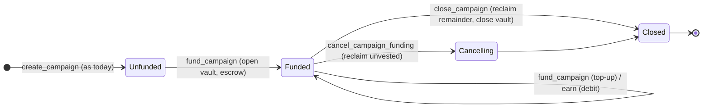

# 01 · Funded Campaign Vaults — "Thesauros"

> **Status:** Draft / Proposed · **Layer:** Foundation · **Depends on:** —
> **Unlocks:** 03 (Coalition Campaigns), 05 (Decay-Reward Mechanics)
> Inherits all [shared conventions](README.md#shared-conventions-normative-for-all-specs).

## 1. Summary

Make a campaign's budget **real escrowed inventory** instead of a notional
counter. A funded campaign owns a vault; every payout debits the vault inside the
same transaction as the earn, so **overspend and insolvency are structurally
impossible** — enforced by the vault balance, not by a field anyone can drift.
Budget can **stream** over the campaign window so a 90-day campaign is not fully
capital-committed on day one, and unspent/unvested budget is reclaimable.

This is the funding primitive that co-funded and cross-brand campaigns
(spec 03) and decay-reward pools (spec 05) draw from.

## 2. Motivation & current gap

Today `Campaign.points_budget` is a notional `u64` (`state.rs`); `points_spent`
is incremented by `saturating_add` in `earn_points_campaign`. Nothing is escrowed:

- A merchant can define a 1,000,000-point MULTIPLIER campaign backed by nothing
  and mint liability into the ecosystem.
- In a coalition, those points may be redeemed at another member's expense —
  unfunded issuance becomes a cross-brand credit risk (see spec 03).
- There is no clean deferred-liability accounting; "budget remaining" is a
  backend belief, not a fact a partner or auditor can verify.

Audit note: the L-5 fix already rejects structurally impossible quest budgets;
this spec makes the budget itself solvent.

## 3. Goals / Non-goals

**Goals**
- A campaign can be made **Funded**: budget escrowed in a program-owned vault.
- Payouts debit the vault atomically; exhaustion halts payouts (revert or
  documented clamp) — never silent over-issue.
- **Streaming release**: only the vested fraction of the budget is spendable at
  time `t`; the unvested remainder is reclaimable on cancel.
- Two backing modes: **PointInventory** (merchant escrows its own points) and
  **StableReserve** (merchant escrows a stablecoin representing the liability).
- Clean lifecycle: fund → (top-up) → spend → cancel/close → reclaim remainder.
- Backward compatible: **unfunded campaigns keep working** exactly as today.

**Non-goals**
- Co-funding by multiple members (spec 03).
- Cross-brand settlement of the escrowed liability (spec 03).
- Governance approval of funding (spec 02 provides it for alliance-scoped cases).

## 4. Design

### 4.1 The vault

A new account `CampaignVault`, one per funded campaign, owns a token account
(the "reserve"):

- **PointInventory backing:** the reserve is a Token-2022 account for the
  campaign's own point mint. `fund_campaign` mints (merchant PDA signs as mint
  authority, exactly as `earn_points`) `amount` points into the reserve. A payout
  is a **transfer** reserve → customer ATA.
- **StableReserve backing:** the reserve is a token account for a caller-declared
  stablecoin mint. `fund_campaign` transfers stable from the merchant. A payout
  still **mints** points to the customer (unchanged earn path) but only if the
  reserve covers `points × unit_value`; the stable stays escrowed as the
  settleable backing (consumed at settlement, spec 03; refunded as breakage on
  close).

The reserve token account authority is the `CampaignVault` PDA (program-owned);
no client key can move it.

### 4.2 Solvency by construction

- **PointInventory:** payout transfers `bonus` from the reserve. If the reserve
  holds `< bonus`, the transfer CPI fails → the earn reverts (strict) or the
  bonus is clamped to `reserve_balance` and the campaign flips `active=false`
  (best-effort, matching today's budget-clamp semantics). Policy chosen per
  campaign via `on_exhaust: Revert | ClampAndClose`.
- **StableReserve:** `required = ui_value_to_stable(bonus)`; if
  `reserve_balance < required` → same policy branch. The mint proceeds only when
  backed.

Because the bound is the *actual token balance*, there is no counter to trust and
no drift possible (removes the class of bug the L-5 fix patched around).

### 4.3 argus interaction (PointInventory payout)

A reserve→customer transfer is a peer transfer and would hit the argus hook.
Add a recognized **campaign-vault flow** to argus, analogous to the existing
treasury/issuer short-circuits in `execute.rs`:

> If the transfer `source` token account's owner is a `CampaignVault` PDA of the
> mint (re-derived and verified, owner program `vesta_core`), approve with
> `reason::CAMPAIGN_FLOW`. Transfer-context binding (H-1) still applies.

This keeps payouts free of gift caps/cooldowns while remaining fail-closed and
pinned. Alternatively (no argus change) fund campaigns as **StableReserve** and
keep the mint path; PointInventory is recommended for point-native single-brand
campaigns, StableReserve where hard value or cross-brand settlement is needed.

### 4.4 Streaming / vesting

`CampaignVault` stores `total_funded`, `spent`, `reclaimed`, and a linear vesting
curve over `[campaign.starts_at, campaign.ends_at]`:

```
vested(t)    = total_funded * clamp((t - start) / (end - start), 0, 1)   // floor
spendable(t) = vested(t).saturating_sub(spent)
```

A payout requires `bonus <= spendable(now)`. `cancel_campaign_funding` reclaims
`total_funded - spent - vested(now)`'s unvested portion immediately; `close`
reclaims everything unspent. All fixed-point, floored toward the protocol.

### 4.5 Lifecycle



## 5. Account model

New account (append-only; existing `Campaign` gains 3 fields — appended, layout
prefix unchanged):

```
CampaignVault  seeds = ["cvault", campaign]           // NEW prefix
  campaign        : Pubkey
  merchant        : Pubkey
  backing         : u8         // 0 = PointInventory, 1 = StableReserve
  reserve         : Pubkey     // token account (PDA-owned)
  backing_mint    : Pubkey     // point mint or stablecoin mint
  unit_value      : u64        // stable minor units per 1 UI point (StableReserve only)
  total_funded    : u64
  spent           : u64
  reclaimed       : u64
  on_exhaust      : u8         // 0 = Revert, 1 = ClampAndClose
  vesting         : u8         // 0 = Immediate, 1 = LinearOverWindow
  bump            : u8

Campaign (appended fields)
  + funded        : bool
  + funding_epoch : u64        // guards vault↔campaign rebinding across reuse (cf. M-3 created_slot)
```

Reserve token account PDA: `["cvault-reserve", campaign]`, authority =
`CampaignVault`.

## 6. Instruction surface

All merchant-signed. Owner-or-operator per the shared owner/operator rule; **only
the owner** may `cancel`/`close` (reclaims value).

### `fund_campaign(amount, backing, unit_value, on_exhaust, vesting)`
Accounts: `authority` (signer), `merchant` (PDA), `campaign` (mut, `has_one =
merchant`), `campaign_vault` (init_if_needed), `reserve` (init_if_needed token
acct), `backing_mint`, `funder_source` (mut — merchant point-mint authority path
for PointInventory, or merchant stable ATA for StableReserve), `config`,
token/ATA/system programs.
- PointInventory: mint `amount` points into `reserve` (merchant PDA signs).
- StableReserve: transfer `amount` stable from `funder_source` into `reserve`.
- Sets/increments `total_funded`; sets `campaign.funded = true`,
  `funding_epoch = Clock.slot` on first fund; validates `unit_value > 0` for
  StableReserve.

### `earn_points_campaign` (extended)
When `campaign.funded`:
- Compute `bonus` exactly as today (kind math, caps).
- Bind vault: `campaign_vault.campaign == campaign.key() &&
  campaign_vault_seedcheck`.
- Enforce `bonus <= spendable(now)`; apply `on_exhaust` policy.
- **PointInventory:** transfer `bonus` reserve → `customer_ata` (argus
  campaign-flow) instead of minting the bonus. Base (non-campaign) points mint as
  today.
- **StableReserve:** mint `bonus` as today; require reserve covers
  `ui_value_to_stable(bonus)` (accounting only — stable moves at settlement).
- `campaign_vault.spent += bonus`.
- New accounts added to the existing `EarnPointsCampaign` context:
  `campaign_vault`, `reserve` (+ argus extras on the PointInventory path). Guard
  the tx account count (§ Compute).

### `cancel_campaign_funding()`  *(owner-only)*
Reclaims the **unvested** remainder to the merchant (burn points / return stable),
leaves vested-but-unspent available; sets `campaign.active = false`.

### `close_campaign` (extended)  *(owner-only)*
Reclaims **all** unspent reserve (`total_funded - spent`), closes `reserve` and
`CampaignVault` (rent → authority). For PointInventory the reclaimed points are
**burned** (they were the merchant's own liability). Idempotent with the existing
close.

### `top_up_campaign(amount)` = `fund_campaign` on an already-funded campaign.

## 7. Math & limits

- Vesting/`spendable` per §4.4, all `checked_*`, floored.
- `unit_value` conversions reuse `util::ui_points_to_raw` semantics for the point
  side; stable side is integer minor units.
- Per-earn payout still respects the existing multiplier cap and
  `MAX_EARN_PER_TX`; funding does not raise those.
- `total_funded` bounded by `u64`; top-ups use `checked_add`.

## 8. Security considerations

- **Value conservation (invariant #4):** a funded PointInventory campaign can pay
  out at most `total_funded`; the reserve *is* the cap. StableReserve mints are
  bounded by escrowed stable / `unit_value`.
- **Pinned derivation (#3):** `earn_points_campaign` re-derives `CampaignVault`
  and `reserve`; argus re-derives the campaign-vault source before granting
  `CAMPAIGN_FLOW`.
- **Owner-only reclaim (M-1 doctrine):** operators may trigger funded payouts
  (earn) but never `cancel`/`close`/reclaim.
- **Reuse safety (M-3):** `funding_epoch` prevents a vault from a closed campaign
  id binding to a recreated one.
- **Pause (L-2):** `fund`/`earn` check `!config.paused && !merchant.paused`.
- **argus (H-1):** the new campaign-flow path asserts `transferring`.
- **Rounding:** all conversions floor toward the protocol; no user-favoring
  rounding.

## 9. Migration & compatibility

- `Campaign` gains 3 appended fields → `INIT_SPACE` grows; **new campaigns only**.
  Existing devnet campaigns predate this; ship behind a fresh deploy (devnet is
  disposable). No change to `Merchant`'s argus-read prefix.
- Unfunded path is the default and unchanged — zero behavior change for current
  usage.
- New argus `reason::CAMPAIGN_FLOW` + the campaign-vault short-circuit is additive
  and fail-closed.

## 10. Test plan (LiteSVM)

- Fund (both backings) → earn debits reserve → balances reconcile.
- Exhaustion: `Revert` reverts the earn; `ClampAndClose` clamps + deactivates.
- Vesting: payout beyond `spendable(now)` rejected; advances with `warp`.
- `cancel` reclaims exactly the unvested remainder; `close` burns/returns the rest
  and closes accounts.
- Authority: operator can earn, cannot cancel/close; non-owner rejected.
- argus: PointInventory payout passes the hook via `CAMPAIGN_FLOW`; a spoofed
  (non-vault) source is rejected; `transferring=false` direct call rejected.
- Reuse: close id N, recreate id N, fund again → old vault cannot bind.

## 11. Phased rollout

1. `CampaignVault` + `fund_campaign` + StableReserve accounting path (no argus
   change) + close/refund. *(smallest shippable, unlocks spec 03 settlement)*
2. PointInventory payout + argus `CAMPAIGN_FLOW`.
3. Streaming/vesting + `cancel_campaign_funding`.

## 12. Open questions

- PointInventory payout via transfer (argus change) vs. burn-from-reserve +
  mint-to-customer (no argus change, but double CPI)? Recommend the argus
  campaign-flow for cleanliness; decide before phase 2.
- Fractional funding calibrated to historical breakage (fund `< 100%` of face)?
  Deferred to spec 05's breakage reporting.
- Should `unit_value` be oracle-fed or governance-set? Governance-set for v1
  (spec 02), no oracle dependency.
