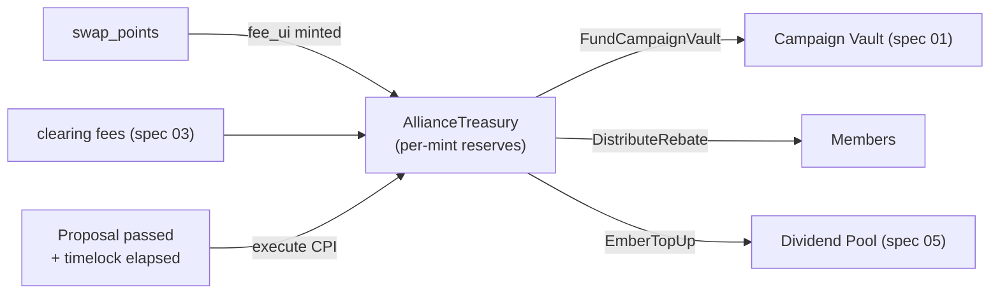

# 02 · Koinon Treasury & Governance — "Boule"

> **Status:** Draft / Proposed · **Layer:** Alliance core · **Depends on:** —
> **Unlocks:** 03 (funds coalition campaigns), 04, 05 (governs parameters)
> Inherits all [shared conventions](README.md#shared-conventions-normative-for-all-specs).

## 1. Summary

Give the alliance a **constitution and a purse**. The swap spread that is today
charged and **collected nowhere** flows into a program-owned **AllianceTreasury**.
Members get **scoped roles** and a **sybil-resistant, self-executing governance**
process (propose → vote → timelock → execute) whose vote weight comes from a
**soulbound** membership badge bound to an **aegis** legal-entity identity — so
voting power can't be bought, transferred, or wallet-farmed. Passed proposals
move treasury funds and change alliance parameters via the program's own CPI, with
no trusted operator in the loop.

This turns "a swap function pretending to be an organization" into an operating
cooperative that can fund coalition campaigns (spec 03), dividends (spec 05), and
rebate members.

## 2. Motivation & current gap

- `Alliance.fee_bps` is applied in `handle_swap_points` purely as a haircut
  (`ui_out` is reduced; the spread is **not minted anywhere**). The alliance earns
  nothing; there is no treasury.
- The alliance has **no roles** (only a single `authority` + two-step handover),
  **no voting**, and no collective way to admit/expel members, change the fee or
  rate bounds, or spend shared value.
- With no treasury and no revenue share, members have no economic reason to grow
  the alliance. (Audit accepted-risk: "`fee_bps` collects nothing".)

## 3. Goals / Non-goals

**Goals**
- Route the swap spread (and future clearing fees, spec 03) into an
  `AllianceTreasury`.
- **Roles/permissions:** Operator, Voting Member, Finance, Auditor, Campaign
  Manager — scoped instruction authority.
- **Governance:** on-chain proposals + voting + timelock + program-executed
  outcomes for a fixed set of privileged actions.
- **Sybil resistance:** one aegis-attested legal entity = one governance identity,
  regardless of wallet count; vote weight from a soulbound badge.
- **Revenue share / rebate** of treasury inflows back to members pro-rata by
  contribution.
- Backward compatible: existing single-`authority` alliance operations keep
  working until governance is enabled.

**Non-goals**
- Cross-brand liability settlement (spec 03).
- The consumer-facing shared status tier (spec 04).
- A tradeable governance token (explicitly avoided — badges are soulbound).

## 4. Design

### 4.1 Treasury capture

Change `swap_points`: instead of discarding the `fee_bps` spread, **mint the fee
portion of the destination points to the treasury reserve** and the net to the
customer.

```
gross_ui = ui_amount * rate_a / rate_b            // as today
fee_ui   = gross_ui * fee_bps / 10_000            // floor
net_ui   = gross_ui - fee_ui
raw_out      = ui_points_to_raw(mint_b, net_ui)   // to customer (as today)
raw_fee_out  = ui_points_to_raw(mint_b, fee_ui)   // to treasury reserve  (NEW)
```

Both mints are backed by the merchant-B PDA signer exactly as the current swap
mint. The treasury thus accrues a **diversified basket of member point-mints**,
which is a claim it can redeploy into coalition campaigns (spec 03) and dividends
(spec 05). An optional **protocol fee** (small, in a governance-set stable) can be
layered later without changing this.

> Value conservation (#4) holds: total minted `= gross_ui`, still `≤ ui_amount ·
> rate_a` (fee only redistributes; nothing extra is created).

### 4.2 Treasury account

`AllianceTreasury` PDA per alliance, owning one reserve token account **per mint
it holds** (created on first accrual of that mint). Balances are program-owned;
funds move only via a governance-executed instruction or an automatic accrual.

### 4.3 Roles

`MemberRole` PDA per (alliance, member-merchant), a permission **bitmask**:

| Bit | Role | Grants |
|---|---|---|
| 0 | Operator/Admin | bootstrap admin (the current `authority` seat) |
| 1 | Voting Member | may `cast_vote` |
| 2 | Finance | may execute treasury-spend proposals, run settlement (spec 03) |
| 3 | Auditor | read/statement access (spec 03's reporting) |
| 4 | Campaign Manager | may author co-funded campaigns (spec 03) |

Roles are assigned by governance (or, before governance is enabled, by the
alliance `authority`). Owner-only high-value actions require the passed proposal,
not merely a role.

### 4.4 Governance: propose → vote → timelock → execute

- **`Proposal`** PDA: `kind`, `payload`, `created_slot`, `voting_ends_at`,
  `timelock_ends_at`, tallies, `state` (Voting/Passed/Executed/Rejected/Expired).
- **`VoteRecord`** PDA per (proposal, voter-identity): one vote per identity;
  prevents double-vote.
- **Weight** comes from the soulbound badge (§4.5); genesis picks the weighting
  rule: `OneEntityOneVote | TierWeighted | ClearedVolumeWeighted`.
- **Timelock:** a passed proposal cannot execute until `timelock_ends_at`, giving
  a member time to exit a hostile outcome.
- **Execute** is a program CPI performed inside `execute_proposal` — moves
  treasury funds, sets params, admits/expels — so the vote *is* the action; no
  operator can front-run or veto it.

**Proposal kinds (v1):** `SetFeeBps`, `SetRateBounds`, `SetSettlementRate`
(spec 03), `AdmitMember`, `ExpelMember`, `SpendTreasury{to, amount, mint}`,
`FundCampaignVault{campaign, amount}` (spec 01/03), `DistributeRebate`,
`SetAlliancePaused`, `SetMemberRole{member, bitmask}`.

### 4.5 Sybil-resistant identity & weight

- On admission, a **soulbound governance badge** (Token-2022 `NonTransferable`,
  like `kleos`) is minted to the member's admin key. It is the vote-weight token
  and cannot be sold or moved.
- **One badge per aegis-attested legal entity:** `admit_member` requires an
  `aegis` attestation over the member's admin identity (schema =
  `MERCHANT_ENTITY`), so one company = one seat even across many wallets.
- Weight read = badge presence (`OneEntityOneVote`) × optional tier or
  cleared-volume multiplier read from `AllianceMember` stats.

### 4.6 Rebate / revenue share

`distribute_rebate` (governance-approved) splits a treasury balance to members
pro-rata by a contribution metric (cleared volume / breakage contributed /
`total_swapped_*`), paid from the relevant mint reserves. Aligns members to grow
coalition volume.



## 5. Account model

```
AllianceTreasury  seeds = ["atreasury", alliance]              // NEW
  alliance     : Pubkey
  accrued_mints: u16            // count of reserves opened
  bump         : u8
TreasuryReserve   seeds = ["atreasury-res", alliance, mint]    // NEW (token acct, PDA-owned)

MemberRole        seeds = ["arole", alliance, merchant]        // NEW
  alliance : Pubkey
  merchant : Pubkey
  perms    : u8                 // bitmask
  bump     : u8

Proposal          seeds = ["aprop", alliance, prop_id_le]      // NEW
  alliance        : Pubkey
  id              : u64
  proposer        : Pubkey
  kind            : u8
  payload         : [u8; N]     // kind-tagged, bounded
  voting_ends_at  : i64
  timelock_ends_at: i64
  yes_weight      : u128
  no_weight       : u128
  state           : u8
  bump            : u8

VoteRecord        seeds = ["avote", proposal, identity]        // NEW
  proposal : Pubkey
  identity : Pubkey
  weight   : u128
  support  : bool
  bump     : u8

Alliance (appended)
  + gov_enabled    : bool
  + weight_rule    : u8
  + quorum_bps     : u16
  + pass_bps       : u16
  + voting_secs    : u32
  + timelock_secs  : u32
  + treasury_bump  : u8

governance badge mint  seeds = ["agov-badge", alliance, merchant]  // NonTransferable
```

## 6. Instruction surface

- `enable_governance(weight_rule, quorum_bps, pass_bps, voting_secs, timelock_secs)`
  — alliance `authority`, one-way switch that gates privileged actions behind
  proposals thereafter.
- `admit_member(role_bitmask)` — requires aegis entity attestation; mints the
  soulbound badge; opens `MemberRole`. Before `gov_enabled`: `authority`-signed;
  after: via `AdmitMember` proposal execution.
- `set_member_role(member, bitmask)` — governance-gated after enable.
- `propose(kind, payload)` — Voting Member; opens `Proposal`, sets windows.
- `cast_vote(support)` — Voting Member with a valid badge + aegis identity; writes
  `VoteRecord`, adds weight; rejects double-vote and post-window votes.
- `finalize_proposal()` — permissionless crank after `voting_ends_at`; sets
  Passed/Rejected by quorum+pass thresholds.
- `execute_proposal()` — permissionless crank after `timelock_ends_at` for a
  Passed proposal; performs the kind's CPI (treasury move / param set / admit /
  expel / rebate). Finance role required for treasury-spend kinds.
- `accrue_swap_fee` — internal, invoked by the modified `swap_points`.
- `distribute_rebate(metric, amount)` — via `DistributeRebate` execution.
- Two-step `authority` handover retained.

## 7. Math & limits

- Fee split floored toward the customer→treasury as in §4.1; conservation proven.
- Tally in `u128`; quorum = `total_weight_participated ≥ quorum_bps · eligible`;
  pass = `yes ≥ pass_bps · (yes+no)`. All `checked_*`.
- Timelock/voting windows are `i64` unix, validated `> 0` and ordered.
- Rebate split floors; dust remains in the treasury.

## 8. Security considerations

- **Governance capture / low turnout:** configurable quorum + pass thresholds +
  timelock (exit window). `ClearedVolumeWeighted` must cap any single member's
  weight (anti-dominance); default `OneEntityOneVote`.
- **Sybil:** soulbound badge + aegis entity attestation → one company one seat;
  badges are `NonTransferable` (cannot be bought).
- **Self-executing treasury (#3/#4):** `execute_proposal` re-derives every
  account and performs the CPI itself; no operator discretion; a rejected/expired
  proposal can never execute.
- **Value conservation:** treasury accrual is a redistribution of the swap's own
  fee; it mints no unbacked value.
- **Two-step authority + pause (L-2)** retained.
- **Regulatory framing (killer risk):** a fee-earning treasury edges toward a
  financial entity. Keep treasury use **utility-scoped** (funds campaigns,
  rebates, dividends — not cash-out), document it, and gate cash-like flows behind
  the mainnet legal review already on the roadmap.

## 9. Migration & compatibility

- `Alliance` gains appended governance fields (`INIT_SPACE` grows) → new
  alliances; `gov_enabled=false` by default reproduces today's behavior.
- `swap_points` fee behavior changes from "discarded" to "accrued to treasury";
  the customer's `net_ui` is **unchanged** (they already didn't receive the fee),
  so no customer-visible regression. Requires the treasury reserve to exist
  (auto-opened on first accrual).
- Additive; no change to `Merchant` argus-read prefix or existing member records
  (new `MemberRole` is a side account).

## 10. Test plan (LiteSVM)

- Swap accrues `fee_ui` to the treasury reserve; customer `net_ui` matches the
  pre-change amount; conservation holds.
- Propose → vote (weights per rule) → finalize (quorum/pass edge cases) →
  timelock → execute; hostile proposal blocked within timelock.
- Double-vote rejected; non-member vote rejected; vote after window rejected.
- `execute_proposal` moves treasury funds / sets params exactly as the payload;
  Finance role enforced for spend.
- Sybil: two wallets of one entity get one badge/seat; a second badge mint
  rejected.
- Rebate splits pro-rata; dust retained; authority/role violations rejected.

## 11. Phased rollout

1. **Treasury capture** — `AllianceTreasury` + modified `swap_points` fee
   accrual + `SpendTreasury` executed by the alliance `authority` (no full voting
   yet). *"Your fees now accrue to you."*
2. **Roles** — `MemberRole` + soulbound badge + aegis-gated `admit_member`.
3. **Voting** — `Proposal`/`VoteRecord` + propose/vote/finalize/timelock/execute.
4. **Rebate** — `distribute_rebate`.

## 12. Open questions

- Fee in destination points (basket) vs. a separate stable protocol fee? v1 uses
  the point basket (no new asset dependency); revisit for mainnet monetization.
- Weight rule default and per-member weight cap value.
- Should `execute` be permissionless crank (chosen) or role-restricted? Crank is
  more credibly neutral; keep it permissionless.
