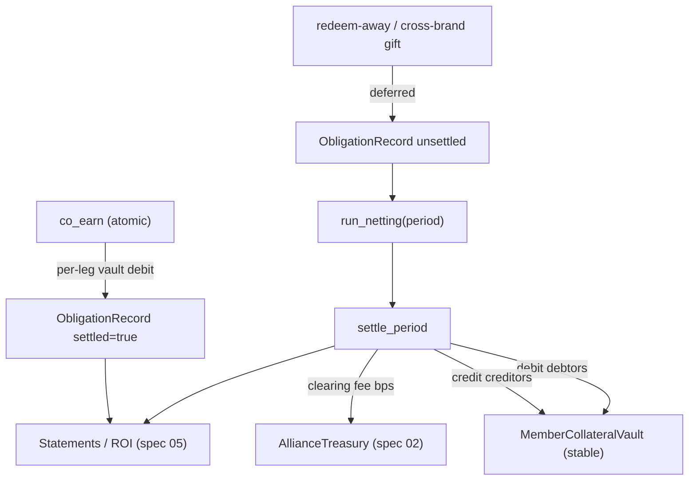

# 03 · Coalition Campaigns — "Syntely"

> **Status:** Draft / Proposed · **Layer:** Flagship · **Depends on:** 01 (vaults), 02 (treasury/governance)
> **Unlocks:** the coalition's reason to exist; feeds 04, 05
> Inherits all [shared conventions](README.md#shared-conventions-normative-for-all-specs).

## 1. Summary

The marquee coalition capability, in three interlocking parts:

1. **Co-funded joint campaigns** — several alliance members pool escrowed budget
   (spec 01 vaults) into one campaign and split cost and attribution by agreed
   shares. "Fill up at the café, shop at the bookstore, earn 5×."
2. **Cross-brand Quest Passport** — a soulbound quest NFT whose steps are
   **on-chain predicates** evaluated against state at *any* member (a badge you
   hold, a purchase at brand B, a completed term-vault), so a quest composes
   across brands with **zero bilateral integration**.
3. **Cross-brand settlement** — cross-brand value either settles **atomically
   inside the earn transaction** (each leg debits its own funder's vault) or, for
   deferred flows (earn at A, redeem at B later), accrues **obligation records**
   that a periodic **multilateral netting** run settles against member
   **collateral** at a governed settlement rate.

Together: joint campaigns create cross-brand demand → the ledger settles and
monetizes the resulting liability. That loop is the business.

## 2. Motivation & current gap

- Campaigns are **single-merchant** and **one-per-earn**; quests are
  **visit-count only**. Two brands literally cannot run one campaign, share its
  cost, or split its liability.
- Alliances only **swap**. There is no joint marketing, no cross-brand quest, and
  **no reconciliation** of the liability created when one brand's points are
  honored by another. Today's swap "collects the fee nowhere" and records no
  obligation — an IOU no one clears.
- This is the entire point of a coalition, and it is absent.

## 3. Goals / Non-goals

**Goals**
- Author a campaign co-funded by ≥2 members with `share_bps` contributions and a
  declared **attribution rule**.
- **Atomic co-earn:** one qualifying action pays out from multiple member vaults
  in a single all-or-nothing (or declared skip-leg) transaction, with per-leg
  provenance on-chain.
- **Composable cross-brand quests** via a soulbound Quest Passport + predicate
  steps; governance-approved templates for cross-brand quests.
- **Settlement:** atomic-in-tx for co-earn; a deferred **obligation ledger** with
  multilateral netting + collateral for redeem-away and gift-across-brand.
- Monetization hooks: origination fee (spec 02 treasury) + clearing fee (bps on
  cleared notional).

**Non-goals**
- Consumer shared status (spec 04) — quests may *read* status once it exists.
- The governance machinery itself (spec 02) — this spec *uses* it to approve
  cross-brand campaigns/templates and set the settlement rate.

## 4. Design

### 4.1 Joint campaign & contribution split

`JointCampaign` references an ordered list of **contributors**, each an alliance
member with a `share_bps` and a spec-01 `CampaignVault` they funded. The joint
campaign activates only when **every** contributor's vault is funded to its share
(multisig-of-funding). Governance (spec 02, `Campaign Manager` role +
`FundCampaignVault`/approval) gates creation of any cross-brand campaign.

```
JointCampaign
  contributors: Vec<Contributor { member, campaign_vault, share_bps, funded }>
  attribution : Attribution     // WhereActionHappened | SplitByShare | AnchorBears
  policy      : ExhaustPolicy   // Revert | SkipDryLegs
  window, name, ...
Σ share_bps == 10_000
```

### 4.2 Atomic co-earn

`co_earn` assembles one transaction with a payout CPI **per contributing leg**:

- For each leg, debit that member's vault (spec 01) — mint/transfer that member's
  own points to the customer, or a shared reward from a pooled vault.
- **Provenance:** each leg emits a `CoEarnLeg` event and, where the value is
  cross-brand, writes an `ObligationRecord` (§4.4) — so "who paid for what" is the
  ledger, not an invoice.
- **All-or-nothing** (`Revert`) or **skip dry legs** (`SkipDryLegs`) per the
  campaign policy; a dry vault under `Revert` fails the whole tx.
- **Attribution** decides which member's vault bears each leg's cost:
  `WhereActionHappened` (the member where the qualifying purchase occurred bears
  its share), `SplitByShare` (fixed), or `AnchorBears` (a designated anchor
  subsidizes).

**Account/CU cap (critical):** each leg adds accounts (vault, reserve, mint, ATA,
+ argus extras on PointInventory). Cap contributors per `co_earn` tx to a fan-out
`MAX_COEARN_LEGS` (target ≤ 4) that fits Solana's account & CU limits; larger
coalitions split across multiple `co_earn` txs with idempotent per-leg progress
keyed by `(joint_campaign, customer, day)`.

### 4.3 Cross-brand Quest Passport

- **`QuestTemplate`** (governance-approved for cross-brand): an ordered list of
  **predicate steps**, a window, and a reward (paid from a joint/treasury vault).
- **Predicates** are evaluated against on-chain accounts the program can read:
  - `HoldsAchievement{achievement}` — customer holds a `kleos` badge / `KleosReceipt`.
  - `SpentAtMember{member, min_base}` — a qualifying earn at that member's mint.
  - `CompletedTermVault{min_days}` — a matured term-vault (spec 05).
  - `HasAttestation{issuer, schema, mask}` — an aegis credential (region/tier).
  - `HoldsStatus{tier}` — alliance status ≥ tier (spec 04, once it exists).
- **`QuestPassport`** — a `NonTransferable` Token-2022 NFT minted to the customer;
  **`QuestProgress`** PDA tracks a step bitmap keyed to the passport, so quests
  can't be traded or farmed as a market.
- `advance_step` verifies the referenced accounts for one step (pinned
  derivation, owner-program checks) and sets its bit; `complete_quest` requires
  the full bitmap and pays the reward from the funding vault via `co_earn`-style
  payout. Bounded step count per tx; multi-tx progress allowed.

### 4.4 Cross-brand settlement

Two regimes, chosen per flow:

**A. Atomic (co-earn / joint reward):** because each leg debits its own funder's
vault inside the transaction, **settlement already happened** — no deferred debt.
The `ObligationRecord` is written as an audit/statement artifact (spec 05 reads
it) with `settled = true`.

**B. Deferred (redeem-away, gift-across-brand):** when a customer earns points at
A and later redeems/consumes value fulfilled by B, B is owed. Each such event
writes an **unsettled `ObligationRecord`** (`issuer=A`, `acquirer=B`, `notional`,
`unit_value` = governed settlement rate). At each **settlement period** close:

- `run_netting(period)` computes the **multilateral net** position per member
  (collapses N² flows to N balances) and posts a signed root (net debtors /
  creditors).
- `settle_period` debits net debtors' **`MemberCollateralVault`** (pre-funded
  stable) and credits net creditors. Shortfall → cure window → draw collateral →
  suspend earn rights (via `MemberRole`/pause).
- The alliance treasury (spec 02) takes a **clearing fee (bps on gross cleared
  notional)** — the recurring, volume-scaling revenue line.



## 5. Account model

```
JointCampaign        seeds = ["jcamp", alliance, jc_id_le]        // NEW
  alliance, id, creator, attribution, policy, window, name
  contributors: Vec<Contributor>   // bounded (≤ MAX_CONTRIBUTORS)
  activated: bool

QuestTemplate        seeds = ["qtmpl", alliance, tmpl_id_le]      // NEW (gov-approved if cross-brand)
  steps: Vec<Predicate>            // bounded (≤ MAX_STEPS)
  window, reward_vault, name

QuestPassport mint   seeds = ["qpass", template, customer]        // NonTransferable NFT
QuestProgress        seeds = ["qprog", template, customer]        // NEW
  template, customer, step_bitmap: u32, completed: bool, started_slot

ObligationRecord     seeds = ["oblig", alliance, seq_le]          // NEW (or compressed log + Merkle root)
  issuer, acquirer, notional_ui, unit_value, period, settled: bool

MemberCollateralVault seeds = ["acoll", alliance, merchant]       // NEW (stable token acct, PDA-owned)
  alliance, merchant, floor, balance_ref

SettlementPeriod     seeds = ["asettle", alliance, period_le]     // NEW
  net_root: [u8;32], gross_notional, fee_charged, state
```

Governance-set parameters (spec 02): `settlement_rate` (unit value), `clearing_fee_bps`,
`collateral_floor`, `period_secs`, `MAX_COEARN_LEGS`, `MAX_CONTRIBUTORS`, `MAX_STEPS`.

## 6. Instruction surface

- `create_joint_campaign(id, contributors[], attribution, policy, window, name)`
  — Campaign Manager role; requires governance approval for cross-brand; opens
  `JointCampaign`. Activates when all contributor vaults are funded to share.
- `co_earn(amount_base, visit_day)` — merchant-signed at the acting member;
  multi-leg payout with per-leg vault debit + `ObligationRecord` (settled) +
  `CoEarnLeg` events; enforces `MAX_COEARN_LEGS`, attribution, exhaust policy.
- `create_quest_template(id, steps[], window, reward_vault, name)` — Campaign
  Manager; cross-brand templates require a passed proposal.
- `mint_quest_passport()` — customer opt-in; mints the soulbound passport, opens
  `QuestProgress`.
- `advance_step(step_index)` — verifies the step's referenced accounts (pinned);
  sets the bit. Permissionless (anyone can crank a customer's verifiable step) or
  customer-signed, per template.
- `complete_quest()` — requires full bitmap in-window; pays reward from
  `reward_vault` (spec 01 payout path).
- `record_obligation(...)` — internal, emitted by redeem-away / cross-brand gift
  paths (offers redeemed against another member; argus-policed cross-brand gift).
- `run_netting(period)` — permissionless crank after period close; posts net root.
- `settle_period(period)` — Finance role; debits/credits collateral, charges
  clearing fee to treasury, handles shortfall/cure.
- `top_up_collateral(amount)` / `draw_collateral` — member funds / enforced draw.

## 7. Math & limits

- **Attribution split:** per-leg cost = `reward · share_bps / 10_000` (floor);
  remainder dust to the anchor or the treasury (declared).
- **Multilateral netting:** `net(m) = Σ owed_to(m) − Σ owed_by(m)` over unsettled
  obligations in the period; `Σ net == 0` (invariant, asserted). All `i128`
  intermediate, `checked_*`.
- **Cross-mint notional:** obligations store **UI value** at the governed
  settlement rate; conversion via the shared UI path, floored toward the creditor
  being under-credited (protocol-safe).
- **Clearing fee:** `fee = gross_notional · clearing_fee_bps / 10_000` (floor) →
  treasury.
- **Fan-out caps:** `MAX_COEARN_LEGS`, `MAX_CONTRIBUTORS`, `MAX_STEPS` sized to
  Solana account/CU limits; each documented with a measured CU budget before
  ship. Overflow → multi-tx path, never silent truncation.

## 8. Security considerations

- **Value conservation (#4):** every co-earn leg is backed by a funded vault
  (spec 01); the reward cannot exceed pooled escrow. Deferred obligations are
  bounded by collateral + default handling.
- **Attribution disputes / free-riding (killer risk):** attribution rule is
  **fixed at campaign creation** and enforced on-chain (`WhereActionHappened`
  reads the acting member from the signed earn), not litigated after.
- **Default cascade (killer risk):** collateral floor + cure window + draw +
  earn-suspension; optionally a mutualized default fund (treasury slice).
  Creditors are never credited value the debtor's collateral can't cover in the
  period.
- **Atomicity:** `co_earn` legs commit or revert together (`Revert`) unless
  `SkipDryLegs` is explicitly chosen and logged (no silent partial).
- **Pinned derivation (#3):** quest predicates and settlement re-derive and
  owner-check every referenced account; a spoofed badge/vault/attestation fails
  closed.
- **Soulbound integrity:** passport is `NonTransferable`; progress keyed to it
  can't be transferred or farmed as a market.
- **Governance-gated cross-brand:** no member can unilaterally create a campaign
  that spends another member's vault; funding is per-member and consent is the
  funded share.
- **Compute:** hard caps prevent tx-limit failures that would otherwise fail
  closed and block legitimate earns.

## 9. Migration & compatibility

- All new accounts; single-merchant campaigns (spec 01 / current) unchanged.
- Requires spec 01 vaults and spec 02 governance/treasury deployed first.
- `ObligationRecord` may be realized as discrete accounts (simpler, more rent) or
  a compressed log + on-chain Merkle root (cheaper, adds a claim/dispute flow) —
  see Open Questions.
- No change to `Merchant` argus-read prefix.

## 10. Test plan (LiteSVM)

- Joint campaign: activates only when all shares funded; co-earn pays each leg
  from the right vault; attribution routes cost correctly; `Revert` vs
  `SkipDryLegs` behavior on a dry leg.
- Fan-out cap: `MAX_COEARN_LEGS+1` rejected; multi-tx progress idempotent (no
  double-pay for the same `(jc, customer, day)`).
- Quest: predicate steps verify real cross-brand state; spoofed
  badge/vault/attestation rejected; out-of-window completion rejected; passport
  non-transferable; reward paid once.
- Settlement: obligations net multilaterally (`Σ net == 0`); `settle_period`
  moves collateral correctly; shortfall triggers cure→draw→suspend; clearing fee
  hits treasury.
- Authority: Campaign Manager / Finance roles enforced; non-role rejected.

## 11. Phased rollout

1. **Joint campaigns + atomic co-earn** (settlement regime A only) on spec 01
   vaults — the visible flagship, no deferred debt yet.
2. **Quest Passport + templates** (single-brand steps first, then cross-brand
   under governance).
3. **Deferred settlement** — obligation ledger + netting + collateral + clearing
   fee (regime B). Highest complexity; ship last.

## 12. Open questions

- `ObligationRecord` as accounts vs. compressed log + Merkle root + dispute
  window? Log scales better; decide before phase 3.
- Settlement asset: single alliance stablecoin vs. per-pair? Single for v1.
- Default fund: mutualized treasury slice vs. pure per-member collateral? Start
  per-member; add mutualization if a coalition demands it.
- `advance_step` permissionless crank vs. customer-signed — per template flag;
  default customer-signed for privacy.
