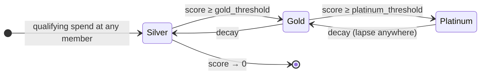

# 04 · Portable Decaying Alliance Status — "Aureus"

> **Status:** Draft / Proposed · **Layer:** Consumer flywheel · **Depends on:** 02 (governance/params); 03 optional (benefit-cost settlement)
> Inherits all [shared conventions](README.md#shared-conventions-normative-for-all-specs).

## 1. Summary

A **cross-brand status tier** (think Star Alliance Gold) that lives at the
alliance level, is **earned from aggregate qualifying activity at any member**,
and confers benefits honored at **every** member. The twist no incumbent can
match: **status itself decays** — the qualifying score bleeds down continuously,
so a lapse *anywhere* threatens the perks you enjoy *everywhere*. This applies
loss aversion to a positional good — the single stickiest retention lever known —
and it is only credible because VESTA already has a native decay rail.

Permissionless membership collapses the moat airline alliances took 25 years and
bilateral treaties to build: a merchant plugs into portable status by joining a
`koinon`.

## 2. Motivation & current gap

- Tiers/streaks are **per-merchant** (`CustomerProfile.tier`, `streak_days`). A
  customer's real value is their **total** spend across the coalition, but a
  Platinum-at-café is a nobody at the bookstore.
- Alliances only **swap**; there is no shared status, no reciprocal earning, no
  reason for a customer to consolidate spend into the coalition.
- No shared status ⇒ no "one card, everywhere" consumer promise ⇒ the coalition
  is worth no more than the sum of its members.

## 3. Goals / Non-goals

**Goals**
- One **alliance status** per customer, aggregating qualifying activity across all
  members into a tier (e.g., Silver/Gold/Platinum).
- **Score decays** continuously via a governed rate; tier is a pure function of
  the decayed score → status must be *defended*, not earned once.
- **Cross-brand benefits:** earn-multiplier uplift, exclusive offer access,
  reduced swap fee, term-vault bonus (spec 05) — honored at every member.
- **Anti-free-rider:** governance sets a minimum benefit contribution; benefit
  cost is borne by the granting member and (optionally) settled/rebated via
  spec 03 so a generous anchor isn't drained.
- **Sybil-resistant:** qualifying activity is real spend (min thresholds),
  optionally aegis-gated for region-scoped status.

**Non-goals**
- A transferable status token (status is account state, not a tradeable asset).
- The settlement ledger itself (spec 03) — this spec *emits* benefit-cost
  obligations into it when present.

## 4. Design

### 4.1 Status account & scoring

`AllianceStatus` PDA per `(alliance, customer)`:

- `score: u64` — decayed qualifying score.
- `last_update_day: u32` — UTC day of the last touch (for lazy decay).
- `tier: u8` — cached, recomputed on touch.
- `lifetime_qualifying: u64` — audit metric.

On a **qualifying event** (an earn at any member above a governed min-spend), the
program: (1) lazily decays `score` to `now` (§4.2), (2) adds the event's weighted
contribution (`ui_value_of_spend × weight`), (3) recomputes `tier`. Recording is
a small CPI/inline step added to the earn path (or a permissionless crank that
replays recent earns), keyed to the acting member so cross-brand aggregation is
provable.

### 4.2 Score decay (defend-forever mechanic)

`InterestBearingConfig` is mint-wide and cannot vary per account, so status
decay is **computed in-program**, not tokenized:

```
elapsed = today - last_update_day
decay   = min(score, score * status_decay_bps * elapsed / 10_000)   // linear, floored, checked
score  := score - decay
```

Governance (spec 02) sets `status_decay_bps` (per day) and the tier thresholds.
A customer who stops transacting slides down tiers on a predictable curve; a
customer active at *any* member holds the line.

### 4.3 Tiers & benefits

`tier = max{ t : score ≥ threshold[t] }`. Each tier maps to a **benefit set**
each member honors:

| Benefit | Mechanism |
|---|---|
| Earn-multiplier uplift | `earn_points` reads status, adds a bounded bps to the multiplier (jointly capped with the existing ×2.4 ceiling) |
| Reduced swap fee | `swap_points` reads status, reduces `fee_bps` for the customer |
| Exclusive offers | `redeem_offer` gates an offer on `tier ≥ min_status_tier` |
| Term-vault bonus | spec 05 reads status to boost the term bonus |

Benefits are honored at every member, but each member **declares which benefits
it grants and at what magnitude** (within governance-set minimums), stored on
`MemberRole`/a `MemberBenefit` side account.

### 4.3.1 Reading status without moving `Merchant`'s prefix
Status reads are additive accounts on the relevant instruction contexts; they do
**not** alter `Merchant`/`CustomerProfile` layouts beyond appended fields, and
never touch the argus-read `Merchant` prefix (invariant #6).

### 4.4 Benefit cost & anti-free-rider

- The **granting member bears** the cost of the uplift it honors (it's minting
  its own points / discounting its own fee).
- **Governance minimum:** `admit_member` / `set_member_role` requires a member to
  declare a benefit set `≥` a governed floor, so a member cannot harvest
  status-driven traffic while offering nothing.
- **Optional settlement (spec 03):** when a member honors a benefit for a status
  earned mostly elsewhere, it may emit a benefit-cost `ObligationRecord`, letting
  the coalition rebate generous members from the treasury (spec 02) — closing the
  asymmetry the enterprise study flagged as the killer risk.

### 4.5 Sybil resistance

- Qualifying contribution requires real spend above `min_qualifying_base`;
  micro-activity can't farm tiers.
- Region-scoped status variants gate on an `aegis` attestation.
- Status is account state bound to the customer wallet; it is not transferable.



## 5. Account model

```
AllianceStatus   seeds = ["astatus", alliance, customer]     // NEW
  alliance, customer
  score            : u64
  last_update_day  : u32
  tier             : u8
  lifetime_qualifying : u64
  bump             : u8

MemberBenefit    seeds = ["abenefit", alliance, merchant]    // NEW (or fold into MemberRole)
  earn_uplift_bps      : u16    // per-tier arrays or a base + tier step
  swap_fee_discount_bps: u16
  min_offer_tier       : u8
  bump                 : u8

Alliance (appended, governance-set via spec 02)
  + status_decay_bps   : u32
  + tier_thresholds    : [u64; MAX_TIERS]
  + min_qualifying_base : u64
  + min_benefit_floor  : (bounded struct)
```

## 6. Instruction surface

- `record_qualifying_activity(base)` — inline in / CPI from `earn_points` at any
  member: lazily decays, adds contribution, recomputes tier. Idempotent per earn.
- `recompute_status()` — permissionless crank; applies decay + recomputes tier on
  read (also done lazily by every touch).
- `set_member_benefit(...)` — member declares its honored benefits ≥ governed
  floor; governance-gated after `gov_enabled`.
- Benefit application is **read-only** inside existing instructions:
  - `earn_points` (extended): optional `alliance_status` account → uplift the
    multiplier (bounded, jointly capped).
  - `swap_points` (extended): optional `alliance_status` → `fee_bps` discount.
  - `redeem_offer` (extended): optional `alliance_status` → gate `min_offer_tier`.
- `emit_benefit_obligation(...)` — optional, writes a spec-03 obligation for the
  honored benefit's cost (rebate path).

All status reads are **optional accounts**: if absent, instructions behave exactly
as today (no status = no uplift), preserving backward compatibility.

## 7. Math & limits

- Decay per §4.2: linear, floored, `checked_*`; `elapsed` from UTC-day diff.
- `tier` lookup over `tier_thresholds` (monotone).
- Earn uplift is added to the campaign/streak multiplier and **re-clamped** to the
  existing `MAX_TOTAL_MULTIPLIER_BPS` (×2.4) — status never breaches the global
  earn cap or `MAX_EARN_PER_TX`.
- Swap fee discount floors `fee_bps` at 0; never negative.
- Contribution weight and thresholds are governance-set `u64`.

## 8. Security considerations

- **No unbacked value:** status only *modulates* existing capped mints/fees; it
  mints nothing on its own and cannot exceed the earn cap.
- **Anti-free-rider (killer risk):** governed benefit floor + granting-member-pays
  + optional rebate settlement.
- **Sybil:** min-spend qualification + optional aegis gating; status
  non-transferable.
- **Pinned derivation (#3):** every instruction re-derives `AllianceStatus` for
  the acting `(alliance, customer)`; a spoofed status account (wrong seeds/owner)
  is rejected, so a customer can't present a forged Platinum.
- **Layout stability (#6):** additive accounts/fields only; `Merchant` prefix
  untouched.
- **Pause (L-2):** qualifying recording and benefit application respect pauses.
- **Rounding:** decay and discounts floor toward the protocol.

## 9. Migration & compatibility

- All new accounts; `Alliance` gains appended governance params. Status reads are
  optional accounts, so **no existing instruction breaks** and non-status flows
  are unchanged.
- Requires spec 02 for governed params (thresholds, decay, floors). Benefit-cost
  rebate requires spec 03; without it, granting members simply bear their own
  cost.

## 10. Test plan (LiteSVM)

- Qualifying earns at multiple members aggregate into one status; tier crosses
  thresholds.
- Decay: `warp` days → score decays linearly → tier drops; a fresh qualifying
  earn restores it.
- Benefit application: earn uplift respects the ×2.4 cap; swap-fee discount
  applied and floored at 0; offer gated on tier.
- Anti-free-rider: `set_member_benefit` below floor rejected.
- Sybil: sub-threshold spend does not accrue; region status gated on aegis.
- Pinned: spoofed `AllianceStatus` rejected; forged Platinum cannot claim uplift.
- Backward compat: instructions with the status account omitted behave as today.

## 11. Phased rollout

1. `AllianceStatus` + `record_qualifying_activity` + decay + tiers (read-only
   status, no benefits yet) — "your coalition standing."
2. Benefits: earn uplift + offer gating + swap-fee discount + `MemberBenefit`
   floor.
3. Benefit-cost obligations + treasury rebate (needs spec 03).

## 12. Open questions

- Decay model: linear (chosen, cheap) vs. exponential (smoother, costlier). Linear
  for v1.
- Recording on the earn hot path (inline CPI, +CU) vs. a periodic crank replaying
  events (no hot-path cost, eventual consistency). Prefer inline for correctness;
  measure CU.
- Tier count and threshold curve — governance-tunable; ship 3 tiers.
- Should status decay pause while a term-vault (spec 05) is locked? Attractive
  ("locking defends status") — deferred to spec 05 integration.
