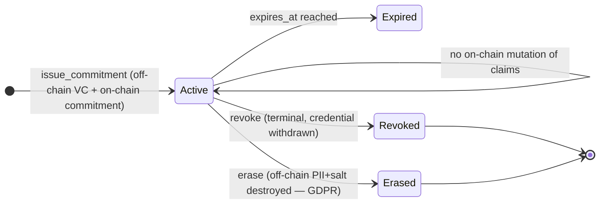

# 06 · aegis — Commitment Substrate + Typed Multi-Credential

> **Status:** ✅ Phase 1 implemented (v2.0.0) · **Track:** B (Identity & Trust) · **Layer:** Foundation (price of entry) · **Depends on:** —
> **Unlocks:** 07 (verify/policy), 08 (accreditation)
> Inherits all [shared conventions](README.md#shared-conventions-normative-for-all-specs), incl. [Track B conventions](README.md#track-b-conventions-aegis--sas--crypto--normative-for-specs-0608).

## 1. Summary

Invert aegis's data model: **PII moves off-chain, only a hiding+binding
commitment stays on-chain.** Replace the opaque `value: u64` bitmask and the
one-attestation-per-`(issuer, subject)` straitjacket with **typed, versioned,
multi-credential** attestations registered against a **schema registry that is
SAS-compatible**. This single change converts aegis from "illegal to deploy with
real identity data" into a privacy-by-design substrate, and it needs **no ZK and
no trusted setup**.

Everything else in Track B (verify, policy, accreditation, and the wave-2 ZK
layers) builds on this substrate.

## 2. Motivation & current gap

- `subject: Pubkey` + `value: u64` are **world-readable and immutable**: KYC tier,
  age band, region, and a human-linkable wallet are published forever. That is a
  per-record GDPR Art. 17 (erasure) / Art. 5 (minimisation) violation and a
  standing deanonymisation dataset — a compliance **non-starter**, not a nit.
- **One attestation per `(issuer, subject)`** forces region+KYC+age into one
  bitmask — no independent issuance/expiry/revocation per claim.
- `schema: u16` / `value: u64` carry **no semantics** — nothing outside VESTA can
  interpret a credential, so aegis is structurally un-composable.

## 3. Goals / Non-goals

**Goals**
- On-chain = commitment + Merkle root + validity + revocation + non-identifying
  metadata. **No plaintext claims on-chain.**
- **Cryptographic erasure:** destroying the off-chain salt renders the on-chain
  commitment permanently unopenable → GDPR-compatible "erasure" of an immutable
  record.
- **Multi-credential:** many independent credentials per `(issuer, subject)`,
  keyed by schema.
- **Typed schema registry**, versioned, mapped to external standards (W3C VC type,
  ISO 18013-5 mdoc namespace) and **aliasing a SAS schema** where one exists.
- Per-attribute commitments so individual claims open independently (basis for
  spec 07 predicate checks and wave-2 ZK).
- **Holder-centric:** the W3C-VC-shaped credential lives with the subject
  off-chain; the chain is the integrity + freshness + revocation anchor.

**Non-goals**
- ZK predicate proofs / accumulator revocation (wave 2; this substrate is their
  precondition).
- The `verify` verdict interface and policy engine (spec 07).
- Issuer accreditation (spec 08).

## 4. Design

### 4.1 Commitment, not content

Issuance produces a W3C-VC-shaped credential held by the subject off-chain. On
chain, the attestation stores:

```
commitment  = Poseidon(claims ‖ holder_binding ‖ salt)          // hiding + binding
attr_root   = MerkleRoot([ Poseidon(attr_i ‖ salt_i) ]_i)       // per-attribute leaves
```

- **Hiding** via a random `salt` (off-chain); **binding** via Poseidon collision
  resistance. On-chain bytes are computationally indistinguishable from random.
- `attr_root` lets a single attribute be opened (Merkle path) without revealing
  the others — the primitive spec 07's disclosure checks and wave-2 circuits use.
- `holder_binding` is a **holder-controlled key/handle**, *not* the payment
  wallet, so a credential is not trivially linked to on-chain asset activity.
  (Full unlinkable per-verifier pseudonyms are wave 2.)

### 4.2 Cryptographic erasure (GDPR)

You cannot delete from an immutable chain — so make the on-chain record
**meaningless without off-chain material.** On a data-subject erasure request the
issuer destroys the off-chain PII + salt; the commitment becomes an unopenable
hash pre-image. A terminal `status = Erased` marks it. This is the recognised
GDPR-compatible pattern (data is "erased" when it is rendered irreversibly
inaccessible).

### 4.3 Typed multi-credential + schema registry

- Attestation PDA seed changes to `["attestation", issuer, subject, schema_id]` →
  many live credentials per pair.
- `Schema` account declares typed fields, field encodings (fixed for
  hash/circuit compatibility), version, a `standard_uri`, a `content_hash`
  (SHA-256 of the off-chain schema doc on Arweave/IPFS), a `deprecated` flag +
  successor, and an **optional `sas_schema: Option<Pubkey>` alias** so the aegis
  typed view reconciles with a SAS schema rather than forking the vocabulary.

### 4.4 SAS integration

aegis schemas may alias SAS schemas; a subject may hold SAS attestations *and*
aegis commitments. aegis's contribution here is the **commitment + typed-field +
erasure** layer that SAS's freeform on-chain data does not provide. Spec 07's
`verify` then reads both. (If a claim must stay confidential, use an aegis
commitment; if public transparency is desired, a plain SAS attestation is fine —
the verifier policy in spec 07 decides which it accepts.)

### 4.5 Lifecycle



## 5. Account model

```
Schema        seeds = ["schema", registrar, schema_id_le]         // NEW
  version        : u8            // Track B versioned header
  registrar      : Pubkey
  id             : u64
  fields         : Vec<FieldDef> // {name, type, bit/byte layout} — bounded
  encoding       : u8
  standard_uri   : String        // bounded; W3C VC / mdoc namespace
  content_hash   : [u8; 32]      // SHA-256 of off-chain schema doc
  sas_schema     : Option<Pubkey>
  deprecated     : bool
  successor      : Option<Pubkey>
  bump           : u8

Attestation   seeds = ["attestation", issuer, subject, schema_id_le]   // RE-SEEDED
  version        : u8
  issuer         : Pubkey
  subject        : Pubkey        // holder-binding handle (NOT necessarily payment wallet)
  schema_id      : u64
  commitment     : [u8; 32]      // Poseidon(claims ‖ holder_binding ‖ salt)
  attr_root      : [u8; 32]      // per-attribute Merkle root
  valid_from     : i64
  expires_at     : i64
  status         : u8            // Active | Revoked | Erased
  issued_at      : i64
  bump           : u8
```

> Layout note: the plaintext `value: u64` is **removed**. The `version` header
> (Track B convention) future-proofs the read path and lets spec 07 evolve
> storage without breaking consumers — replacing argus's current fragile
> fixed-offset reads.

## 6. Instruction surface

Issuer-authorised (authority or operator per aegis's existing model; two-step
authority retained).

- `register_schema(id, fields, encoding, standard_uri, content_hash, sas_schema?)`
  — opens a `Schema`.
- `deprecate_schema(successor?)` — marks deprecated; existing attestations stay
  valid until expiry/revocation.
- `issue_commitment(schema_id, commitment, attr_root, valid_from, expires_at)` —
  opens/updates the `Attestation` for `(issuer, subject, schema_id)`; **takes no
  claims**, only the commitment. Validates the schema exists and is not
  deprecated (configurable).
- `revoke_attestation()` — terminal `Revoked` (already terminal in current aegis).
- `erase_attestation()` — terminal `Erased`; distinct from revoke (signals
  off-chain data + salt destroyed). Emits an audit event.
- `verify_disclosure(leaf, path, index)` — **pure/read-only** helper: recompute
  the leaf and check it against `attr_root` (log₂ n Poseidon hashes). Lets a
  verifier confirm a single opened attribute against the on-chain root off the hot
  path. (Full verdict + policy = spec 07.)

## 7. Cryptographic parameters & limits

- **Hash:** Poseidon over the BN254 scalar field (via `sol_poseidon`), so the same
  commitments/roots are reusable inside wave-2 BN254 Groth16 circuits without
  re-hashing in a different field.
- **Merkle:** binary, Poseidon-compressed; bounded depth (≤ `MAX_ATTR_DEPTH`,
  e.g. 8 → 256 attributes) to cap `verify_disclosure` CU.
- **Salt:** ≥128-bit random, off-chain only; per-attribute salts recommended to
  block cross-attribute correlation.
- All index/length math `checked_*`; `expires_at > valid_from` enforced (matches
  current aegis validation).

## 8. Security & privacy considerations

- **Privacy model:** on-chain reveals nothing about attribute values (commitments
  + roots only). A verifier learns only the attribute(s) the holder opens,
  off-chain. Unopened attributes and (with per-verifier salts) cross-verifier
  correlation remain hidden. **Honest scope:** this is commitment-based selective
  disclosure, *not* zero-knowledge — the opened value is shown to the chosen
  verifier. ZK (hide the value, prove only a predicate) is wave 2 (spec 07 §
  roadmap) and does not change this substrate.
- **Erasure honesty (killer risk):** blinded `subject` handles can still leak via
  on-chain transaction-graph correlation if the handle is reconstructably linked
  to a payment wallet. The holder-binding handle **must** be decoupled from the
  payment wallet or the erasure claim is cosmetic; wave-2 pseudonyms harden this.
- **Fail closed (#2), pinned derivation (#3):** consumers re-derive the
  attestation PDA from `(issuer, subject, schema_id)` and check owner program +
  `version`; a wrong-version or spoofed account rejects.
- **Two-step authority, pause** retained from current aegis.
- **No unbacked state:** issuance writes only a commitment the issuer vouches for;
  no value is minted.

## 9. Migration & compatibility

- **Breaking for aegis storage:** `Attestation` is re-seeded (adds `schema_id`)
  and `value` is removed. argus's current fixed-offset `value & mask` read **stops
  working** — it migrates to spec 07's `verify` (ship 06+07 together for argus).
- Devnet is disposable; deploy fresh. No impact on `vesta_core`/argus account
  layouts other than argus's aegis-read path (which spec 07 replaces cleanly).
- SAS is untouched; aegis schemas optionally alias SAS schemas.

## 10. Test plan (LiteSVM)

- Issue commitment → on-chain bytes reveal no claim; `verify_disclosure` accepts a
  correct (leaf, path) and rejects a tampered one.
- Multi-credential: same `(issuer, subject)` holds N schemas independently;
  revoke/erase one leaves others Active.
- Erasure: `erase_attestation` sets `Erased`, emits audit event; a
  previously-valid disclosure no longer verifies once the (test) salt is dropped.
- Schema: register/deprecate; issuing under a deprecated schema behaves per policy;
  `sas_schema` alias stored.
- Authority: non-issuer cannot issue/revoke/erase; two-step handover; pause honored.
- Version header: a consumer rejects an unexpected `version`.

## 11. Phased rollout

1. Schema registry + re-seeded multi-credential `Attestation` with
   `commitment`/`attr_root` (+ `version` header) + `verify_disclosure`.
2. `erase_attestation` + audit events + SAS schema aliasing.
3. Per-verifier salt guidance + holder-binding-handle tooling (SDK; full
   pseudonyms are wave 2).

## 12. Open questions

- Holder off-chain storage: wallet-native, a holder agent, or issuer-hosted with
  holder key? Determines UX and the erasure guarantee — resolve before phase 1.
- Poseidon arity / Merkle layout to match the wave-2 circuit toolchain (align with
  Light Protocol conventions to avoid re-hashing).
- Keep a narrow, explicitly-public plaintext attestation type for non-PII flags
  (e.g., "is a member"), or route all public flags to SAS? Prefer SAS for public.
