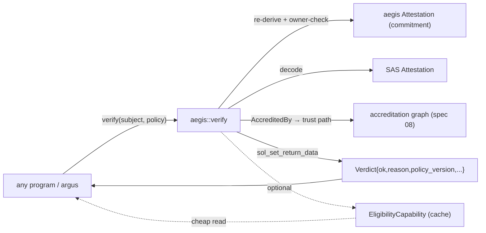

# 07 · aegis — `verify` Interface + Policy Engine

> **Status:** Draft / Proposed · **Track:** B · **Layer:** Composability / enforcement · **Depends on:** 06
> **Unlocks:** any program (argus first) gating on credentials; enforces 08
> Inherits all [shared conventions](README.md#shared-conventions-normative-for-all-specs), incl. [Track B conventions](README.md#track-b-conventions-aegis--sas--crypto--normative-for-specs-0608).

## 1. Summary

Give aegis the thing SAS deliberately leaves thin: a **stable, CPI-callable
`verify` instruction that returns an enforceable pass/fail-with-reason verdict**,
plus a **jurisdiction-aware policy engine** so a verifier evaluates a credential
against a named, versioned policy instead of hardcoded logic. This is "the syscall
for credentials": programs submit a question and read a verdict; they never parse
attestation accounts. It reads **both aegis-native commitments (spec 06) and SAS
attestations**, and it turns argus from a program that reads aegis by fragile byte
offsets into just **one policy consumer**.

## 2. Motivation & current gap

- argus reads aegis by **hardcoded byte offsets** (`ATTESTATION_DISCRIMINATOR`,
  `attestation_offset::*`). That is a private, brittle ABI: any aegis layout change
  silently mis-reads or breaks it, and **no external program will ever build on a
  layout that can shift under it.** (Spec 06 removes the field it reads, forcing
  this migration anyway.)
- Gating logic is **baked into one consumer**. There is no policy layer: no
  per-jurisdiction rules, no reusable predicate vocabulary, no
  documented/reproducible accept-reject decision an examiner can inspect.

## 3. Goals / Non-goals

**Goals**
- `verify(subject, predicate, [accounts])` → structured verdict via
  `sol_set_return_data`, **read-only and parallelizable** (no write locks).
- A compact, fixed **predicate opcode set** (exactly argus's current semantics,
  lifted out and generalized): pinned issuer, schema match, attribute
  disclosure/threshold, not-revoked, time window, and (spec 08) accredited-issuer.
- Reads **aegis commitments** *and* **SAS attestation PDAs** behind one interface.
- A **Policy registry**: named, versioned, jurisdiction-scoped verifier policies;
  a verdict records *which policy version decided* (audit-grade).
- A **direct-read fallback** (version-guarded) for CU-sensitive hot paths (transfer
  hooks) so integrators choose CPI (safe/evolvable) vs. read (cheap/pinned).
- Ship an `aegis-verify` Rust crate + TS SDK mirroring the logic byte-for-byte.

**Non-goals**
- ZK predicate proofs (wave 2 — the opcode set is designed to accept a
  `ZkPredicate` variant later without an interface break).
- Metering/fees for verify (wave 2 trust-marketplace).
- Authoring the actual legal content of jurisdiction policies (that stays with the
  verifier's compliance counsel — see §8 killer risk).

## 4. Design

### 4.1 The `verify` verdict

```
verify(subject: Pubkey, predicate: Predicate, remaining_accounts: [...])
  → return_data: Verdict { ok: bool, reason_code: u16, matched_schema: u64,
                           matched_issuer: Pubkey, expires_at: i64, policy_version: u32 }
```

- Mutates nothing; writes the `Verdict` with `sol_set_return_data` (≤1024 B); the
  caller reads it with `sol_get_return_data`.
- The caller passes the attestation account(s) it wants evaluated; `verify`
  **re-derives and owner-checks** them (pinned derivation #3) — it never trusts a
  client-labelled account. It detects aegis-native vs. SAS by owner program and
  decodes accordingly.

### 4.2 Predicate opcode set

A tiny, bounded, versioned enum — the whole trust logic, made a public vocabulary:

| Opcode | Meaning |
|---|---|
| `PinnedIssuer(pubkey)` | attestation issued by exactly this issuer |
| `SchemaIs(schema_id)` | attestation is of this schema |
| `AttrOpened(index, leaf, path)` | a disclosed attribute matches `attr_root` (spec 06) |
| `AttrThreshold(index, op, value, opening)` | disclosed attribute satisfies `≥/≤/==` |
| `NotRevoked` / `NotErased` | status check |
| `WithinWindow` | `now ∈ [valid_from, expires_at)` |
| `AccreditedBy(root, max_depth)` | issuer trusted via spec 08 trust path |
| `ZkPredicate(circuit_id, proof, publics)` | **reserved for wave 2** |

Predicates compose with `All`/`Any` (bounded fan-out). Argus's current
`value & mask != 0 ∧ schema ∧ ¬revoked ∧ window` becomes
`All[ PinnedIssuer, SchemaIs, AttrThreshold(...), NotRevoked, WithinWindow ]`.

### 4.3 Policy engine

`Policy` accounts wrap a predicate set + metadata so verifiers reference a **name**,
not inline logic:

- Fields: `id`, `authority`, `version`, `jurisdiction`, `predicate` (composed),
  `min_issuer_tier` (spec 08), `freshness_secs` (max credential age), `deprecated`,
  `successor`.
- `verify_policy(subject, policy)` evaluates the policy's predicate and returns the
  verdict **stamped with `policy_version`** — a reproducible, examiner-inspectable
  decision. Rule changes = a new version; past decisions remain auditable against
  the version live at the time.
- Jurisdiction-scoped: the same credential can pass an EU policy and fail a US one,
  deterministically on-chain.

### 4.4 CU reality & the direct-read fallback

A CPI + return-data round-trip costs ~1.5–3k CU; a full pairing (wave-2 ZK) far
more. Inside a Token-2022 transfer hook, budget is shared with the transfer and
paid **every** peer transfer. So aegis ships **two first-class paths**:

- **`verify` CPI** — the default for ordinary programs; safe, evolvable, policy-aware.
- **Direct read** — a documented, **`version`-guarded** decoding helper in the
  `aegis-verify` crate for hot loops; the version header (spec 06) makes it safe
  against layout drift (unlike today's raw offsets). For argus specifically, the
  hot path may read a **capability/decision cache** (a short-lived account written
  once by `verify`) instead of re-verifying every transfer — the same
  "verify-once, read-cheap" pattern wave-2 ZK will require.

### 4.5 argus migration

argus stops reading aegis offsets. Two options, both clean:
1. **Per-transfer `verify` CPI** (simplest; measure CU).
2. **Capability cache:** a periodic `verify` mints a short-lived
   `EligibilityCapability { subject, policy, expires_at }`; the hook does a cheap
   existence/expiry read. Recommended for high-frequency mints. Transfer-context
   binding (audit H-1) still applies.



## 5. Account model

```
Policy               seeds = ["policy", authority, policy_id_le]     // NEW
  version, authority, id, jurisdiction, predicate (bounded blob),
  min_issuer_tier, freshness_secs, deprecated, successor, bump

EligibilityCapability seeds = ["elig", policy, subject]              // NEW (optional cache)
  policy, subject, issued_at, expires_at, version, bump
```

`verify` itself is a stateless instruction (no account of its own). `Verdict` is
return-data, not an account.

## 6. Instruction surface

- `verify(subject, predicate)` — stateless, read-only; writes `Verdict`
  return-data. Permissionless.
- `verify_policy(subject, policy)` — same, evaluating a registered `Policy`.
- `register_policy(...)` / `deprecate_policy(successor?)` — policy authority
  (a verifier / compliance owner), two-step authority.
- `mint_eligibility_capability(policy, subject)` — runs `verify_policy` and, on
  pass, writes a short-lived `EligibilityCapability` (opt-in caching path).
- `revoke_eligibility_capability` — issuer/authority or auto-expiry.

SDK/crate deliverables: `aegis-verify` (Rust: `verify` CPI wrapper + version-guarded
direct-read + capability read) and a TS `verify()` mirroring it byte-for-byte.

## 7. Limits & determinism

- Predicate fan-out bounded (`MAX_PREDICATE_TERMS`); `AccreditedBy` depth bounded
  (spec 08) so CU is deterministic and the tx account list is explicit (no
  unbounded traversal).
- `verify` is pure ⇒ no write locks ⇒ verifications parallelize across the SVM
  (the property that makes it ecosystem-viable).
- `Verdict` ≤ 1024 B (return-data limit); fields fixed-width.
- All comparisons/window math `checked_*`; time from `Clock`.

## 8. Security considerations

- **Pinned derivation (#3), fail closed (#2):** `verify` re-derives every
  attestation/issuer/policy account and owner-checks it; any missing/mismatched
  input ⇒ `ok=false` with a reason (never a permissive default). SAS accounts are
  decoded only when owner == SAS program.
- **Read-only integrity:** `verify` cannot mutate credential state, so a malicious
  caller can't use it to tamper; the capability cache is the only writable path and
  is policy-gated + expiring.
- **Version guard:** consumers gate on the `version` header; an unexpected version
  fails closed (this is the concrete fix for argus's fragile offset coupling).
- **Transfer-context (H-1):** any argus hot-path use (CPI or capability read)
  keeps the `transferring`-flag assertion.
- **Killer risk — false compliance confidence:** encoding a jurisdiction rule
  wrong produces a green light that is legally red. Mitigation: policy *content* is
  authored and owned by the verifier's compliance counsel (aegis provides the
  engine, not the legal opinion); `policy_version` + decision events make every
  verdict reproducible and auditable.
- **CU DoS:** bounded predicate/depth prevents a crafted policy from exhausting CU.

## 9. Migration & compatibility

- Requires spec 06 (commitment attestations + version header).
- argus migrates off fixed offsets to `verify`/capability (ship 06+07 together).
- Additive for the wider ecosystem: any program adopts `verify` without aegis
  seeing it; SAS unaffected (aegis reads SAS, not vice-versa).
- `ZkPredicate` opcode reserved now ⇒ wave-2 ZK adds no interface break.

## 10. Test plan (LiteSVM)

- `verify` returns correct verdict for: pinned issuer match/mismatch, schema
  match/mismatch, disclosed-attribute threshold pass/fail, revoked/erased,
  in/out of window.
- Reads a **SAS** attestation and an **aegis** commitment behind the same call.
- Spoofed/mislabelled attestation account ⇒ `ok=false` (pinned derivation).
- Policy: `verify_policy` stamps `policy_version`; deprecated policy behavior;
  jurisdiction A passes / B fails the same credential.
- Capability cache: mint on pass, cheap read, expiry; stale capability rejected.
- argus end-to-end: transfer gated via capability read; `transferring=false`
  direct-invoke still rejected (H-1); version-mismatch fails closed.
- Parallelism: two `verify` calls in one tx take no conflicting write locks.

## 11. Phased rollout

1. `verify` + predicate opcodes (no policy) + `aegis-verify` crate; migrate argus
   to `verify` (or capability). Kills the offset coupling.
2. Policy registry + `verify_policy` + decision events (audit-grade).
3. `EligibilityCapability` caching path for high-frequency hot paths.

## 12. Open questions

- argus hot path: per-transfer `verify` CPI vs. capability cache — decide by CU
  measurement (cache likely wins for frequent mints).
- Predicate blob encoding: fixed opcode enum (chosen) vs. a tiny bytecode VM
  (more flexible, riskier). Enum for v1.
- Should `verify` optionally emit a decision **event** (not just return-data) for
  off-chain audit even when called read-only? Yes for `verify_policy`; opt-in for
  raw `verify` (events cost CU).
