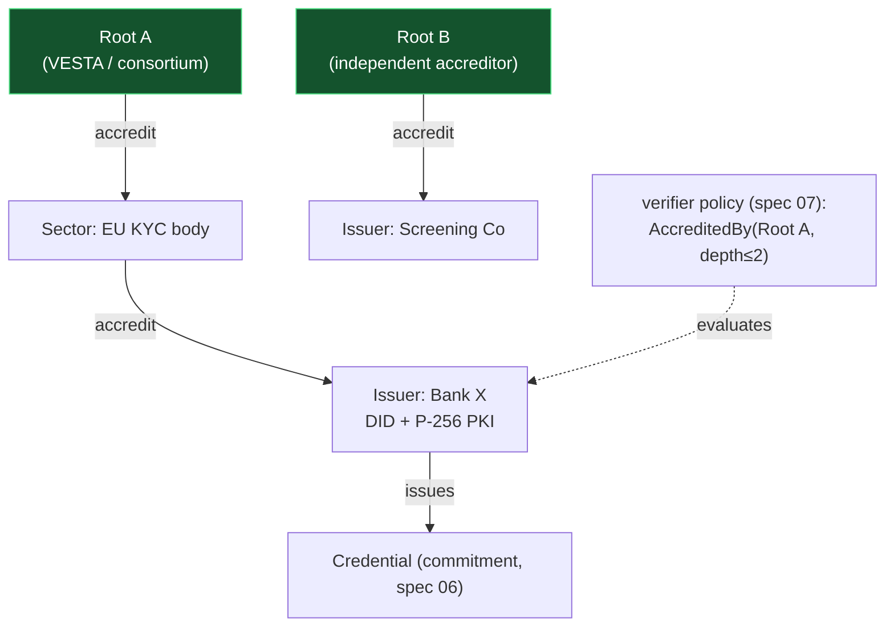

# 08 · aegis — Issuer Accreditation Trust Graph

> **Status:** Draft / Proposed · **Track:** B · **Layer:** Moat · **Depends on:** 06 (accreditation is an attestation); enforced by 07 (`AccreditedBy`)
> Inherits all [shared conventions](README.md#shared-conventions-normative-for-all-specs), incl. [Track B conventions](README.md#track-b-conventions-aegis--sas--crypto--normative-for-specs-0608).

## 1. Summary

Replace "just trust the pinned issuer pubkey" with an **on-chain, recursive
accreditation graph**: issuers attest about issuers, so a verifier pins **one
trust root** and learns, in-transaction, whether an unknown issuer is trustworthy
— no hand-maintained allowlist. Issuer identities bind to a **DID** and to
**real-world PKI** (P-256/eIDAS/mDL via the secp256r1 precompile), and carry an
off-chain **KYB + liability** dossier (hash on-chain) with an optional **bond** the
dispute process can slash. This is the layer SAS has no equivalent for, and it is
**the un-forkable moat**: code forks in a weekend; a graph of real accreditors,
legal relationships, and PKI bindings does not.

## 2. Motivation & current gap

- Today a verifier must **hardcode a specific issuer pubkey** (argus "pins
  issuer"). That doesn't scale past one bilateral relationship — a new dApp has no
  way to discover *which* KYC issuer is legitimate, and no basis to trust a
  credential from an issuer it's never heard of. **This is the single biggest
  reason aegis is stuck as a VESTA-internal helper.**
- Any keypair can be an "issuer." No KYB of the issuer, no liability if a
  credential is false, no recourse. In regulated finance the entire value of a KYC
  attestation is *someone is legally on the hook if it's wrong.*
- No binding to off-chain legal identity or existing PKI (eIDAS, mDL, national
  eID), so aegis can't bridge to the identity infrastructure enterprises already
  trust.

## 3. Goals / Non-goals

**Goals**
- **Accreditation = an attestation whose subject is an Issuer** (reuse spec 06),
  under a reserved `accreditation` schema. Recursive: root → sector → issuer.
- A verifier evaluates **"issuer accredited-by ROOT within depth D"** as a spec-07
  predicate (`AccreditedBy`), passing the trust-path accounts explicitly (bounded
  depth ⇒ no unbounded loop, deterministic CU).
- **DID + real-world PKI binding:** an issuer proves control of a P-256/Ed25519
  key (secp256r1/Ed25519 precompile) that maps to eIDAS/mDL/WebAuthn material;
  bind a `did:sol`-style identifier resolvable to keys/endpoints.
- **KYB & liability:** off-chain dossier (legal entity, licence, insurance, signed
  liability undertaking) with an on-chain `content_hash`, tier, jurisdiction,
  licence expiry, and status.
- **Accountability economics:** optional issuer **bond**; a proven misissuance
  (dispute — wave 2) can **slash** it. Accreditation is **time-boxed/renewable**;
  a lapsed licence/insurance auto-suspends the issuer and de-validates its live
  credentials.
- **Plural roots:** the design must not require a single root; verifiers choose
  which root(s) they trust.

**Non-goals**
- The dispute/appeal process and bond-slashing execution (wave-2 trust-marketplace;
  this spec defines the bond account and status hooks they use).
- Authoring the legal KYB criteria (that's the accreditor's compliance function).
- Consumer credential privacy (spec 06) — accreditation is about issuers and is
  intentionally public (accountability, not privacy).

## 4. Design

### 4.1 Accreditation as an attestation

An accreditation is a spec-06 attestation with:
- `issuer` = the **accreditor** (a root or an already-accredited sector body),
- `subject` = the **accredited Issuer's PDA** (issuers accrediting issuers),
- reserved `schema = ACCREDITATION` whose typed fields are `tier`,
  `permitted_schemas`, `jurisdiction`, `licence_expiry`, `dossier_hash`.

Because it reuses spec 06, accreditation inherits versioning, expiry, and
revocation for free. Revoking an accreditation instantly de-trusts everything
below it (§4.4).

### 4.2 Recursive trust path (the verify primitive)

Spec 07's `AccreditedBy(root, max_depth)` predicate validates a path
`issuer → accreditor → … → root` (length ≤ `max_depth`, e.g. **≤ 2** to cap CU),
where each edge is a non-revoked, in-window accreditation attestation and each
node's `permitted_schemas` covers the credential's schema. The caller passes the
path accounts explicitly (no on-chain enumeration). A verifier's config becomes
**"I trust root R (depth ≤ D)"**, not a list of 40 pubkeys.

### 4.3 DID + real-world PKI binding

- The `Issuer` account gains a `did` (resolvable identifier) and a registered
  `pki_key` (P-256 or Ed25519).
- **Proof of control:** `verify_pki_control` checks a signature over a fresh
  challenge using the **secp256r1 precompile** (P-256 → the key material behind
  eIDAS QWAC, ISO 18013-5 mDL, WebAuthn) or the Ed25519 precompile. This lets
  aegis ingest and anchor identity from existing national/enterprise PKI **without
  those systems trusting Solana** — aegis becomes a bridge, not a walled garden.

### 4.4 Revocation cascade (power + danger)

Revoking an accreditation edge de-trusts the whole subtree beneath it in one
action — exactly what you want when an accreditor is compromised, and exactly what
can nuke a legitimate ecosystem branch by mistake. Mitigations: a **grace/timelock**
on cascade effect for non-emergency revocations, an **emergency-vs-standard**
revoke distinction, and clear events so relying parties see the cause. Verifiers
may also require **≥2 independent roots** for high-stakes policies (spec 07),
so one root's failure doesn't unilaterally break or forge trust.

### 4.5 Cold-start & root plurality

At genesis VESTA is the first root **and** the first accredited issuer — value
exists at N=1 (argus trusts VESTA-root credentials immediately; no chicken-and-egg,
since issuer and first verifier are the same org). But "trusted because VESTA says
so" is only a bootstrap: the spec commits to **plural roots** (any entity can be a
root a verifier chooses to pin), and to onboarding independent accreditors (a
compliance consortium, a licensed CDD provider) so trust decentralizes over time.
This plural-root path is a first-class requirement, not an afterthought (it's the
named killer risk).



## 5. Account model

```
Issuer (appended fields)                                   // extends current aegis Issuer
  + version        : u8
  + did            : String            // bounded, resolvable id
  + pki_key        : [u8; 33]          // compressed P-256 (or Ed25519 32B) 
  + pki_scheme     : u8                // 0 = secp256r1, 1 = ed25519
  + accredited_by  : Option<Pubkey>    // parent accreditation attestation
  + tier           : u8
  + status         : u8                // Active | Suspended | Revoked
  + licence_expiry : i64

// Accreditation reuses spec-06 Attestation with schema = ACCREDITATION:
//   issuer = accreditor, subject = accredited Issuer PDA, fields = {tier,
//   permitted_schemas, jurisdiction, licence_expiry, dossier_hash}

IssuerBond        seeds = ["ibond", issuer]                // NEW (optional)
  version, issuer, amount, asset_mint, locked, slashable_by (accreditor/authority), bump

TrustRoot         seeds = ["troot", root_authority]        // NEW (registry of recognized roots)
  version, authority, name, metadata_uri, active, bump
```

## 6. Instruction surface

- `register_trust_root(name, metadata_uri)` — declares a root (permissionless to
  *declare*; trust is by verifier opt-in, not by registration — plural roots).
- `accredit_issuer(subject_issuer, tier, permitted_schemas, jurisdiction,
  licence_expiry, dossier_hash)` — accreditor issues an accreditation attestation
  (reuses spec-06 `issue_commitment` under the reserved schema; here fields may be
  public since it's about issuer accountability).
- `revoke_accreditation(mode: Standard | Emergency)` — revokes an edge; cascade
  timelock on `Standard`.
- `set_issuer_identity(did, pki_key, pki_scheme)` — issuer registers its DID + PKI
  key.
- `verify_pki_control(challenge, signature)` — precompile check proving the issuer
  controls `pki_key`; sets a verified flag / timestamp.
- `post_bond(amount, asset_mint)` / `withdraw_bond` — optional accountability
  stake; `withdraw` blocked while `locked` (an open dispute, wave 2).
- `suspend_issuer` / `reinstate_issuer` — status transitions; auto-suspend on
  `licence_expiry` lapse (crank-checkable).
- **Consumed by spec 07:** `AccreditedBy(root, max_depth)` predicate walks the
  path accounts and checks each edge + `permitted_schemas` + status + window.

## 7. Limits & determinism

- **Bounded depth** (`max_depth ≤ 2` default, hard cap) with caller-supplied path
  accounts ⇒ deterministic CU, no unbounded traversal, fail-closed on a broken
  edge.
- `permitted_schemas` bounded list; schema coverage checked per edge.
- All time/window/tier comparisons `checked_*`; status transitions validated.
- PKI verification via precompile (fixed cost); one challenge-response per
  `set_issuer_identity` refresh.

## 8. Security considerations

- **Killer risk — root centralization/capture.** If VESTA is the *only* root,
  aegis is "trusted because VESTA says so" — the original criticism restated.
  Mitigations are first-class (§4.5): permissionless root declaration, verifier-
  chosen roots, multi-root policies for high-stakes checks, and a committed
  onboarding path for independent accreditors. This is a *governance* problem
  harder than the crypto; treat plural-root adoption as a success metric.
- **Cascade danger (§4.4):** subtree de-trust is powerful; timelock +
  emergency/standard split + events + multi-root requirements bound the blast
  radius of a wrong or malicious revocation.
- **PKI binding integrity:** proof-of-control via the audited precompile; bind a
  fresh challenge (anti-replay). A stale/absent proof ⇒ issuer treated as
  PKI-unverified (policies may require verified PKI).
- **Pinned derivation / fail closed (#2/#3):** `AccreditedBy` re-derives every path
  account and owner-checks it; any broken/mismatched/expired/revoked edge ⇒ verdict
  `ok=false`.
- **Accountability, not privacy:** accreditation data is deliberately public
  (subject privacy is untouched — accreditation subjects are *issuers*, not
  people).
- **Two-step authority, pause** inherited.

## 9. SAS integration

SAS has issuer identity but **no recursive accreditation/trust traversal as a
verify primitive** — this is aegis's clean, non-overlapping addition. The trust
graph can accredit issuers that publish **SAS** attestations just as well as
aegis-native ones (spec 07 reads both), positioning aegis as the **trust layer over
any attestation store on Solana**.

## 10. Migration & compatibility

- Extends the existing aegis `Issuer` (appended fields + version). Accreditation
  reuses spec-06 attestations, so it requires 06; enforcement requires 07's
  `AccreditedBy`.
- Backward compatible with a single hardcoded issuer: a verifier can still pin an
  exact issuer (`PinnedIssuer`) and adopt `AccreditedBy` later.
- No `vesta_core`/argus layout impact beyond argus adopting the spec-07 predicate.

## 11. Test plan (LiteSVM)

- Accredit root → sector → issuer; `AccreditedBy(root, 2)` passes for a
  bottom issuer and fails at depth 3 (cap) or on a broken/expired/revoked edge.
- `permitted_schemas`: an issuer accredited for KYC cannot pass a health-schema
  policy.
- PKI: `verify_pki_control` accepts a valid P-256 signature (secp256r1 precompile)
  and rejects a wrong/replayed one; policy requiring verified PKI fails an
  unverified issuer.
- Revocation cascade: revoking a sector edge de-trusts its subtree; `Standard`
  respects timelock, `Emergency` is immediate; events emitted.
- Licence lapse auto-suspends; suspended issuer's credentials fail policies.
- Multi-root: a policy requiring 2 roots fails with 1; passes with 2.
- Bond: post/withdraw; withdraw blocked while locked.

## 12. Phased rollout

1. Accreditation-as-attestation + `AccreditedBy` predicate (spec 07) + trust roots
   + tier/permitted-schemas/status. *(delivers the moat's core)*
2. DID + PKI binding (`verify_pki_control`) + licence-expiry auto-suspend.
3. Bond accounts + cascade timelock/emergency split (dispute execution &
   slashing are wave-2 trust-marketplace).

## 13. Open questions

- Root plurality mechanics: fully permissionless root declaration vs. a curated
  root set at genesis with a path to opening it? Lean permissionless-declare,
  verifier-chooses-trust.
- Max accreditation depth: 2 (chosen, CU-safe) vs. deeper with a cached
  "effective root" pointer to avoid long paths.
- Where does the KYB dossier live, and who audits the accreditor itself
  (accreditor-of-accreditors / insurance of the root)? The governance-hard part;
  resolve with the mainnet legal review.
- Reconcile with any emerging SAS issuer-reputation primitive to avoid divergence.
