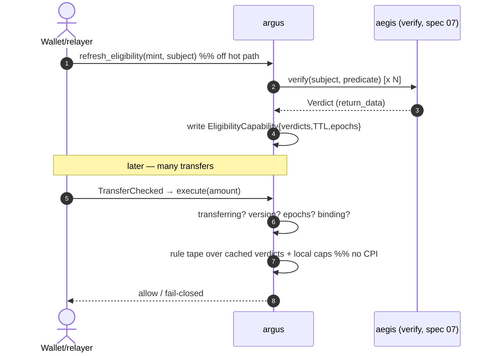

# 09 · argus — Policy VM + Verdict Capability (aegis-compatible core)

> **Status:** ◒ Phase 1–2a implemented (v2.0.0 — capability + aegis migration; guard now enforces aegis `verify_policy` so rules are data with no redeploy. Full data-driven mechanical-rule interpreter + dynamic EAML deferred: low value / high risk) · **Track:** C (Transfer Policy) · **Layer:** Core · **Depends on:** 06, 07
> **Unlocks:** 10 (enterprise governance); is the migration that lets Track B ship
> Inherits all [shared conventions](README.md#shared-conventions-normative-for-all-specs), incl. [Track B conventions](README.md#track-b-conventions-aegis--sas--crypto--normative-for-specs-0608).

## 1. Summary

Re-architect argus around three cleanly separated layers so it survives the aegis
rework and becomes a reusable transfer-policy engine:

- **aegis decides** *who is eligible* behind the stable `verify` CPI (spec 07).
- A **Verdict Capability** (`EligibilityCapability`) collapses that expensive
  decision into a versioned, epoch-gated **cached bitmap**, paid **once off the
  hot path**.
- **argus enforces** a per-mint **versioned rule tape** over that bitmap plus
  mechanical caps/velocity — inside `execute`, in `<3k` CU, with **zero hot-path
  CPI**.

This is also the **migration**: argus stops reading aegis by fixed byte offsets
(which the commitment-only aegis of spec 06 deletes the field for) and consumes
`verify` only in the off-path refresh. Ship **06 + 07 + 09 together**.

## 2. Motivation & current gap

- `execute`'s attestation stage reads the aegis account by hardcoded offsets
  (`ATTESTATION_DISCRIMINATOR`, `attestation_offset::*`, `value & mask`). Spec 06
  removes the public `value` → this **breaks** and the 21 guard tests fail. A
  clean interface is mandatory, not optional.
- The policy is a **hardcoded 12-stage pipeline** with one pinned
  `(issuer, schema, mask)` — a 13th rule or a second issuer is a program upgrade.
- **CU reality:** doing a `verify` CPI per transfer would pay aegis's recursive
  trust-graph + jurisdiction cost on **every hop** (a DEX route pays the hook 1–8×
  per tx). That is unusable. The cost must move off the per-transfer path.

## 3. Goals / Non-goals

**Goals**
- Consume aegis via `verify` (spec 07) — **no byte offsets, ever** — through a
  cached `EligibilityCapability`.
- **Hot path: no CPI, `<3k` CU, constant** w.r.t. trust-graph depth.
- A **versioned, data-driven rule model** so new mechanical rules and new aegis
  predicates don't require a program change.
- **Fail-closed spine:** pinned derivation, versioned reads, epoch invalidation,
  transferring-flag (audit H-1), capability binding.
- Preserve today's local controls (pause, caps, velocity, lists, treasury/delegate
  flows) with unchanged semantics.
- Keep argus **multi-tenant-ready** (all state already mint-scoped).

**Non-goals** (→ spec 10)
- Governance lifecycle / roles / separation of duties, decision statements, the
  trust-triangle authority model, travel-rule, sanctions-screening semantics,
  licensing/monetization.
- The aegis-side `verify`/policy/accreditation internals (specs 06–08).

## 4. Design

### 4.1 Verdict Capability — verify-once, consume-many

New permissionless instruction `refresh_eligibility(mint, subject)` does the heavy
lift **off the hot path**: it calls aegis `verify(subject, predicate)` (spec 07)
for each predicate the mint's policy requires, reads the `Verdict` from
`return_data`, and writes an `EligibilityCapability` PDA `["cap", mint, subject]`:

```
EligibilityCapability
  version        : u8
  mint           : Pubkey
  subject        : Pubkey
  verdicts       : u32        // bitmap: predicate index -> satisfied
  issued_slot    : u64
  expiry_slot    : u64        // TTL
  policy_epoch   : u64        // must match GuardConfig.policy_epoch
  screening_epoch: u64        // must match aegis screening epoch (fast revocation)
  aegis_program  : Pubkey     // pin the aegis deployment consulted
  bump           : u8
```

`execute` **never CPIs aegis**. On a peer transfer it loads the capability
(delivered via the ExtraAccountMetaList), and checks: `version` ok,
`expiry_slot >= clock.slot`, `policy_epoch == GuardConfig.policy_epoch`,
`screening_epoch` current, `mint`/`subject`/`aegis_program` bound correctly — then
reads `verdicts` for the bits its rule tape requires.

Refresh is **bundleable**: a wallet with a stale/absent capability prepends
`refresh_eligibility` in the same transaction before its transfer — pay once, then
transfer freely until TTL. A cache miss/expiry fails the transfer **closed** with
a distinct `EligibilityStale` error telling the client to refresh.

### 4.2 Rule Tape — a bounded, versioned policy VM

`PolicyAccount` `["policy", mint]` holds `{ version, epoch, rules: Vec<Rule> }`
(bounded, `rules.len() <= MAX_RULES`, e.g. 16). Each `Rule` is a fixed-size tagged
struct `{ opcode, flags, params }`. `execute` runs a **tiny bounded interpreter**:

| Opcode | Check (mechanical, argus already knows how) |
|---|---|
| `NOT_PAUSED` | guard not paused |
| `NONZERO` | amount > 0 |
| `PER_TX_CAP` / `MAX_BALANCE` | existing caps |
| `COOLDOWN` / `VELOCITY` / `TX_COUNT` | existing velocity (WalletPolicyState) |
| `LIST_ALLOW` / `LIST_DENY` | existing list membership |
| `TREASURY_FLOW` / `DELEGATE_FLOW` | existing short-circuits |
| **`REQUIRE_PREDICATE(idx)`** | the escape hatch: bit `idx` set in the capability's `verdicts` |

The interpreter orders **cheap local checks first** (short-circuit before touching
the capability), and `REQUIRE_PREDICATE` is a pure bitmap read — **no CPI**. All
*semantic* eligibility (jurisdiction, accreditation, DID) lives in aegis as a
predicate; adding it to argus is appending one `REQUIRE_PREDICATE` entry + bumping
`epoch`. The `idx → aegis predicate-id` mapping lives in `PolicyAccount`, versioned
by `epoch`.

> v1 may keep the current caps as fast-path fields on `GuardConfig` and introduce
> the rule tape incrementally; the **only** hard requirement for the aegis
> migration is that the attestation stage becomes `REQUIRE_PREDICATE` over the
> capability. Full VM generalization can be phase 2 (§11).

### 4.3 Rule-aware ExtraAccountMetaList

The EAML is **compiled deterministically from the active rules** on `set_policy`:
velocity/cooldown ⇒ add `WalletPolicyState`; lists ⇒ add `PolicyListEntry`; any
`REQUIRE_PREDICATE` ⇒ add the single `EligibilityCapability` (once, regardless of
predicate count). **No aegis account ever appears in the hot path** — only argus's
own capability — which is what severs the offset coupling at the resolution layer.
A minimal-policy mint drops from 7 fixed accounts to 2–3.

### 4.4 Fail-closed spine

Every hot-path read is hardened (mostly discipline, little new machinery):

1. **Pinned derivation (#3):** re-derive capability/policy/state/list PDAs from
   `[seed, mint, …]` and assert `key ==` + `owner == argus`; nothing trusted by
   position.
2. **Versioned reads:** assert the `version` byte of every argus account **and**
   of the aegis `Verdict` (in refresh); unknown version ⇒ fail closed. This is the
   concrete fix for the offset fragility.
3. **Epoch invalidation:** `GuardConfig.policy_epoch` bumps on any policy change;
   `screening_epoch` tracks aegis's fast-revocation clock. A capability with a
   stale epoch is rejected regardless of TTL — so a freshly-revoked/sanctioned
   subject can't outrun a config change to `expiry_slot`.
4. **Transferring-flag (audit H-1):** keep asserting the Token-2022
   `TransferHookAccount.transferring` flag so `execute` can't be invoked outside a
   real transfer.
5. **Capability binding:** the capability stores `mint`+`subject`+`aegis_program`;
   `execute` asserts all three match the live transfer — blocking cross-mint /
   cross-aegis replay.

### 4.5 Hot-path CU budget

| Path | Cost | Frequency |
|---|---|---|
| `refresh_eligibility` (verify CPI + write) | ~6k–17k CU | once per TTL window, **off** hot path |
| `execute` cache-hit (load + version + expiry + epochs + bitmap + local caps) | **~0.8k–3k CU** | every transfer / hop |
| old per-transfer `verify` CPI (rejected) | 5k–16k CU **× hops** | — |

Constant hot-path cost independent of trust-graph depth; ~10–20× cheaper than
per-hop verify on a multi-hop route. Store bumps everywhere — **never**
`find_program_address` in `execute`.



## 5. Account model

```
EligibilityCapability  seeds = ["cap", mint, subject]     // NEW (§4.1)
PolicyAccount          seeds = ["policy", mint]           // NEW (§4.2) — versioned rule tape
GuardConfig (appended)
  + version           : u8
  + policy_epoch      : u64
  + aegis_program     : Pubkey     // which aegis deployment (spec 07 verify)
  + required_predicates : u32      // bitmap index space the policy uses
  // existing: authority(+pending), treasury, paused, caps, velocity params, bump
WalletPolicyState / PolicyListEntry / ExtraAccountMetaList : unchanged shape (EAML content compiled per §4.3)
```

## 6. Instruction surface

- `refresh_eligibility(subject)` — permissionless; CPIs aegis `verify` per required
  predicate; writes/updates `EligibilityCapability`. Pins `aegis_program`,
  `policy_epoch`, `screening_epoch`, `expiry_slot`.
- `revoke_capability(subject)` — authority or permissionless-on-expiry; forces a
  refresh (e.g., after an out-of-band revocation).
- `set_policy(rules)` — guard authority (two-step retained); writes `PolicyAccount`,
  recompiles the EAML (§4.3), bumps `policy_epoch`. Validates `rules.len() <=
  MAX_RULES`, opcode/param bounds, and a static CU cost model (reject a tape that
  could exceed budget → never fail-close legit transfers).
- `initialize_guard` (extended) — sets `version`, `aegis_program`, initial policy.
- `configure_policy` / `set_guard_paused` / list ops / two-step authority —
  retained; `configure_policy` folds into `set_policy` over time.
- `execute` (rewritten per §4.1–4.4) — hot path, no CPI, fail-closed.

## 7. Math & limits

- `MAX_RULES` (≤16) and per-opcode param bounds; interpreter is a bounded
  forward-only loop (no backward jumps) — DoS- and audit-safe.
- Epoch/slot comparisons and all caps use `checked_*`.
- TTL policy is **per-predicate class**: short TTL for volatile predicates
  (sanctions), long TTL for stable ones (accreditation); a policy declares each
  predicate's max TTL, and `refresh_eligibility` sets `expiry_slot` to the min.
- `verdicts`/`required_predicates` are `u32` (≤32 predicate slots per mint); extend
  to `u64`/array only if a tenant needs more (versioned).

## 8. Security considerations

- **Staleness window (killer risk):** a subject revoked in aegis stays "eligible"
  until `expiry_slot`. Mitigated by (a) per-class TTL (short for high-risk), and
  (b) `screening_epoch` override — any aegis screening-epoch bump invalidates all
  capabilities of that class **regardless of TTL** (spec 10 wires the sanctions
  freeze to this). Getting TTL wrong is a compliance hole, so TTL is policy-set and
  auditable.
- **Fail-closed on aegis outage:** if `refresh_eligibility` can't complete, no
  fresh capability exists ⇒ transfers requiring that predicate fail closed. That is
  the correct compliance posture; spec 10 adds tenant-opt-in **grace mode** for
  low-risk predicates only.
- **Pinned derivation / versioned reads / capability binding / transferring-flag**
  per §4.4 — the multi-tenant correctness spine.
- **Interpreter safety:** bounded, forward-only, every opcode fail-closed by
  default; `set_policy` static-checks CU so a bad tape can't brick a mint.
- **No value creation:** argus gates transfers; it mints nothing.

## 9. Migration & compatibility

- **Breaking for argus's aegis path:** the offset-read attestation stage is
  removed and replaced by `REQUIRE_PREDICATE` over the capability. **Ship 06 + 07 +
  09 together**; the guard tests migrate to the capability flow (the
  `gift_flow`/attestation tests get a `refresh_eligibility` step).
- Local-only guards (pause, caps, velocity, lists, treasury/delegate) are unchanged
  — a mint using no predicates needs no capability and behaves as today (minus the
  removed single-attestation stage).
- Devnet is disposable; deploy fresh. No change to `vesta_core`/`Merchant`
  argus-read prefix (argus reads token accounts + its own PDAs + aegis via verify).

## 10. Test plan (LiteSVM)

- `refresh_eligibility` CPIs aegis `verify`, writes a capability with correct
  bitmap/TTL/epochs; `execute` cache-hit allows with **no** aegis account in the tx.
- Cache miss/expiry ⇒ `EligibilityStale` fail-closed; bundled refresh+transfer
  succeeds.
- Epoch invalidation: bump `policy_epoch` (or `screening_epoch`) ⇒ old capability
  rejected even before TTL.
- Spoofed capability (wrong seeds/owner/mint/subject/aegis_program) ⇒ rejected.
- Transferring-flag: direct `execute` invocation still rejected (H-1).
- Rule tape: `REQUIRE_PREDICATE` gates on the bitmap; local caps/velocity/lists
  behave exactly as the current suite; `set_policy` rejects an over-budget/oversized
  tape.
- Multi-tenant: two mints with different policies/aegis programs are isolated; one
  authority cannot touch the other's config.
- Regression: the existing 21 guard behaviors (pause, gift caps, cooldown, count,
  volume, treasury/delegate flows, program-owned-dest) still hold.

## 11. Phased rollout

1. **Capability + aegis migration + fail-closed spine** — `EligibilityCapability`,
   `refresh_eligibility`, `execute` consuming the bitmap, versioned reads, epoch +
   capability binding. Attestation stage → `REQUIRE_PREDICATE`. *(This is the slice
   we implement alongside aegis 06/07.)*
2. **Full rule-tape VM + rule-aware dynamic EAML** — generalize the pipeline into
   the interpreter + compiled EAML.
3. Hand off enterprise concerns to **spec 10** (governance, statements, trust
   triangle, sanctions/travel-rule, multi-tenant licensing).

## 12. Open questions

- Capability granularity: one `["cap", mint, subject]` with a bitmap (chosen) vs.
  per-predicate capabilities (finer revocation, more accounts). Bitmap for v1.
- Co-locate the verdict into `WalletPolicyState` for velocity-using mints (saves
  one account load) — a phase-2 optimization for high-frequency tenants; keep the
  separate capability as the default.
- Exact `screening_epoch` source/shape from aegis (coordinate with spec 07/10);
  until sanctions ships, `screening_epoch` is a no-op equal check.
- Keep `configure_policy` as a thin alias during migration vs. cut straight to
  `set_policy`.
