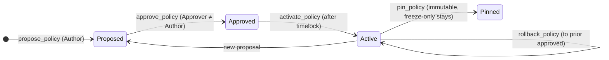

# 10 · argus — Enterprise Governance & Multi-Tenancy

> **Status:** Draft / Proposed · **Track:** C · **Layer:** Governance / moat / monetization (wave 2) · **Depends on:** 09 (VM + capability), 08 (accreditation)
> Inherits all [shared conventions](README.md#shared-conventions-normative-for-all-specs).

## 1. Summary

Turn the argus core (spec 09) into a **governed, auditable, multi-tenant transfer
control plane** a regulated issuer would run their instrument on. It answers an
examiner's three questions natively — *who can change the control, what did the
control do, and by what authority does this entity run it* — with on-chain,
privacy-preserving proof:

- **Governed policy lifecycle** (propose → approve → timelock → activate →
  rollback) with **separation of duties** — replacing today's silent live-mutation
  and the all-or-nothing `finalize` cliff.
- **Decision statements** — canonical, reason-coded, tamper-evident transfer
  decision records fit for compliance filing.
- **The trust triangle** — argus's authority is *derived from* vesta_core merchant
  ownership + an aegis accreditation root, not asserted by a keypair.
- **Semantic predicates** delivered through the spec-09 capability: sanctions/
  freeze propagation, dual-party travel-rule, jurisdiction corridors.
- **Multi-tenancy + licensing** — any Token-2022 mint runs the one argus program
  with its own policy; a tiered license monetizes the premium (governance/
  statements/accreditation) features.

## 2. Motivation & current gap

- **Governance:** `GuardConfig` is live-mutable by one key — no proposal trail, no
  delay, no diff, no rollback; `finalize` is a one-way cliff that makes a policy
  bug permanent. Neither is acceptable to a controls function.
- **Authority:** the guard key is a free-floating keypair with no link to who owns
  the merchant economy (vesta_core) or whether they're an accredited issuer
  (aegis). The trust triangle is implicit and social.
- **Audit:** decision events are telemetry, not a compliance artifact (no canonical
  reason codes, no "which policy decided", no provable-complete statement).
- **Reach & revenue:** argus is a VESTA-internal singleton with no third-party
  adoption path and no monetization.

## 3. Goals / Non-goals

**Goals**
- Versioned, content-addressed policies with maker/checker approval, timelock, and
  rollback; configurable immutability instead of an all-or-nothing finalize.
- A role graph with **separation of duties** (pause ≠ caps ≠ attestation-policy ≠
  approve), each role a key or multisig.
- Canonical decision records + period **statements** anchored on-chain (Merkle
  root), privacy-preserving (reference aegis verdicts by commitment, never PII).
- Trust triangle: argus governance authority bound to vesta_core merchant ownership
  and continuously checked against an aegis accreditation root (auto-degrade on
  revocation).
- Semantic predicates over the spec-09 capability: `SANCTIONS` (screening-epoch
  hard block), `TRAVEL_RULE` (dual-party + payload commitment), `CORRIDOR`
  (jurisdiction verdict from aegis policy).
- Multi-tenant registration + tiered licensing; expiry degrades to a **safe,
  functional** posture, never to insecure or asset-stranding.

**Non-goals**
- The spec-09 core (capability, VM, EAML, fail-closed spine).
- aegis internals (06–08); this spec *consumes* accreditation + policy + screening.

## 4. Design

### 4.1 Governed policy lifecycle (replaces live-mutation + finalize)

A policy change is a lifecycle, not a write:

1. `propose_policy` (**Author** role) writes an immutable, hashed `PolicyVersion`
   (the full rule tape from spec 09). Nothing goes live.
2. `approve_policy` (**Approver** role, must differ from Author — program rejects
   self-approval) records who/when and starts a **timelock**.
3. After `timelock`, `activate_policy` (**Activator**) points `PolicyPointer.active`
   at the new version and bumps `GuardConfig.policy_epoch` (spec 09 invalidates
   stale capabilities).
4. `rollback_policy` re-points to any prior approved version via an expedited path.
5. `pin_policy` finalizes a *specific* version (immutable) while leaving an
   emergency-freeze authority alive — **configurable immutability**, not a cliff.



### 4.2 Role graph — separation of duties

`RoleRegistry` `["roles", mint]` maps roles → authorities (key **or** multisig):
`Author`, `Approver`, `Activator`, `PauseOperator` (freeze-only), `CapsOperator`
(velocity/caps only), `AttestationOperator` (aegis policy/predicate refs only),
`Reporter` (statements), `RoleAdmin` (grants/revokes, itself multisig + timelocked).
Every privileged instruction checks the **specific** role — a compromised
CapsOperator cannot touch attestation policy or unpause. Role grants may be gated
on an aegis credential (e.g., a "named compliance officer" attestation via
`verify`), tying human governance to attested identity.

### 4.3 The trust triangle (the moat)

`TrustAnchor` `["trust", mint]` = `{ vesta_core_merchant_ref, aegis_accreditation_root,
required_accreditation_types, degrade_mode }`. Binds the corners:

- **argus↔vesta_core:** the governance seat is bound to the vesta_core merchant
  owner record; a merchant-ownership change requires re-attesting argus roles.
- **argus↔aegis:** the governing entity must chain up to the configured aegis
  **accreditation root** (spec 08) within max depth, unrevoked. `reverify_accreditation`
  (permissionless crank) re-runs the check and can trip `degrade_mode`
  (transfers-frozen or redemption-only) on revocation — **authority evaporates on
  revocation, no human key needed.**
- **aegis↔vesta_core:** points minted by vesta_core move only if argus's active
  policy references an aegis policy the issuer is accredited to enforce.

### 4.4 Semantic predicates (over the spec-09 capability)

All resolve **off the hot path** into the capability bitmap; `execute` reads a bit.

- **`SANCTIONS`** — evaluated first, `BLOCK`-only (never WARN). Requires
  `NOT_SANCTIONED` for sender **and** recipient, sourced from an **accredited**
  screening issuer (§4.3). Uses aegis's `screening_epoch`: a shorter-TTL / epoch
  bump gives near-real-time freeze propagation (spec 09 §8) without polling.
- **`TRAVEL_RULE`** — fires only when `amount ≥ threshold`; requires counterparty
  eligibility for **both** parties plus a `TravelRulePayload` **commitment** bound
  to `(sender, recipient, amount-band)` (PII off-chain). Recipient identity is
  delivered via the EAML, derived from the **actual** destination owner and
  validated in-hook (anti-substitution).
- **`CORRIDOR`** — delegates the (sender-jurisdiction, recipient-jurisdiction,
  amount, asset-class) decision to aegis's jurisdiction-aware policy engine (spec
  07); argus enforces the returned verdict + optional numeric limit. argus never
  enumerates jurisdictions itself.

### 4.5 Decision statements (audit)

Standardize the `execute` decision record: `{ mint, from, to, amount, decision,
canonical_reason_code, active_policy_hash, aegis_verdict_ref, timestamp }` with a
stable reason-code enum (`DENY_LIST`, `VELOCITY_CAP`, `ELIGIBILITY_FAIL`,
`JURISDICTION_BLOCK`, `SANCTIONS_BLOCK`, …). An off-chain indexer materializes
**period statements**; on-chain `StatementCommitment` `["statement", mint, period]`
anchors the Merkle root signed by the `Reporter` role → tamper-evident and
**provably complete** (no cherry-picked omissions). Verdicts are referenced by
commitment/nullifier, never PII.

### 4.6 Lifecycle ops

- **Shadow mode:** a pending `PolicyVersion` (during timelock) runs alongside the
  active one, emitting "would-have-decided" records without enforcing — so a
  change is evidence-based (how many transfers it *would* block) before activation.
  Bounded/sampled to protect CU.
- **Emergency freeze vs planned change:** `PauseOperator` holds an instant,
  no-timelock **freeze-only** power (cannot change rules or bypass approval);
  unfreeze requires a second role (checker). An on-chain `IncidentState`
  (`NORMAL → FROZEN(reason) → INVESTIGATING → ROLLBACK|HOTFIX`) is part of the audit
  record. Defined aegis-side freeze triggers (mass revocation, accreditation loss)
  wire to auto-degrade.

### 4.7 Multi-tenancy + licensing

argus is already mint-scoped; formalize tenancy: `initialize_tenant(mint)` sets up a
tenant's own `RoleRegistry`/`TrustAnchor`/`PolicyPointer`, independent of VESTA.
`LicenseState` `["license", mint]` = `{ tier, expiry, entitlements }`; premium
governance instructions (`activate_policy`, `anchor_statement`, trust-triangle,
travel-rule/sanctions/corridor) check a live license. **Free tier** = the spec-09
local controls (caps/velocity/lists) — so every VESTA-style deployment onboards at
zero cost. Fees are charged on **governance/statement events**, never per transfer
(no tax on holders), routed to an `argus_treasury`. **Expiry degrades to free-tier
/ freeze-only, never to insecure or asset-stranding** (a verifiable on-chain
guarantee).

## 5. Account model (new)

```
PolicyVersion       seeds = ["pver", mint, version_hash]   // immutable, content-addressed
PolicyPointer       seeds = ["active", mint]               // {active_hash, pending_hash, approve_ts, activate_after, shadow}
RoleRegistry        seeds = ["roles", mint]                // role -> authority(+multisig flag)
TrustAnchor         seeds = ["trust", mint]                // merchant_ref, accreditation_root, required_types, degrade_mode
StatementCommitment seeds = ["statement", mint, period]    // merkle_root, reporter, period
IncidentState       seeds = ["incident", mint]             // state, reason, opened_ts, actor
LicenseState        seeds = ["license", mint]              // tier, expiry, entitlements
TravelRulePayload   seeds = ["travel", mint, payload_commitment]
argus_treasury      seeds = ["argus-treasury"]             // fee vault
```

## 6. Instruction surface (new)

- Lifecycle: `propose_policy`, `approve_policy`, `activate_policy`,
  `rollback_policy`, `pin_policy`.
- Roles: `grant_role`, `revoke_role` (RoleAdmin, timelocked); self-approval guard.
- Trust triangle: `set_trust_anchor`, `reverify_accreditation` (crank),
  `degrade`/`restore`.
- Audit: enriched decision events (in `execute`); `anchor_statement` (Reporter).
- Ops: `freeze` (single-role, instant), `unfreeze` (dual-role),
  `set_shadow(pending)`.
- Tenancy/license: `initialize_tenant`, `set_license`, entitlement checks on
  premium ixs.
- Predicates: registered as spec-09 rule-tape opcodes; `refresh_eligibility`
  resolves them via aegis.

## 7. Security & compliance considerations

- **Timelock vs emergency (killer risk):** the freeze path is instant and
  freeze-only; it can never change rules or bypass approval, so speed doesn't
  become a change-control bypass.
- **Governance deadlock:** RoleAdmin recovery path (multisig + timelock) that does
  **not** reintroduce a god key; lost-Approver recovery defined.
- **Auto-degrade foot-gun:** accreditation-revocation → degrade uses grace windows
  + a challenge path; false-positive/aegis-outage must not instantly brick a live
  instrument (tunable fail-safe vs fail-closed per issuer).
- **Statement completeness:** "provably complete" only holds if every decision path
  emits; coverage is a tested invariant, and reorg/rollup edges are handled.
- **License safety (killer risk):** a business-reason expiry must **never** strand
  or freeze holder assets — degradation is to a safe functional posture, verifiable
  on-chain.
- Inherits the spec-09 fail-closed spine, pinned derivation, versioned reads,
  transferring-flag, and value-conservation (argus mints nothing).

## 8. Migration & compatibility

- Purely additive over spec 09; free-tier behavior = spec-09 core, so existing
  deployments are unaffected until they opt into governance/premium.
- Requires spec 08 (accreditation) for the trust triangle and `SANCTIONS`/`CORRIDOR`
  issuer trust; travel-rule requires the EAML recipient-identity delivery from
  spec 09 §4.3 generalized.
- Governance can start off-chain-signed with on-chain execution to reduce cost;
  full multisig via Squads.

## 9. Test plan (LiteSVM)

- Lifecycle: propose→approve→timelock→activate bumps `policy_epoch`; self-approval
  rejected; rollback restores a prior version; `pin_policy` blocks further change
  but leaves freeze alive.
- Roles: each privileged ix enforces its specific role; CapsOperator cannot touch
  attestation policy or unpause; grant/revoke timelocked.
- Trust triangle: `reverify_accreditation` trips `degrade_mode` on a revoked
  accreditation; grace window respected; merchant-ownership change forces role
  re-attestation.
- Predicates: `SANCTIONS` hard-blocks on a stale screening epoch; `TRAVEL_RULE`
  gates both parties + payload commitment above threshold, no-op below; `CORRIDOR`
  enforces the aegis verdict + limit.
- Statements: enriched decisions emit canonical reason codes + policy hash;
  `anchor_statement` roots a period; a missing decision breaks completeness (caught).
- Ops: shadow mode emits would-have-decided without enforcing; emergency freeze is
  instant + freeze-only; unfreeze needs two roles.
- License: premium ix rejected without a live license; expiry degrades to free-tier
  and **never** strands assets; fees hit `argus_treasury` on governance events only.

## 10. Phased rollout

1. **Governance lifecycle + roles/SoD** (fixes live-mutation + finalize cliff) —
   the price-of-entry controls narrative; ship for VESTA first.
2. **Decision statements** — the cold-start revenue wedge (audit-ready records).
3. **Trust triangle + accreditation auto-degrade** (needs spec 08) — the moat.
4. **Semantic predicates** — `SANCTIONS`, then `CORRIDOR`, then `TRAVEL_RULE`.
5. **Multi-tenant + licensing** — third-party adoption + monetization.

## 11. Open questions

- Governance execution: on-chain voting vs. off-chain-signed + on-chain execute for
  role/version approval? Start off-chain-signed via Squads multisig authorities.
- Auto-degrade default posture (freeze vs redemption-only) and grace-window length
  — issuer-configurable; pick conservative defaults.
- Statement anchoring cadence + who runs the indexer (protocol vs. tenant vs.
  auditor); the on-chain root is the trust primitive regardless.
- License enforcement is only as strong as contract + technical gate (a verifier
  can't be forced to pay for a read) — align with aegis's metering (spec-05-style
  wave-2) rather than taxing transfers.
