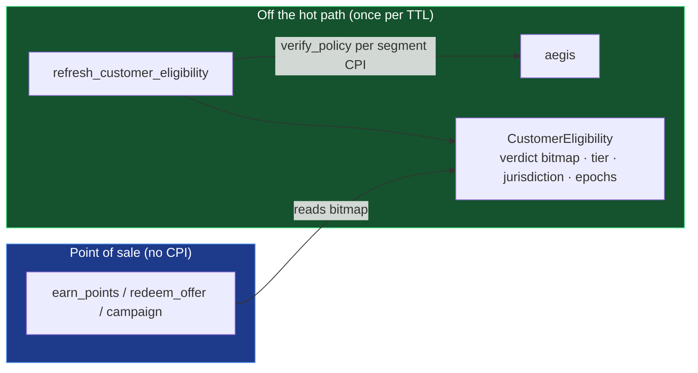

# 12 · vesta_core — Verified Customer Segmentation & Programmable Growth

> **Status:** Draft / Proposed · **Track:** D (Merchant) · **Layer:** Growth engine / the differentiator · **Codename:** PROSOPON · **Depends on:** 06 (commitments), 07 (verify/policy), argus capability model (shipped v2.1.0); (11) for merchant trust
> Inherits all [shared conventions](README.md#shared-conventions-normative-for-all-specs).

## 1. Summary

Turn the merchant from a flat-rate, identity-blind mint into a **programmable,
identity-aware growth engine**. Personalization is driven by
**privacy-preserving aegis verdicts cached off the hot path** — reusing argus's
shipped verify-once/read-cheap `EligibilityCapability` pattern verbatim — so a
merchant learns only that a predicate holds (verified EU / KYC-tier-2 /
accredited / 18+), **never the customer's PII**. On that substrate:

- **Verified segments (§4.1)** — a `CustomerEligibility` verdict cache + named
  `MerchantSegments`; earn, offers, and campaigns gate and boost on segment bits.
- **Programmable earn (§4.2)** — an `EarnPolicy` rule tape (category/time/
  first-visit/spend-curve/segment boosts) replacing the single hardcoded curve.
- **Customer lifecycle (§4.3)** — real on-chain new/active/at-risk/churned state
  that **winback** and **welcome** campaigns can target.
- **Sybil-gated referral (§4.4)** and **offer marketplace depth (§4.5)**.

This is the first time `vesta_core` consumes the fully-built aegis, and it is
VESTA's **unforgeable moat**: no incumbent loyalty program can privacy-preservingly
target verified attributes without an aegis-style verdict layer.

## 2. Motivation & current gap

- **The merchant is identity-blind.** aegis `verify`/`verify_policy` are shipped
  (return-data `Verdict { ok, jurisdiction: u16, tier: u8, expires_at, … }`,
  non-reverting) — and `vesta_core` never calls them. Earn/offers/campaigns can
  target only loyalty `tier` (cumulative spend) and raw basket size. "2× for
  verified EU customers", "accredited-only offer", "18+ flash sale" are all
  inexpressible — the single highest-converting loyalty lever is missing.
- **Earn is one hardcoded curve.** `accrue()` is `base_rate × streak`, full stop —
  every richer rule is a whole `Campaign` account, and campaigns don't compose.
- **No lifecycle state.** `CustomerProfile` has `last_visit_day` but no derived
  new/active/at-risk/churned state — winback and welcome promos are impossible.
- **No acquisition loop** — no referral binding, no gift-an-offer, no gated/flash
  inventory.
- **The proven off-hot-path pattern is right there.** argus ships
  `refresh_eligibility → EligibilityCapability` consumed with zero hot-path CPI
  (spec 09 §4.1). The merchant has the identical need and no equivalent — until now.

## 3. Goals / Non-goals

**Goals**
- Consume aegis identity **off the hot path**, privacy-preservingly (a bit, never
  PII), reusing the argus capability spine (pinned derivation, versioned reads,
  TTL + policy/screening-epoch invalidation, `aegis_program` binding).
- Make earn rules and offer/campaign eligibility **governed data**, not code.
- Add real customer lifecycle state and the winback/referral/offer loops that
  ride it.
- Strictly additive: every new consumer account is **optional** — omitted ⇒ the
  instruction behaves exactly as today (tier/spend-only). Missing verdict ⇒
  segment unmet ⇒ never *worse* than today (graceful cold-start).

**Non-goals**
- Merchant-side accreditation (→ spec 11) and internal RBAC (→ spec 13).
- Alliance-level *portable* status (owned by spec 04); §4.3 lifecycle is
  merchant-local and non-portable.
- Any new value ceiling — all boosts re-clamp to the existing ×2.4 /
  `MAX_EARN_PER_TX` limits.

## 4. Design

### 4.1 `CustomerEligibility` verdict cache + segments (the substrate) ★

`MerchantSegments` `["segments", merchant]` — a bounded (≤32), versioned list of
named segments, one bitmap slot each:

```
Segment { policy: Pubkey /* aegis Policy */, name, ttl_secs, min_tier: u8 }
MerchantSegments { version, merchant, policy_epoch, segments: Vec<Segment>, bump }
```

`CustomerEligibility` `["celig", merchant, customer]` — the merchant-side twin of
argus's `EligibilityCapability`:

```
version, merchant, customer,
verdicts        : u32     // bit i = Segment i predicate satisfied
kyc_tier        : u8      // from Verdict.tier
jurisdiction    : u16     // from Verdict.jurisdiction
issued_at, expires_at : i64
policy_epoch    : u64     // must match MerchantSegments.policy_epoch
screening_epoch : u64     // aegis fast-revocation clock (argus-shared)
aegis_program   : Pubkey, bump
```

- `set_merchant_segments(...)` — owner (governed under spec 13 when adopted);
  bumps `policy_epoch`.
- `refresh_customer_eligibility(customer)` — **permissionless, off hot path** —
  CPIs aegis `verify_policy` per segment, folds `Verdict.ok` into the bitmap,
  records `jurisdiction`/`tier`, sets `expires_at` to the min per-segment TTL,
  pins `aegis_program`/`policy_epoch`/`screening_epoch`. One refresh serves earn,
  redeem, campaigns, referral.
- **Consumption:** earn/offer/campaign read this bitmap with **no CPI** (exactly
  like `argus::execute`). Absent/stale/epoch-mismatch ⇒ segment treated as unmet.

The fail-closed spine (pinned PDA derivation, `version` gate, `expires_at` TTL,
`policy_epoch`/`screening_epoch` invalidation, `aegis_program` binding) is lifted
verbatim from spec 09 §4.1/§4.4.



### 4.2 `EarnPolicy` — programmable earn as data

`EarnPolicy` `["earnpolicy", merchant]` — a bounded (≤16), versioned rule tape
(argus-rule-tape style), interpreted by a small forward-only loop:

| Opcode | Effect |
|---|---|
| `CATEGORY_MULT(category_id, bps)` | boost for a SKU/category (earn passes `category_id`) |
| `TIME_WINDOW_BOOST(start_s, end_s, bps)` | happy-hour |
| `FIRST_VISIT_BONUS(flat_raw)` | welcome bonus on first earn |
| `SPEND_TIER_CURVE([(threshold_base, bps)])` | marginal earn rises with basket |
| `SEGMENT_BOOST(seg_idx, bps)` | boost when the §4.1 bitmap bit is set |

`earn_points` gains an **optional** `earn_policy` account + `category_id` arg; the
interpreter adds bps, then re-clamps to the existing ×2.4 / `MAX_EARN_PER_TX`
ceiling — `accrue()` is reused unchanged as the mint core, **no new value
ceiling**. Time-boxed *budgeted* promos stay as `Campaign` (which owns budgets and
per-customer caps that `EarnPolicy` deliberately lacks).

### 4.3 Customer lifecycle state + winback

`CustomerLifecycle` `["clife", merchant, customer]` (a **side account**, so the
`init_if_needed` `CustomerProfile` on the earn path is never resized):

```
first_visit_day, state /* New|Active|AtRisk|Churned|Reactivated */,
churn_after_days, reactivations, vip: bool
```

Earn transitions `state` from recency (`CustomerProfile.last_visit_day`).
Campaign targeting gains `target_lifecycle_state` via a small `["ctarget",
campaign]` side account (Campaign layout untouched): a **winback** campaign pays
only Churned/AtRisk; a **welcome** campaign pays only New. `vip` is an
owner-granted manual override (comped press/influencers) bounded by the same ×2.4
cap — merchant-local, distinct from spec 04's portable alliance status.

### 4.4 Sybil-gated referral

`Referral` `["referral", merchant, referee]` binds `referee → referrer` at first
earn; a both-sided bonus pays when the referee crosses `min_qualifying_base`.
**Sybil defense = §4.1:** payout requires the referee's `CustomerEligibility.kyc_tier
≥ 1` (a distinct verified human), blocking self-referral farms — a concrete,
unique use of the identity substrate. Payout draws from the `FLAT_BONUS` campaign
budget/cap machinery (or a spec-01 funded vault when that lands).

### 4.5 Offer marketplace depth + gift-an-offer

`OfferFace` `["oface", offer]` (side account — `Offer` prefix stable, `merchant`
at offset 8 preserved for memcmp): `min_tier, min_segment_idx, starts_at, ends_at,
per_customer_limit, bundle_offer_ids[≤8]`. `redeem_offer` gains **optional**
`offer_face` + `customer_eligibility` accounts to gate "accredited-only",
"EU-region flash", "Gold-tier bundle". `gift_offer(recipient)` — buyer burns
points, mints a `Receipt` redeemable by another wallet (the gift-then-redeem path
already tolerates profile-less recipients) → an acquisition loop.

## 5. Account model (new)

```
MerchantSegments      seeds = ["segments", merchant]         // §4.1
CustomerEligibility   seeds = ["celig", merchant, customer]  // §4.1 verdict cache
EarnPolicy            seeds = ["earnpolicy", merchant]        // §4.2
CustomerLifecycle     seeds = ["clife", merchant, customer]  // §4.3 side account
CampaignTarget        seeds = ["ctarget", campaign]          // §4.3 side account
Referral              seeds = ["referral", merchant, referee]// §4.4
OfferFace             seeds = ["oface", offer]               // §4.5 side account
```
No change to `Merchant`, `CustomerProfile`, `Offer`, or `Campaign` layouts.

## 6. Instruction surface (new)

- Segments/identity: `set_merchant_segments`, `refresh_customer_eligibility` (crank).
- Earn: `set_earn_policy`; `earn_points` gains optional `earn_policy` + `category_id`.
- Lifecycle: `set_campaign_target`, `set_customer_vip`; lifecycle transitions ride
  existing earn.
- Referral: `bind_referral`, `claim_referral_bonus`.
- Offers: `set_offer_face`, `gift_offer`; `redeem_offer` gains optional gate accounts.

## 7. Math & limits

- Bounded, forward-only rule interpreter (≤16 rules) — DoS- and audit-safe; every
  opcode clamps into the existing joint ×2.4 / `MAX_EARN_PER_TX` ceiling.
- Segment bitmap is `u32` (≤32 segments/merchant); TTL is the min of the matched
  segments' `ttl_secs`; all `checked_*`.
- Verdict staleness bounded by per-segment TTL + `screening_epoch` override
  (spec 09 §8), reused verbatim.

## 8. Security & compatibility

- **Additive & optional.** All personalization state is in **new PDAs** with fresh
  seed prefixes (no collision with the existing seed table); every consumer account
  is optional ⇒ omitted = today's behavior. The argus-read `Merchant` prefix and
  the `Offer`/`Campaign` layouts are untouched, so the shipped guard tests are
  unaffected. This is the spec-04 optional-account compatibility pattern.
- **`CustomerProfile` growth is the trap — avoided.** `earn_points` uses
  `init_if_needed` with `CustomerProfile::INIT_SPACE`; appending fields would break
  existing profiles. Lifecycle/referral/VIP therefore live in **side accounts**.
- **Cross-program version gate.** Deserializing the argus/aegis-shaped
  `CustomerEligibility` gates on its `version` byte so a layout change fails closed
  rather than misreads.
- **Cold-start is the adoption risk, not a layout risk.** Segments fire only once
  customers hold credentials; missing verdict = segment unmet = tier-only
  fallback, so the merchant is never worse than today and can ramp as credentials
  populate.
- Privacy: the merchant program and the merchant operator observe only bitmap bits
  + coarse tier/jurisdiction — never the underlying claim (aegis holds only
  commitments on-chain).

## 9. Test plan (LiteSVM)

- Verdict pass/fail folds the correct bit; expiry and `policy_epoch`/`screening_epoch`
  bump invalidate the cache; spoofed cache (wrong seeds/owner/mint/aegis_program)
  rejected; absent cache ⇒ graceful tier-only fallback.
- Each `EarnPolicy` opcode; joint-cap clamp holds; optional-account back-compat
  (no `earn_policy` ⇒ identical mint to today).
- Lifecycle day-warp transitions; winback pays churned only; welcome gated to
  first visit; VIP uplift bounded by ×2.4.
- Referral bind-once; threshold payout; unverified/self-referral rejected.
- Offer segment/tier/window/limit gates; bundle atomicity; gift redemption by a
  third party.

## 10. Phased rollout

1. **`CustomerEligibility` substrate + segments** with a single `SEGMENT_BOOST`
   earn rule and segment-gated offers — the flagship; closes the "aegis unused by
   the merchant" gap and stands up the moat.
2. **Full `EarnPolicy`** rule tape.
3. **Lifecycle + winback/welcome** targeting.
4. **Referral** and **offer marketplace depth / gift** (parallelizable).
5. Manual VIP override.

## 11. Open questions

- Segment definition ergonomics: named aegis `Policy` per segment (chosen) vs.
  inline predicate — Policy reuse wins (rules editable in aegis, no vesta redeploy).
- Should `set_merchant_segments` / `set_earn_policy` be governed by spec 13's
  lifecycle from day one, or owner-instant until governance is adopted? (Recommend:
  owner-instant pre-governance; auto-governed once spec 13 is on — same opt-in
  pattern as argus `configure_policy`.)
- Referral payout source before spec 01 lands (campaign budget) vs. after (funded
  vault) — keep the funding pluggable.
