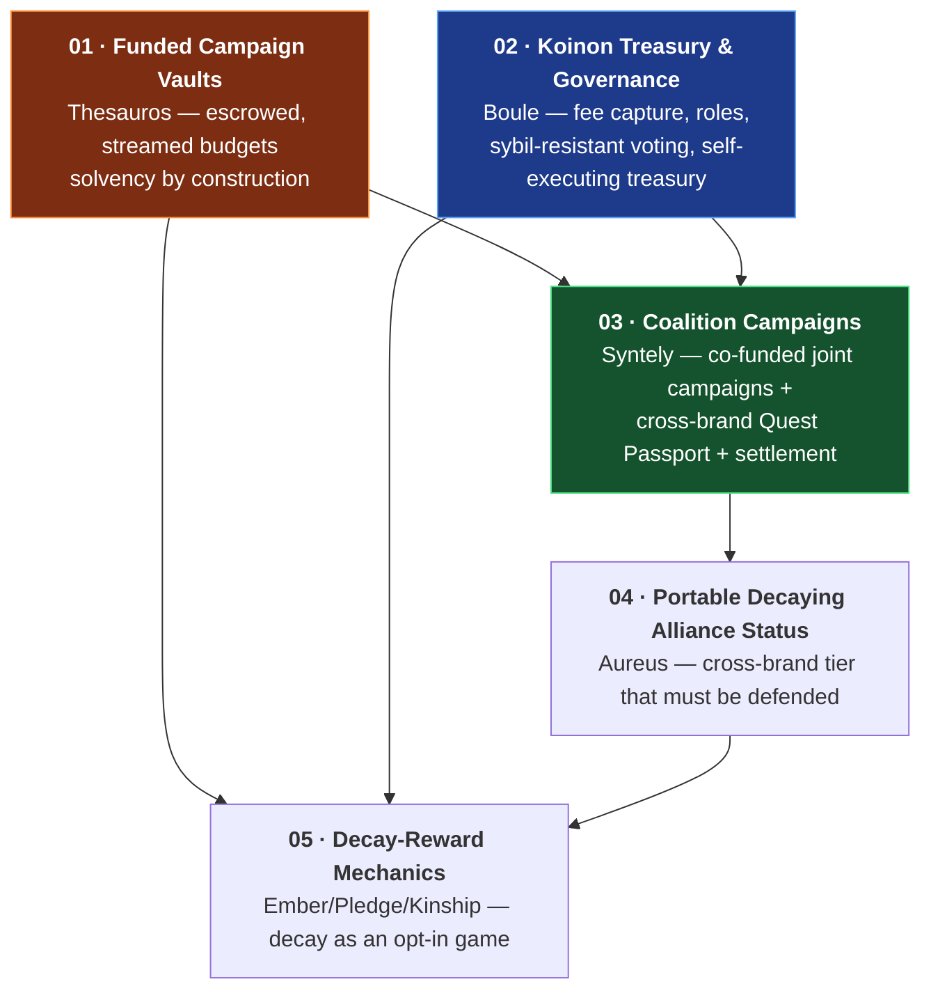
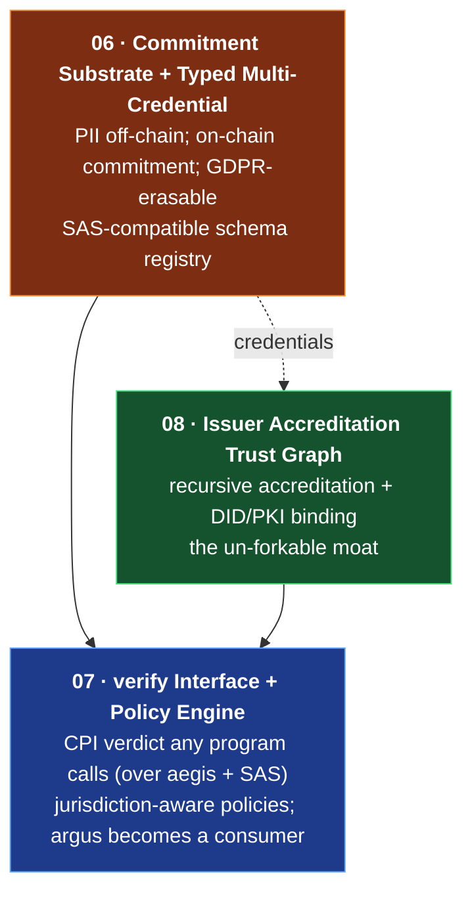

# VESTA Enterprise Specifications

Implementation-grade technical specifications for the next evolution of the VESTA
protocol, organized into two tracks:

- **Track A — Campaigns & Alliances** (specs 01–05): turning single-merchant,
  notional features into a **provably-funded, cross-brand, self-settling coalition
  product**.
- **Track B — Identity & Trust / aegis** (specs 06–08): turning the attestation
  program from a public-PII shell into a **privacy-preserving verification & trust
  layer** for Solana.

Each track was derived from three independent design studies; the directions
below are the points where all three lenses converged.

## Track A — Campaigns & Alliances, at a glance

| # | Spec | Codename | Layer | Depends on |
|---|---|---|---|---|
| 01 | [Funded Campaign Vaults](01-funded-campaign-vaults.md) | Thesauros | Foundation | — |
| 02 | [Koinon Treasury & Governance](02-koinon-treasury-governance.md) | Boule | Alliance core | — |
| 03 | [Coalition Campaigns](03-coalition-campaigns.md) | Syntely | Flagship | 01, 02 |
| 04 | [Portable Decaying Alliance Status](04-portable-alliance-status.md) | Aureus | Consumer flywheel | 02 (03 optional) |
| 05 | [Decay-Reward Mechanics](05-decay-reward-mechanics.md) | Ember/Pledge/Kinship | Differentiator | 01, 02, 04 |

**Recommended delivery order:** 01 → 02 → 03, then 04, then 05.

## Track B — Identity & Trust (aegis), at a glance

Repositions aegis from a credential *store* into the **enforcement + trust layer**
that the [Solana Attestation Service (SAS)](https://solana.com/docs/tools/attestations)
deliberately leaves thin. aegis does **not** rebuild SAS storage; it integrates
over it.

| # | Spec | Layer | Depends on |
|---|---|---|---|
| 06 | [Commitment Substrate + Typed Multi-Credential](06-aegis-commitment-substrate.md) | Foundation (price of entry) | — |
| 07 | [verify Interface + Policy Engine](07-aegis-verify-and-policy.md) | Composability / enforcement | 06 |
| 08 | [Issuer Accreditation Trust Graph](08-aegis-issuer-accreditation.md) | Moat | 06 (07 to enforce) |

**Recommended delivery order:** 06 → 07 → 08. ZK predicate gating, scalable
revocation, and the trust-marketplace (metering/audit/delegation) are **wave 2**
(higher risk / trusted-setup / liability) and are noted in each spec's roadmap,
not specified here.

**Thesis (Track B):** *aegis is a privacy-preserving verification & trust layer —
issuers publish only commitments + accreditation, holders keep their data, and any
program gates via a `verify` verdict over revocable credentials (aegis-native and
SAS), learning that a rule holds and nothing about the person.*

---

## Shared conventions (normative for all specs)

These rules are inherited from the existing programs and the
[security audit](../SECURITY_AUDIT.md); every spec below assumes them and only
calls out deviations.

### Programs & IDs
- `vesta_core` `gaMq6BpH…RG6L4LDz` — economy (merchants, points, offers,
  campaigns, achievements, alliances, clawback).
- `argus` `9zJEWrk4…Czsz3rx` — SPL transfer-hook policy engine (fail-closed).
- `aegis` `AcCdMQC1…Thsu15e1` — attestation registry.

All new instructions land in `vesta_core` unless a spec explicitly says
otherwise. New cross-program reads follow the **pinned-derivation** rule (§Security).

### Existing PDA seeds (do not collide)
`["config"]` · `["merchant", authority, id_le]` · `["mint", merchant]` ·
`["customer", merchant, wallet]` · `["offer"|"campaign"|"achieve", merchant, id_le]` ·
`["cprogress", campaign, customer]` · `["badge"|"kleos", achievement, customer]` ·
`["alliance", creator, id_le]` · `["member", alliance, merchant]` ·
`["guard", mint]` · `["wstate", mint, owner]` · `["entry", mint, target]` (argus) ·
`["issuer", authority, id_le]` · `["attestation", issuer, subject]` (aegis).

New seeds introduced by these specs are namespaced with fresh, distinct prefixes
and listed per spec. No new seed may share a prefix with the above.

### Track B conventions (aegis / SAS / crypto) — normative for specs 06–08
- **Integrate, don't rebuild.** aegis does not duplicate SAS's Credential→Schema→
  Attestation *storage*. `verify` (spec 07) reads both aegis-native attestation
  accounts **and** SAS attestation PDAs; aegis schemas may alias a SAS schema.
  SDKs to interop with: `sas-lib` (TS), `solana-attestation-service-client` (Rust).
- **PII never on-chain.** On-chain stores only commitments (hiding + binding),
  Merkle roots, validity, revocation, and non-identifying policy metadata. Real
  claims live off-chain with the holder/issuer (W3C-VC-shaped).
- **Available Solana crypto (verified):** `sol_poseidon` (BN254-field ZK-friendly
  hash), `alt_bn128` add/mul/**pairing** (Groth16/BN254 verification — wave 2),
  the **secp256r1 precompile** (P-256/ES256 → mDL, WebAuthn, national PKI/eIDAS),
  the Ed25519 precompile, and **state compression** (concurrent Merkle trees).
  **Not** available: BLS12-381 pairings (so BBS+ selective disclosure stays
  off-chain). Any spec naming a proof states its curve, hash, and where it runs.
- **`verify` is read-only & parallelizable.** It mutates nothing and writes its
  verdict via `sol_set_return_data`; it must not take write locks (no shared
  counter) so verifications don't serialize.
- **Versioned account header.** Every aegis account carries `version: u8`
  immediately after the discriminator; readers/`verify` gate on it, so storage can
  evolve without breaking integrators (this replaces argus's current fragile
  fixed-offset reads — audit-adjacent robustness).

### Money model
- Points are **Token-2022** mints with `InterestBearingConfig` (negative rate =
  decay). The merchant PDA `["merchant", authority, id]` is the mint authority,
  `PermanentDelegate`, and metadata/rate authority.
- **UI value vs raw:** raw units are NOT comparable across mints (decay runs from
  each mint's init timestamp). All cross-mint value math goes through the shared
  `util::ui_points_to_raw` / `raw_to_ui` path (Token-2022 `amount_to_ui_amount`),
  exactly as `swap_points` does today.
- **Stable backing** (where a spec escrows hard value) uses a caller-supplied
  SPL/Token-2022 stablecoin mint recorded on the vault; the protocol never
  assumes a specific mint address.

### Authority & lifecycle patterns (reuse verbatim)
- **Owner vs operator:** owner-only instructions derive the merchant PDA from the
  **signing** `authority.key()` + `has_one = authority`; operator-capable ones use
  `merchant.authority` in seeds + an explicit `can_operate` check. High-privilege
  actions (treasury spend, clawback, finalize) are **owner/governance-only**
  (audit M-1).
- **Two-step authority handover** for every new authority-bearing account
  (`pending_authority: Option<Pubkey>` + propose/accept; `accept` requires
  `pending == Some(signer)`). Mirrors config/alliance/issuer/guard.
- **Pause semantics:** every value-moving instruction checks `!config.paused`
  and the relevant scoped pause (merchant/alliance/campaign) (audit L-2).

### Security invariants (normative)
1. **Checked arithmetic only** — `checked_*`/`saturating_*`; the workspace lints
   `unsafe_code = forbid` and `clippy::arithmetic_side_effects = deny` stay on.
2. **Fail closed** — any missing/invalid/mismatched account rejects; never a
   permissive fallback (argus doctrine).
3. **Pinned cross-program derivation** — never trust a client-supplied account for
   policy/value; re-derive the PDA (seeds+bump) and verify owner program +
   discriminator, as `initialize_transfer_guard` verifies the merchant and
   `argus::execute` verifies the attestation.
4. **Value conservation** — any mint must be backed by an escrowed debit or a
   governed, budget-bounded authorization; no instruction may mint unbacked value
   beyond a documented cap. Cross-mint legs are UI-denominated and floor toward
   the protocol (as proven for `swap_points`).
5. **Transfer-context binding** — any new hook path asserts the Token-2022
   `TransferHookAccount.transferring` flag (audit H-1).
6. **Account-layout stability** — `Merchant`'s fixed-offset prefix
   (`id`/`authority`/`point_mint`/`treasury`) that argus reads by offset must not
   move. New fields append; new records use new accounts.

### Account sizing & rent
Every new account is `#[account] #[derive(InitSpace)]`, `space = 8 + INIT_SPACE`,
rent paid by the initiating signer, closable (`close = <payer>`) where a clean
lifecycle end exists. Non-closable only where anti-reset matters (velocity/quest
state), explicitly noted.

### Compute & transaction limits
Multi-CPI / multi-account instructions (co-funded earns, cross-brand quests)
**must** state their account-count and CU budget and cap coalition fan-out per
transaction. Where a single tx cannot hold the fan-out, the spec defines a
multi-tx commit with idempotent partial progress.

### Testing bar
Each spec ships LiteSVM coverage: happy path + every authority-violation +
every cap/solvency/limit rejection + day/epoch rollover. Regression tests for any
behavior an audit finding depends on. `cargo fmt --check`, `clippy -D warnings`,
and `cargo test` are the merge gate. On-chain SBF binaries must be rebuilt
(`anchor build`) before the LiteSVM suite (it loads `target/deploy/*.so`).

### Spec status
All specs are **Draft / Proposed** — design agreed, not yet scheduled. Each
carries an Open Questions section to resolve before implementation.

---

*Maintainer: [ivasik-k7](https://github.com/ivasik-k7) · security contact `kovtun.ivan@proton.me`.*
